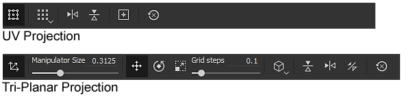
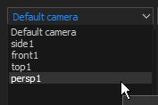
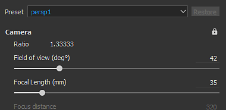
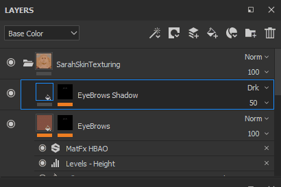
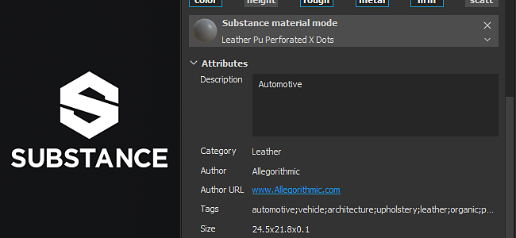

# 2018.2 版本

**Substance Painter 2018.2** 新增了期待已久的功能，例如次表面散射繪畫，讓貼圖比以往更簡單。

上映日期： *2018年8月2日*

## 主要特色

### 次表面散射

**現在即時視窗和** Iray 渲染器&#x200B;**都支援**&#x200B;**次表面散射**。\
次表面散射是一種光在穿透物體或表面時產生的機制。 與金屬表面反射不同，部分光線被材料吸收後 **散射到內部**。 現實生活中許多材料都有表面下散射，例如表皮或蠟。

我們的Subsurface效果實作與其他遊戲引擎的即時實作以及其他離線渲染器非常接近。 這讓製作散射貼圖以用於其他應用變得非常簡單。

{width="650px"}

上面是一個知名的 Digital Emily 2 資產範例。 感謝南加州大學創意技術研究所及 Wikihuman 計畫成員，讓我們能夠展示使用 Digital Emily 2 資產的渲染圖。\
（請注意，此比較是在類似但不完全精確的光線條件下進行，可能解釋視覺差異。）

要在專案中加入次表面散射，請遵循以下幾個步驟：

1. 進入&#x200B;**顯示設定**&#x200B;視窗，**啟用**&#x200B;**次表面散射**&#x200B;設定。
1. 在目前的貼圖集中新增一個「**散射**」通道
1. 在新通道中使用填充層或 **白色** 油漆，讓 **視窗中顯示** 次表面效果。

更詳細的程序可參考 [地下散射文件](../../features/subsurface-scattering/subsurface-scattering.md)。

>[!NOTE]
>
> 為了支援即時視窗&#x200B;**中的次表面散射，專案中的著色器**&#x200B;必須更新&#x200B;**&#x200B;**。\
> 關於自訂著色器，請參閱說明選單中的文件&#x200B;**，了解著色器 API** 中有哪些變更&#x200B;**。**

### 填充層操作手

填充層控制已改良，新增操作手。 現在更能精確放置和控制填充投影。

使用&#x200B;**UV投影**&#x200B;時，操作手會出現在2D視圖&#x200B;**中**：

* 點擊&#x200B;**操作手在**&#x200B;外側會&#x200B;**&#x200B;**&#x200B;旋轉它。
* 點擊&#x200B;**邊**&#x200B;框的方格&#x200B;**可以**&#x200B;**調整**&#x200B;大小。
* 點擊 **操作手內** 側即可 **翻譯** 。
* 用 **CTRL** 來影響對稱&#x200B;**的多角**。
* 使用 **SHIFT** 來 **約束** 變換（平移、旋轉或縮放）。\
  

使用 **三平面投影** 時，操作手會出現在 **三維視圖** 中：

* 虛點立方體代表全域投影
* 使用 **W**、**E** 或 **R** 鍵盤快捷鍵在 Translate **、** Rotate **和** Scale **模式間**&#x200B;切換。
* 使用 **T** 鍵快捷鍵在操作手的局部與世界方向間切換。
* 使用 **SHIFT** 來 **約束** 轉換。
* 三平面立方體投影也可以在進階填充層屬性中進行修改：\
  \
  

視窗頂端的情境工具列也會根據當前投影模式調整，提供額外工具與控制：

更多細節請參閱 [填充層文件](../../painting/fill-projections/fill-projections.md)。

### 非方形且非耕作的模板與投影工具支援

模板參數與投影工具已改進，支援非平方解析度及非耕作行為。\
預設參數現在預設為非耕作。 此參數可在工具屬性中更改：

耕作模式可設定如下：

* **無平鋪** （預設）
* **水平鋪磚**
* **垂直鋪磚**
* **H 和 V 磁磚** （舊行為）

這個新參數可以儲存在工具或筆刷預設中，方便與自訂內容分享。

>[!NOTE]
>
> * 投影比率也會隨著 Substance 檔案而調整，輸出非平方解析度。 比率將直接從輸出節點計算。
> * 使用投影工具時，如果多個通道的比例不同，第一個找到的比例會套用到其他所有通道。

### 相機匯入與管理

現在可以在 **Substance Painter 裡匯入自訂攝影機** ，並搭配網格匯入。\
相機可在 3D 視窗&#x200B;**中選取**&#x200B;觀看&#x200B;**，**&#x200B;並用於 **Iray** 渲染。

更多細節請參閱 [攝影機管理文件](../../interface/viewport/camera-management.md)。

要將 **攝影機** 匯入專案：

1. 將專案中包含攝影機的網格匯出在同一檔案中（支援的格式如 FBX、Alembic 或 glTF）
1. 在新專案視窗（或[專案設定](../../interface/project-configuration.md)）中選擇「匯入攝影機」設定[。](../../getting-started/project-creation.md)\
   
1. 在視窗的下拉選單或使用顯示設定[&#128279;](../../interface/display-settings/camera-settings.md)中的設定切換到想要的相機。\
   

顯示設定視窗中的相機設定已擴展以控制相機屬性。\
**你可以在不同攝影機之間切換**，查看其&#x200B;**比率**&#x200B;並&#x200B;**鎖定**&#x200B;其屬性以避免修改。還原按鈕可用來將相機恢復到初始值。

攝影機框架（及其門）也被考慮進去，使得玩家能從非常特定的視角觀看和繪製。 框架與門會顯示在 3D 視窗上，其不透明度可透過&#x200B;**&#x200B;**&#x200B;[顯示設定](../../interface/display-settings/camera-settings.md)視窗的視窗中控制：

### 層堆疊行為改進

* **將材料與智慧材質拖放到ID地圖上：**\
  將內容從書架拖放到視窗的功能也有所改善。 現在只要按下 **CTRL** 並拖放材質，就可以選擇用作遮罩的 ID 顏色。\
  在新建立的圖層中，會加入帶有色彩選擇效果的黑色遮罩。 如果將相同的材質拖放到另一個 ID 顏色上，已存在的圖層會被更新，ID 顏色會合併。\
  
* **圖層堆疊拖放捲動：**\
  現在拖曳圖層到圖層堆疊時，只剩下一個小視窗。\
  當資源或圖層被拖曳到圖層堆疊視窗的邊界附近時，它會自動開始捲動其內容。\
  

### glTF 與 Alembic 網格匯入

現在支援新的檔案格式，用於匯入網格及建立新專案：

* **glTF** ：這個格式在匯出貼圖時已經有，現在匯入時也能使用。 如果 glTF 檔案包含貼圖，它們會被匯入並放入圖層堆疊中（用於金屬/粗糙度工作流程）。
* **Alembic** ：此格式廣泛應用於視覺特效/動畫產業，用於轉錄網格。

>[!NOTE]
>
> Substance Painter 目前沒有提供控制要匯入哪一幀動畫的方法。\
> 這表示匯出 Alembic 檔案時，要用來繪製的參考框架必須事先設定好。

### 物質整合改進

Substance Painter 內的 Substance 整合功能因期待已久的需求而有所改進：

* <b>若 ： 則可見</b>\
  「可見的如果」是 Substance 檔案格式的一個很棒的功能，可以根據條件隱藏參數。\
  此功能提供更清晰的參數清單與情境設定，整體上讓材質與濾鏡更易使用。\
  更多細節請參閱 [Substance Designer文件](https://experienceleague.adobe.com/en/docs/substance-3d-designer/home)。\
  
* **Substance 預設** Substance 預設是一種簡單的方式，可以提供進階的調整和材質變化。 Substance Source[&#128279;](https://source.allegorithmic.com) 上有很多資料都有預設，建議你試試看！\
  若 Substance 檔案包含一個或多個預設，參數列表中會新增下拉選單。 選擇要套用哪個預設來更新參數。\
  
* **物質屬性**\
  實體屬性現在會顯示在介面中，方便擷取特定檔案的資訊。\
  屬性可以在兩個不同位置查看：屬性視窗的參數上方，或是右鍵點擊書架中的資產。\
   

### 新取樣專案「Jade Toad」

一個名為「**JadeToad**」的新範例專案現已收錄於 Substance Painter 中。 本範例專案預設啟用 **了次表面散射** 效果。\
要找到這個專案，請使用 **檔案** > **開啟樣本......** 選單項目。

## 發行說明

### 2018.2.3

（2018年9月25日發行）

**&#x200B;**&#x200B;修正：**&#x200B;**

* [2D 視圖] 2D 視圖在建立新專案時，有些網格會出現問題
* [撞擊聲]從紫外線投影切換到三平面投影會導致崩潰
* [射線對撞機]因「射線對撞機」多次當機
* [工具]切換圖層會失去修改過的刷子特性
* 切換到橡皮擦時，筆刷設定會被重置

**已知問題：**

* AMD VEGA GPU 的計算凍結問題
* Huion 平板在 Windows 作業系統上出現捷徑的問題

### 2018.2.2

（2018年9月11日發行）

**補充：**

* 摘要：熱修正，包含內容更新、新的腳本功能，以及能夠停用自動更新的功能
* [內容][書架]新增皮膚書架預設
* [內容][書架]將19個皮膚法線轉換為次表面散射材料
* [腳本]從一個未開發的專案建立專案範本
* [腳本操作]取得/設定已開啟專案的匯出設定
* [更新]能夠從設定和環境變數中關閉自動更新彈窗
* [更新]在維護過時的彈出視窗中請顯示「直到下一個版本」

**修正：**

* [相機]從正交切換到透視時變焦錯誤
* [顯示]有些地圖以線性格式顯示，而非 sRGB
* [視窗]網格焦點表現不正常
* [2D 視角]壞掉的相機專案有消失的 UV 殼殼
* [SSS][提示]地下散射工具提示會出現在日誌中
* 有些專案無法在 2018.2 中開啟，且錯誤訊息無法儲存 null substance 套件
* [遮罩]在使用遮罩時，油漆工具的顏色在某些情況下可能會卡住
* [資料]地圖在特定情況下未出現
* [計畫][工具]操作器啟動並有發電機
* [物質]缺少的物質參數群組
* [腳本]文件中軟體名稱錯誤
* [UDIM 聲]日誌中沒有關於多個 UV 磚塊上 UV 殼層的資訊

**已知問題：**

* AMD VEGA GPU 的計算凍結問題
* Huion 平板在 Windows 作業系統上出現捷徑的問題

### 2018.2.1

（2018年8月3日發行）

**修正：**

* 升級專案時缺少的次表面散射著色器參數

**已知問題：**

* AMD VEGA GPU 的計算凍結問題
* Huion 平板在 Windows 作業系統上出現捷徑的問題

### 2018.2

（2018年8月2日發行）

**補充：**

* 摘要：夏季發行、次表面散射支援、投影與填充改進、攝影機匯入與選取、Alembic/glTF 支援、ID 地圖拖放功能、改良的物質格式支援及新內容
* [SSS][觀景窗][Iray]一般地下散射
* [SSS]同步MDL與地下散射參數
* [SSS]新增一個名為「散射」的灰階通道
* [SSS][著色器設定]次表面散射（皮膚或半透明）的散射類型參數
* [SSS][著色器設定]次表面散射的散射尺度參數
* [SSS][著色器設定]次表面散射的色彩參數
* [SSS][顯示設定]散射次表面散射的樣本計數
* [著色器][Iray]為 Iray 整合地下散射 MDL
* [著色器]透過資源更新器更新著色器
* [著色器]更新變更日誌 API 與文件
* [工具特性][計畫]三平面投影的新參數
* [視窗][計畫]直接使用操作手在 3D 視圖中控制填充層屬性（三平面投影）
* [捷徑][計畫]新的捷徑 Q、W、E、R、T 用於三平面投影操作器
* [視窗][程式]直接使用操作手在 2D 視圖中控制填充層屬性（UV 投影）
* [捷徑][計畫]紫外線投影操控器的新捷徑Q
* [情境工具列][計畫]控制三平面投影操作器
* [情境工具列][計畫]控制紫外線投影操控器
* [工具屬性]用投影和模板工具停用貼圖平鋪
* [模板]使用投影工具/模板使用非方形圖像
* [模板]允許在屬性視窗中控制平鋪模式
* [模板]Zoom 不會以非平鋪模板為中心
* [攝影機]從Maya、Max、Blender、Modo、DAE匯入攝影機
* [攝影機][視窗]在視窗中選擇並控制匯入的攝影機
* [攝影機][Iray]在 Iray 中選擇並控制匯入的攝影機
* [攝影機][使用者介面][新專案][專案設定]預設勾選「匯入攝影機」
* [攝影機][捷徑]新增快捷鍵&lt;&quot; and=&quot;&quot; &quot;=&quot;&quot;>「」以切換攝影機&lt;/&quot;>
* [攝影機聲][觀察窗]在視窗中加入畫面
* [攝影機][視窗設定]畫面不透明度控制
* [相機][相機設定]最大焦距為500mm
* [攝影機][攝影機設定]曝光比例
* [攝影機][攝影機設定]新增鎖定選項
* [攝影機][攝影機設定]新增還原選項
* [相機][相機設定]新增對焦距離屬性
* [glTF]匯入 glTF 檔案
* [glTF]匯入環境遮蔽圖
* [Alembic]匯入帶有靜態幾何的 Alembic 1 幀
* [Shelf]使用ID貼圖搭配修飾鍵（CTRL/Command）直接拖放材質到網格上
* [圖層堆疊]透過拖放在帶有 ID 貼圖的網格上材質，自動建立 ID 遮罩
* [圖層堆疊]透過拖放自動捲動圖層堆疊
* [使用者介面][工具屬性]Expose Substance 預設
* [使用者介面][說明選單]說明選單的改進
* [使用者介面][新專案][專案配置]視窗重組
* [使用者介面][新專案][專案配置]將「網格」術語替換為「檔案」
* [使用者介面][物質]在使用者介面中顯示物質屬性
* [快捷鍵]「F4」可在2D與3D視角間切換
* [快捷鍵]切換模板「N」和快速遮罩「U」的新捷徑
* [實體整合]考慮實體參數中的「可見 if」陳述
* [視窗]鏡頭移動後未強制計算陰影
* [內容]更新 MeetMat 並導入攝影機
* [內容]新增啟用次表面散射的樣本 - JadeToad
* [內容]新增啟用次表面散射的 PBR 專案範本
* [內容]更新匯出預設以新增散射通道
* [內容][書架]新增了以下次表面散射支援：pbr-金屬粗糙、pbr-金屬粗糙-α測試、pbr塗層、pbr-spec-光澤
* [內容][書架]新增散射通道給5種智慧材料（彈珠與皮膚）
* [內容][架子] 1 件新玉材
* [內容][書架] 1 件新蠟料

**修正：**

* [CMD] 用同一個命令列換不同版本會有不同結果
* [TDR]如果 TdrLevel 已經設定好，你的日誌裡不會有任何錯誤
* [貝克]環境遮蔽地圖翻轉
* [識別地圖]在0-1範圍外選擇時會崩潰
* [Iray]切換材質集並回到繪圖模式時會當機
* [視窗]在視窗間同步投放區域，方便拖放
* [引擎聲]在鋪磚填充層或繪製小刷子時，莫爾文物
* [授權]授權服務不良軟體版本檢查
* [授權]重新設計我們處理認證的方式
* [API]即使使用範本建立，也要呼叫 `onNewProjectCreated` 腳本 API 事件
* [著色器]當著色器檔案未編譯時，編譯後的著色器不會從快取載入
* [書架]從書架匯出 HDR 檔案會輸出一個有壓縮值的檔案
* [匯出]EXR 匯出將 RGB 色彩值夾在 0-1 之間
* [內容]程序噪音「3D Perlin 噪聲分形」被像素化

**已知問題：**

* AMD VEGA GPU 的計算凍結問題
* Huion 平板在 Windows 作業系統上出現捷徑的問題
