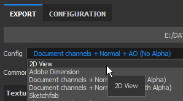

# 版本 2018.3

**Substance Painter 2018.3** 已經推出，帶來了許多新的工作流程和渲染功能！

上映日期： *2018年11月20日*

## 主要特色

### 2D 視圖匯出

現在可以 **將 2D 視圖** 渲染 **匯出成貼圖**。 這項功能受到許多人的請求，我們終於讓它上架了！ 匯出過程會根據目前 2D 視圖&#x200B;**的狀態**，來渲染出符合一般匯出設定（填充、檔案格式、位元深度）的貼圖。這表示如果視圖模式設為 **單人（Solo** ）而非 **材質模式（Material** mode），2D 視圖會直接匯出。

前往 **匯出視窗** ，選擇名為「**2D View**」的新配置：\

匯出視窗的設定&#x200B;**標籤中也有一個**&#x200B;名為&#x200B;**「** 2D View **」的新轉換地圖**，方便你自行建立&#x200B;**匯出預設**。

### 改良烘焙光影濾鏡

**烘焙光照環境**&#x200B;濾鏡大幅改進，現在能正確支援 **HDR 環境貼圖**。\
你現在可以複製視窗的光照（在 2D 視角中看到的），並將其烘焙到基礎色彩通道中。 新濾鏡提供更多控制，例如&#x200B;**垂直**&#x200B;**旋轉環境**&#x200B;貼圖&#x200B;**&#x200B;**&#x200B;及改變&#x200B;**曝光**。

### 即時各向異性鏡面反射

在這個新版本中，我們引入了一個名為「**pbr-metal-rough-anisotropy-angle**」的新著色器。 此著色器支援兩個通道，分別稱為「**各向異性角度**」與「**各向異性層級**」，可用來產生各向異性鏡面反射。 這個著色器也能直接轉成 Iray，無需任何轉換。

這個新著色器可以透過 [著色器視窗](../../interface/shader-settings/shader-settings.md) 點擊著色器按鈕並開啟迷你書架進入：

預設的範例專案「**Preview Sphere**」已更新，利用這個新著色器並展示如何設定不同通道。

>[!NOTE]
>
> 如果你在各向異性角度&#x200B;**通道中使用漸層**&#x200B;時出現奇怪的&#x200B;**線條瑕**&#x200B;疵，試著將濾波模式改成「**最近**」，以防填充層，這可能會改善著色器的取樣並解決問題。

### 更新透明毛色 Shader

**Clear Coat** 著色器（**pbr** 塗層）已改進，提供更多控制與渲染選項。我們也藉此機會讓它與 Iray 相容&#x200B;**，並搭配專用**&#x200B;的 MDL **。**

以下是變更清單：

* **控制** 次級 **粗糙度** 層（透過 **User0** 通道）。
* **透過 User1** 通道遮蔽&#x200B;**次級層**。
* 選擇要套用哪種行為給表面圖層： **保留法線細節** （原始）或 **平滑表面** （新，忽略網格法線貼圖）

為了方便起見，我們也新增了一個新的專案模板，準備為這個新著色器貼圖，名為： **PBR - 金屬粗糙塗層**。

### 新視窗抗鋸齒

我們 Substance Painter 的抗鋸齒後製過程已被重新設計並改為一種稱為「**時間抗鋸齒」（** Temporal Anti-Aliasing，TAA **&#x200B;**）的新方法。\
這種新技術在每種情況下都能以極低的成本提供更好的效果。 **TAA** 透過在多個畫面中累積資訊，能產生非常平滑的邊緣而不損失細節。

由於不再是後製效果，設定在顯示設定視窗中稍微&#x200B;**移動，現在位於**&#x200B;後期效果&#x200B;**區塊下方**&#x200B;**。**

這項新的抗鋸齒技術結合透明度，也帶來全新的可能性。 如果專案使用 **Alpha-Test** 著色器，請試著啟用「**Alpha 抖動**」設定：

新的 **TAA** 也能很好地過濾鏡面反射&#x200B;**&#x200B;**&#x200B;和次表面散射&#x200B;**樣本中**&#x200B;可見的藍噪圖案。

### 稀疏虛擬貼圖（SVT）

這個新版本的一大改變是引入 **了稀疏虛擬貼圖（Sparse Virtual Textures** ，簡稱 **SVT**）。

這套新系統改變了 Substance Painter 的一些基本原理及其應用方式。 Substance Painter 現在使用 SVT 來維持視埠的特定記憶體佔用，允許 **串流進出貼圖**。 主要好處是能更輕鬆地載入較大專案，並減輕 GPU 對 **提升效能**&#x200B;的壓力。 這表示如果資料開始變得太大，我會在磁碟上卸載一些貼圖，必要時再取回來。 這是一個 **揮發性快取** ，應用程式關閉時會被刪除。

系統的另一項優點是視窗內&#x200B;**&#x200B;**&#x200B;引入&#x200B;**了 mipmap**，能提升材質品質並減少 Moire 效應，尤其在 Fabric 圖案中可見。

我們公開了一些關於這個新系統的控制措施，可以在主偏好設定（**編輯>設定**）中進行編輯：

* **快取目錄** ：此設定控制 Substance Painter 將寫入暫存檔案的位置，包括 SVT 快取。
* **硬體支援加速** ：啟用後，Substance Painter 會使用 GPU 原生支援的稀疏貼圖（若關閉，則會退回到軟體實作）

欲了解更多SVT相關資訊，請參閱我們的文件頁面： [稀疏虛擬貼圖](../../features/sparse-virtual-textures.md)

>[!NOTE]
>
> 建議將快取目錄&#x200B;**設**&#x200B;在&#x200B;**固態硬碟（SSD）上，**&#x200B;以確保使用 Substance Painter 時最佳效能。
> 
> 這些設定可透過環境變數 ： [環境變數](../../pipeline-and-integration/configuration/environment-variables.md)來覆寫。

### 全新與改良對稱工具

對稱工具已被重新設計，現在可以偏移原點。 當專案部分對稱或偏心時，計畫可以進行調整。 偏移量會依軸儲存在專案內。

我們也藉此機會對該功能加以關注，現在有了新的視覺回饋：

* 現在預設&#x200B;**會在網格上畫**&#x200B;一條&#x200B;**交點**&#x200B;線，用來顯示對稱平面的位置。
* **現在移動游標**&#x200B;時&#x200B;**會出現一個鏡像點**，顯示鏡像筆觸將應用的位置。

所有新視覺效果皆可透過情境工具列中的對稱選單進行調整：

* **鏡像X、鏡像Y、鏡像Z** ：定義對稱性所用的方向
* **偏移** ：控制每個軸的偏移值。 十字箭頭圖示允許將所有偏移量重置回 0。
* **對稱平面** ：顯示平面允許繪製切割網格的平面。 Show Intersection 會在網格上畫一條線，平面在網格切割處。
* **對稱游標游標**:Show會繪製一個次要的刷子游標，並套用對稱性。「繪畫時隱藏」只會在不畫畫時顯示該游標。
* **操作器** ：顯示操作器會在視窗中顯示一個操作器以偏移對稱平面。 **操作手的大小** 控制控制器在視窗中的大小。

**與三平面及UV操作手相同的快捷鍵**&#x200B;可用來隱藏或顯示對稱操作手：

* **問** ：展示/隱藏操控者
* **Shift：** 快轉平移（離散偏移）
* **+ / -** ：改變操作手尺寸

### 改良型三平面操作手

除了用來控制旋轉的三個原軸外，我們也新增了一個旋轉球體，以控制三平面操作手。 例如，球體讓你更容易快速嘗試不同角度來投射噪音模式。

### 匯出 8bit 抖動貼圖

當將法線貼圖與高度貼圖貼圖匯出為 8 位元格式的檔案格式時，Substance Painter 現在會自動套用&#x200B;**抖動**&#x200B;以減少&#x200B;**條紋**&#x200B;**問題**。

>[!NOTE]
>
> 如果匯出預設使用法線貼圖，但 alpha 中有其他東西（例如 RGB = 法線，A = 粗糙度），則只有法線會被抖動。

### 層堆疊行為改進

對圖層堆疊與圖層管理進行了一些工作流程改進：

* 透過&#x200B;**右鍵選**&#x200B;單將圖層和資料夾&#x200B;**分配**&#x200B;顏色&#x200B;**&#x200B;**&#x200B;**&#x200B;**&#x200B;來組織圖層。\
  Substance Painter 的圖層顏色行為與其他軟體套件略有不同：
  * 資料夾內的圖層會繼承資料夾的顏色（但會顯示較暗）。
  * 在有顏色的資料夾中移動未分配顏色的圖層，會繼承該資料夾的顏色。
  * 如果圖層有專用顏色，資料夾不會覆蓋它。這種原始行為讓著色和組織圖層堆疊變得更容易，而不必手動分配太多顏色。

* 透過點擊滑&#x200B;**鼠快速隱藏和解除隱藏**&#x200B;多個&#x200B;**圖層**&#x200B;**。**\
  我們也趁機稍微調整了隱藏資料夾中解隱藏圖層的行為，這樣資料夾也會同時解除隱藏。

* 用 Arrow 鍵盤快捷鍵&#x200B;**快速**&#x200B;切換混合模式&#x200B;**。**&#x200B;**&#x200B;**\
  關閉&#x200B;**混合彈出選單後**，**焦點**&#x200B;會&#x200B;**持續**&#x200B;停留在該圖層上，且可以透過相同的快捷鍵繼續更改。

### 濾波器與產生器的新物質輸入

新增了Substance輸入，用於自訂濾波器和產生器。 這些新的材質輸入讓更多進階效果得益於新的網格相關資訊。

新增的輸入有：

* 網格位置
* 網格世界空間法線
* 網格世界空間切線
* 網格世界空間雙尖
* 網格紋素尺寸
* 網狀 UV 遮罩

更多細節請參閱新文件： [基於網格的輸入](../../content/creating-custom-effects/mesh-based-input.md)

舉例來說，我們現在提供一個名為「**UV Border Distance**」的新&#x200B;**遮罩產生器**，它能從目前材質集的 UV 島嶼邊界建立黑白遮罩。

>[!NOTE]
>
> 這些輸入直接來自 Substance Painter 的引擎，基於專案 Mesh，並未使用 Bakers[&#128279;](../../baking/baking.md)。

### 新增與更新內容

在這個新版本中，我們加入了新內容：

* 將用於新&#x200B;**任異性**&#x200B;著色器的程序式&#x200B;**漸層**&#x200B;圖案：

  * 各向異性徑向
  * 梯度環形
  * 漸變盤重疊
  * 漸變盤移位
  * 漸層石片
  * 漸變替代
  * 梯度檢查器
  * 梯度檢查雙重
  * 漸層織法
  * 梯度織法旋轉
  * 梯度織角
  * 梯度織角旋轉\
    
* 新 **環境** 地圖：

  * Studio 汽車中立\
    
* 新 **專案**  **範本** ：

  * PBR - 金屬粗糙度各向異性角
  * PBR - 金屬粗糙塗層
* 新 **內容** ：

  * 人類女性 30 多歲 臉部 06（可透過書架上的 Skin 預設快速找到）\
    這種由 Texturing.XYZ **提供**&#x200B;的新皮膚材質，能提供極佳的表面細節，讓皮膚呈現逼真的膚色。\
    

我們也更新了一些現有內容以精煉：

* 更新器篩選「**烘焙光照環境**」：見上文。
* 更新的濾鏡「**MatFx Shutline**」：現在允許隱藏材質效果，只保留高度/法線結果。
* 更新 **範例專案** ：預覽球體現在可以對稱使用，並新增了自訂渲染的攝影機角度。 它的預設著色器現在是「各向異性角度」。

## 發行說明

### 2018.3.3

（2019年3月7日發行）

**補充：**

* [內容]整合新專案範本：「PBR - 金屬粗糙度 Alpha 混合」
* Linux 動態函式庫搜尋順序改為優先將安裝目錄中的函式庫置於系統已安裝的函式庫之前

**修正：**

* 網格有時會從 3D 視窗消失（按 F 重置相機）
* [glTF]更新 Substance Painter Sketchfab 上傳器，新增 Sketchfab 授權類型
* [匯入][glTF]錯誤處理輸入貼圖調變，依 glTF 檔案定義
* [匯入][glTF]glTF 匯入時地面平面顯示錯誤
* [出口][美元]不透明度在 Arkit 中無法運作
* [出口][美元]USDz 出口在某些情況下崩潰
* [出口][美元]未存檔匯入美元可能導致崩盤
* [匯出][美元]貼圖平鋪模式錯誤，網格分割模式錯誤，著色器輸出類型錯誤
* [匯出][美元]僅部分材質集的稀疏匯出，包含所有幾何體
* [實例]嘗試刪除損壞實例圖層時會當機
* [回歸][匯出]有些地圖未以選定的位元深度匯出
* [Linux]函式庫 libtbb.so.2 的問題

**已知問題：**

* 在某些情況下，AMD VEGA GPU 會出現計算凍結的情況
* Huion 平板在 Windows 作業系統上出現捷徑的問題

### 2018.3.2

（2019年1月24日發行）

**補充：**

* 摘要：新增功能的熱修補
* [匯出]允許出口至USDZ
* [視窗]允許在顯示設定中控制材質品質
* [視窗]新增顯示設定中的 mip 偏壓設定
* [視窗]在顯示設定中新增各向異性濾波
* [插件]更新官方插件以使用 Substance Painter 2018 的風格
* [授權]預設安裝授權，存在使用者資料夾

**修正：**

* 墜機與減壓有關
* 在獨奏曲目上加入TAA（TAA）
* 搭配陰影的雜訊、TAA 和帶有抖動的 alpha 測試著色器
* 移除所有經典 PBR 著色器的鏡面抖動
* 在某些情況下，著色器設定會當機
* OpenGL 與 Iray 渲染之間的散射啟動並未同步
* 模糊和複製工具在特定網格上已經無法使用了
* 有些貼圖集無法出現在 Iray 渲染中
* 關閉專案後，已命名的材質集不會被儲存
* 在 ID 貼圖上拖放材質時，線框產生的瑕疵
* [腳本操作]儲存專案時不會強制建立檔案路徑
* [腳本播放]回調「onProjectAboutToSave（）」已經無法使用
* 論壇連結在回報錯誤視窗中斷裂

**已知問題：**

* 在某些情況下，AMD VEGA GPU 會出現計算凍結的情況
* Huion 平板在 Windows 作業系統上出現捷徑的問題

### 2018.3.1

（2018年12月6日發行）

**補充：**

* 摘要：熱修補
* [對稱][視窗]2D視角的對稱繪製回歸，並新增了克隆筆刷預覽功能

**修正：**

* [匯出] 2D 視圖匯出在某些情況下會輸出黑色紋理
* [Iray]在實例化材料層後，正常資訊在 Iray 中變得不正確
* 非方形的貼圖集有時會導致當機
* [復原]多次按 Ctrl+Z 有時會隨機導致當機
* [QML]AlgScrollView 在某些情況下可以在日誌中建立警告（綁定迴圈）

**已知問題：**

* 在某些情況下，AMD VEGA GPU 會出現計算凍結的情況
* Huion 平板在 Windows 作業系統上出現捷徑的問題
* 抗鋸齒與陰影同時啟用時，可能會產生意想不到的效果

### 2018.3.0

（2018年11月20日發行）

<b><b>補充：</b></b>

* 摘要：視窗升級、正確的 2D 視圖匯出、新的 UI 輔助工具、強化的對稱工具、新內容以及大幅提升的效能
* [抗鋸齒][視窗]新的 3D 視窗抗鋸齒過濾（透過顯示設定）
* [匯出]將 2D 視口的內容匯出為單一材質
* [匯出][抖動]揭露導出時的抖動
* [圖層堆疊]圖層與資料夾上的顏色
* [層疊]快速啟動與停用多層與效果
* [圖層堆疊]使用上下鍵和滑鼠捲動，讓混合模式更為簡便
* [計畫][使用者介面]三軸額外旋轉操作器，適用於三平面
* [Proj][Shorcuts] - 以及 + 以改變 UV 投影操控器的大小
* [著色器]在 PBR 塗層著色器中，透過通道控制塗層參數
* [物質]為濾鏡和產生器暴露新的基於網格的紋理輸入
* [對稱][視窗][使用者介面]操控對稱偏移與操控手
* [對稱性][情境工具列][使用者介面]新對稱面板與選項
* [對稱性]新的對稱線交集模式
* [對稱]新的對稱複製游標
* [對稱][捷徑]Q 鍵隱藏，+鍵變大小，Shift 鍵 snap 鍵
* [日誌]無法匯出貼圖時改善錯誤訊息
* [腳本]允許在顯示設定中更改或更新資源
* [腳本]允許在貼圖集中建立或移除通道
* [內容][著色器]透過專用著色器（pbr-metal-rough-anisopy-angle）來支援各向異性
* [內容]預覽球面的各向異性與修正角度更新
* [內容]更新的 matFx 關閉線
* [內容]全新 Texturing.XYZ 無縫臉部掃描
* [內容]新的各向異性程序劇
* [內容]新濾鏡：烘焙光影環境
* [內容]新環境地圖：studio automotive neutral
* [內容]新專案範本：PBR - 金屬粗糙度各向異性角度（含各向異性通道）
* [內容]新專案範本：PBR - 金屬粗糙塗層
* [SVT][引擎]稀疏虛擬貼圖（SVT）
* [SVT][偏好設定][使用者介面]SVT 硬體支援加速選項
* [SVT][日誌]稀疏虛擬貼圖功能（例如磁碟大小）的額外資訊
* [SVT][使用者介面]如果磁碟容量過小以無法容納快取，起始時的訊息視窗
* [SVT][偏好設定][使用者介面]Substance Painter 全球快取位置
* [SVT]新增環境變數以指定 Substance Painter 快取的路徑
* [SVT]啟用 SVT 硬體支援加速的新環境變數
* [SVT]偵測硬體支援稀疏
* [SVT][硬體稀疏]提高 Nvidia GPU 的最低驅動程式版本
* [SVT][著色器][視窗][使用者介面]專案開始時，若出現稀疏虛擬貼圖的瑕疵，請提醒使用者

<b><b>修正：</b>\
</b>

* [顏色選擇器]嘗試選擇顏色時會出現繪畫游標
* 透過選擇或取消選取特定順序的圖層而導致當機
* 貼上一個帶有遮罩的圖層實例時會當機
* [使用者頻道][回歸]重新命名用戶頻道時會當機
* [使用者頻道]灰刷預覽
* [Alembic]匯入後僅有一套材質材質的材質
* [引擎]匯出的材質與刷子印記的視窗不同
* [引擎]帶有等級效果的反轉不會完全影響材質
* 材料選擇器是在撥打時用刷子劃過
* 把解析度切換到 128x128px 會導致當機
* 網格地圖連結在重新烘焙或實例化圖層時沒有正確更新
* [Substance]UserData ColorSpace 無法在烘焙網格法線中作為輸入使用。
* 使用多個著色器實例時的 MDL 關聯不匹配
* [對稱性][填充層]對稱平面及其操作器在填充層中啟動
* [視窗]點擊後翻譯樞軸不一定更新
* [使用者介面]HDPI 顯示器的圖示固定與佔位符移除

<b><b>已知問題：</b>\
</b>

* AMD VEGA GPU 的計算凍結問題
* Huion 平板在 Windows 作業系統上出現捷徑的問題
* 抗鋸齒與陰影同時啟用時，可能會產生意想不到的效果

<b>  
</b>
