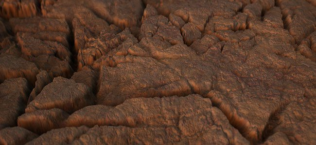
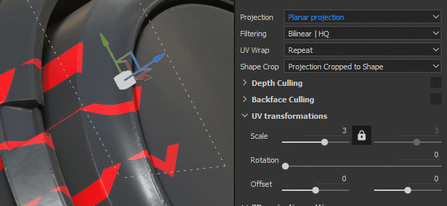
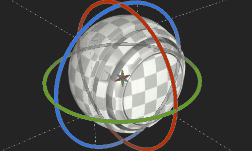

# 版本 2019.1

**Substance Painter 2019.1** 擴充了既有功能，並引入了新的藝術工具。 這次發行同樣著重於帶來大量新內容。

上映日期： *2019年4月23日*

## 主要特色

### 動態筆觸

這次發行後，我們的筆刷引擎支援所謂的動態筆劃。 這類筆觸會因即時產生新的Substance版本而產生變化與新效果。 現在可以為資產上每多一筆刷就換一個新的物質材質或 alpha。

當你的繪圖工具（Paint、Eraser、Smudge 或 Clone）載入一個相容動態筆觸的資源時，會出現一個新的參數群組：

動態筆觸支援以下屬性（若在物質圖中顯示）：

* **郵票索引** ：ID / 郵票號碼，內含一筆劃。
* **隨機種子** ：每張印章或每一筆劃都可能改變。
* **時間** ：畫筆經過的時間，快速或較慢會產生不同的效果。

郵票索引還有另外兩個參數：

* **郵票起始**：從開始&#x200B;*（從 0 開始索引）或*&#x200B;從隨機索引&#x200B;*（選擇 0 與由&#x200B;**印花循環數**&#x200B;定義的最大值*&#x200B;之間的隨機位置）。
* **印花循環計數** ：此參數定義將產生的物質變化總量。 為了優化效能，此參數作為極限。 Substance Painter 用它來回收已生成的素材，而不是創造新的東西。

你只要瀏覽書架，看看現在旁邊的新圖示，就能找到與此新功能相容的資源：

與此功能相容的資源也會自動獲得一個名為「**動態筆劃**」的新標籤，方便在書架中依關鍵字篩選。

我們也新增了許多 **新的工具預設** 可供調整：

{width="450px"}

>[!NOTE]
>
> 想了解更多關於此功能（及其效能影響），請參閱 [專門的文件](../../painting/dynamic-strokes/dynamic-strokes.md)。

### 位移與鑲嵌

Substance Painter 現在在即時視口和 Iray 中都支援 **位移** 與 **網格鑲嵌** 。 它們都可以在 **著色器設定視窗裡的著色器參數** 下方控制。

* **來源通道** ：網格變形所依據的通道。 預設是高度，但也可以設定為位移。
* **縮放** ：控制專案中網格所施加的變形量。

* **細分模式** ：均勻或邊長。 決定如何計算細分的數量。
* **細分數量** ：（模式均勻）從1到32。 高值會產生更多多邊形，這會提供更多細節，但也可能帶來效能問題。
* **最大長度** ：（模態邊長）1 / 值。 每個多邊形邊都會被分割，直到每個段段大小等於或更短，1/1 是場景的大小。

載入「**平鋪材質**」範例專案（透過 **檔案>載入樣本**），快速試用這個新功能：

{width="450px"}{width="450px"}

>[!NOTE]
>
> 架子中新增了一個名為「**Height To Normal**」的新濾鏡，可用來取得最終法線貼圖（以防 Substance Painter 的原生轉換不夠強大）。

### 比較面具效應

製作和混合材質有時會有點困難，所以我們創造了一個新效果叫做「**比較遮罩**」。 此效果能快速且輕鬆地比較兩個通道，並產生遮罩效果。

比較遮罩效應具有以下特性：

* **通道** ：用於比較來源與目標以建立遮罩的通道。
* **比較** ：這裡有三個參數可用來選擇遮罩的計算方式。 中間的下拉選單定義比較運算（小於、在公差範圍內、大於）。
* **Constant** ：當比較設定設為「constant」時，用來比較的數值。
* **硬度** ：控制所產生遮罩比較的平滑度與硬度。
* **直方圖** ：提供來源與目標的直方圖視圖。 知道它們是否有重疊或完全沒有重疊很有用（如果不重疊，遮罩會是空的）。

為了讓設定更簡單，你可以右鍵點擊圖層，選擇快捷鍵「**新增帶有高度組合**&#x200B;的遮罩」，快速將這個新遮罩加入你的圖層。 這個快捷鍵也會把你的高度通道混合模式切換成「普通」，而不是預設的「線性閃避（新增）」。\

### 放射對稱

我們擴展了對稱工具的能力，以處理徑向對稱。 現在在對稱設定選單中新增了一個啟用模式（可在情境工具列中取得）。

以下設定可供選擇：

* **X / Y / Z** ：控制徑向對稱所用的對稱軸方向。
* **計數** ：重複分數。
* **角度跨** 度：原始點重複點的位置。 這個設定可以用來畫一個完整的圓圈或四分之一圓，等等。

我們也新增了一點預覽功能，方便在開始上色前調整設定：

### 新的填充層投影模式

新增兩種投影模式，包含填充層與填充效果： **平面** 投影與 **球面**&#x200B;投影。 我們也加入了許多新參數，進一步控制 3D 投影的行為。

* **新平面投影模式**\
  透過這個新模式，投影平面現在成為可能。 它對於在車輛上製作條紋或在特定位置貼貼貼紙很有用。

  
* **平面投影曲面工具**\
  為了讓平面投影更容易操作，我們也新增了一個稱為 **Surface Tool** 的 3D 操作手控制器，可用快捷鍵&#x200B;**「Shift+W**」進入。 也可以從情境工具列存取。 請注意，這個新模式僅在平面投影中提供。

  

  
* **平面投影剔除/衰落**\
  有多種設定可使平面投影為連續或有限。 啟用剔除設定時，操作手周圍的點線框表示投影的邊界框，中間線則是投影起點。 縮放投影可以控制投影的距離以及何時開始消退。

  {width="500px"}

  
* **新的球面投影模式**\
  球面投影現在可以用這個新模式實現。 有了它，你可以做出進階的模式，或是跟隨較容易彎曲的曲面。

  {width="350px"}
* **新的形狀裁切設定**\
  3D 投影現在有設定來控制投影的重複性。 例如，貼紙只在特定區域重複出現，無需手動遮罩，非常實用。

  {width="500px"}
* **移動並重新命名現有設定**\
  因為這些新投影，我們稍微調整了部分設定的運作方式。 例如「**平鋪**」被重新命名為「**UV Wrap**」。 現在鋪磚只能垂直或水平設置。 縮放、旋轉和偏移現在成為一個名為「**UV 轉換**」的新參數群組，以便在不同投影模式間更一致。

  

  
* **改良版旋轉操作手全軸模式** 不再繪製明確球體，而是隱藏以避免隱藏下方的貼圖。 點擊軸之間的位置會選擇球體，讓所有軸都能同時旋轉。\
  

### 各種改良

* **材質集的多重選擇**\
  現在可以透過紋理集設定同時選擇多個貼圖集來調整解析度。\
  在多重選取模式下，仍有「主要」材質集的概念，因此額外元素會以灰色選取。 如果你需要切換到不同的材質集，但保留目前的選取，可以用滑鼠中鍵來切換。
* **在材質集合清單中快速顯示/隱藏**\
  你現在可以點擊並拖曳（像圖層堆疊裡一樣）來隱藏或顯示貼圖集。
* **圖層堆疊的改良介面**\
  我們改變了圖層隱藏/顯示狀態的圖示，使其更一致且更容易理解。 我們也改變了選取圖層的顯示方式，使其更容易與其效果及其他圖層的選擇比較。\
  
* **根據目前選取** 的新效果位置，任何新增在圖層上的效果都會放在目前選取的效果上方。\
  
* **快速切換材質通道按鈕**\
  你現在可以按 ALT 鍵，點擊頻道按鈕來隔離它。 再點擊一次，所有頻道都會重新啟用。\
  
* **匯出** 時的抖動現在可以透過匯出視窗中檔案格式和位元深度旁的專用設定來停用抖動。 關於抖動如何及何時應用 [，請參閱](../../export/export-window/export-window.md)匯出文件。\
  
* **更佳直方圖**\
  我們重新設計了直方圖產生器。 直方圖現在應該能顯示更準確的資訊，並在圖層堆疊變更後正確更新。\
  
* **更佳的層次實例化**\
  實例化圖層的混合模式現在設定為「通過」，而非預設的混合模式。 此混合模式將提升部分效果在不同材質集間實例化時的相容性。

### 新內容

這次版本我們也加入了許多新內容：從預設到Alpha，甚至還有全新的強大濾鏡。

* **新的畫筆與工具預設**\
  這次版本引入了新的動態筆觸功能，並加入了一些可用的筆刷與工具預設。

  * 10 個全新 Brush 預設：
    * 墨水髒了
    * 墨水隨機
    * 葉曲重
    * 葉曲
    * 葉子凌亂
    * 葉子簡單
    * 葉旋
    * 之字形長距離
    * 之字短路
    * 之字形步
  * 11 個全新工具預設：
    * 秋葉
    * 裂紋
    * 足跡
    * 漸層色相
    * 釘子
    * 卵石
    * 刮痕
    * 噴漆
    * 噴漆輕盈
    * 噴漆紅
    * 拉鍊
* **93位新阿爾法**\
  種類太多，無法全部列舉，所以看看書架的「Alpha」區，你會看到許多新的箭頭、三角形、標誌和其他各種形狀。
* **13 個新濾鏡**\
  這個新版本加入了許多新篩選器，對於許多情況非常實用：

  * **模糊斜坡** ：新增了模糊濾鏡。 這個濾鏡的運作方式和變形濾鏡類似：使用現有的輸入或自訂的輸入來模糊目標通道。
  * **斜角** ：在形狀周圍建立漸層邊框，如果你想擴展遮罩，這很有用。
  * **色彩匹配** ：此濾鏡嘗試將來源顏色與目標顏色匹配。 調整材質顏色很方便。
  * **漸層曲線** ：此濾波器提供可套用於任何灰階輸入的曲線預設列表，以改變其外觀。
  * **漸層動態** ：將灰階輸入重新映射為新的輸入影像（灰階或彩色）。
  * **高度調整** ：此濾波器提供兩種設定，方便輕鬆操作高度通道：偏移與乘法。
  * **高度轉為正常** ：此濾波器將高度通道轉換為標準通道，並輸入正常通道。 根據需求，它有不同的強度控制。
  * **遮罩輪廓** ：此濾鏡會在灰階輸入周圍產生黑底白邊框。 這在遮罩中最有用，可以用來建立形狀周圍的邊界。
  * **PBR 驗證** ：我們新增此濾鏡以檢查您的 PBR 材質顏色是否在正確範圍內。 想了解更多資訊，請 [參考PBR指南](https://www.allegorithmic.com/pbr-guide) ！
  * **MatFX 剝落油漆** ：模擬舊油漆開始剝落。 這個濾鏡會輸出 alpha，方便與下方材質混合。
  * **MatFx 水滴** ：模擬物體表面的水滴。 就像雨後車子上的水一樣。
* **7 台新發電機**\
  這次釋出我們新增了幾個產生器：

  * **環境遮蔽** ：遮罩產生器，提供環境遮蔽網格地圖的控制。 基於 Mask Editor。
  * **世界空間法線：** 遮罩產生器，提供對世界空間法線網格貼圖的控制。 基於 Mask Editor。
  * **位置** ：提供對位置網格貼圖控制的遮罩產生器。 基於 Mask Editor。
  * **曲率** ：提供曲率網格地圖控制功能的遮罩產生器。 基於 Mask Editor。
  * **自動縫合器** ：遮罩產生器，能在 UV 邊界、網格曲率或自訂遮罩輸入附近建立縫線。
  * **UV Texel Density** ：根據網格多邊形的 Texel 密度輸出彩色漸層的輔助工具。
  * **UV 隨機色彩** ：為每個 UV 島嶼產生隨機顏色（或基於自訂漸層輸入）。
* **2 張新環境地圖**

  * 秋之森林
  * 卡諾普斯球場

    
* **5 部新程序劇**

  * 漸層色相
  * 梯度建構器
  * 依索引進行色彩抖動
  * 種子著色抖動
  * 羽毛風格化

    

## 教學課程

歡迎查看我們的教學，介紹我們最新的功能：

我們在Substance Academy上也有教學，教你如何製作動態筆劃： [為Substance Painter製作自訂動態筆劃](https://academy.allegorithmic.com/courses/Creating-a-custom-Dynamic-Stroke-for-Substance-Painter)

## 發行說明

### 2019.1.3

*（2019年7月1日發行）*\
摘要： **包含兩項新功能的錯誤修正**

**修正：**

* 「跟隨路徑」並非每次都有效
* 頻道映射無法在單頻道插槽中使用的 SBSAR 上運作
* [圖層堆疊]隱藏圖層捲動時效能低
* [貼圖集]點擊遮罩間時當機
* [SVT]位移顯示不正確，有些情況下會閃爍
* [Alembic]使用點法線取代頂點法線的網格崩潰
* [Alembic]&#x200B;[日誌]如果匯入時不支援 Alembic 檔案，日誌中會報錯

### 2019.1.2

*（2019年5月21日發行）*\
摘要： **HotFix**

**修正：**

* 在輸入影像時選擇兩個資源時會當機

### 2019.1.1

*（2019年5月20日發行）*\
摘要： **HotFix**

**補充：**

* Substance Engine 最新版本，最新版本為 Substance Designer 2019.1

**修正：**

* [實質]可見 如果輸入影像未被考慮
* [SVT]&#x200B;[引擎]更改貼圖集解析度在某些情況下會導致當機
* [引擎聲]在某些情況下會出現隨機的黑色紋理
* [圖層堆疊]&#x200B;[使用者介面]使用 SHIFT 切換遮罩可同時選擇多個圖層
* [圖層堆疊]不透明度對穿透混合模式下的繪圖效果沒有影響
* [圖層堆疊]高度到法線濾鏡輸入在橡皮擦刷筆劃時無法正確更新
* [層疊]解除智慧面罩掉落時當機
* 線框閃爍陰影與時間抗鋸齒啟動
* [位移]在 AMD 上遇到重金屬網格時會有延遲
* [Windows]透過檔案總管開啟某些專案時會當機
* [直方圖]在某些情況下，移除帶有錨點的遮罩時會發生撞擊
* 在某些罕見情況下，預覽產生時會當機
* [撞擊聲]無法用太多複製和污漬工具重新開啟專案
* 有些情況下，儲存後材質模式中沒有顯示網格
* [腳本] alg.mapexport.documentStructure（） 回傳錯誤的資料夾值

**已知問題：**

* 雙擊貼圖集名稱後，會在進入重新命名模式前選取它

### 2019.1

*（2019年4月23日發行）*\
摘要： **動態筆觸與專屬新內容、即時位移與鑲嵌、Iray、比較遮罩效果、徑向對稱、平面投影與球面投影**

**補充：**

* [工具]動態筆觸：與筆觸並行的物質變化
* [動態筆劃]顯示新的郵票索引參數並有選項
* [動態筆觸]考慮$time參數
* [動態筆劃]每筆劃及每印章產生新的$randomseed參數
* [動態筆劃]從隨機數字開始一個動態筆劃索引
* [動態筆劃]&#x200B;[書架]幫忙尋找帶有專用新圖示的動態筆劃資源
* 即時視窗中的位移與鑲嵌
* Iray 中的位移與鑲嵌
* [著色器設定]&#x200B;[使用者介面]新增控制位移與鑲嵌的新分頁
* [圖層堆疊]新的 CompareMask 效果：透過比較兩個通道來產生遮罩
* [圖層堆疊]&#x200B;[使用者介面]右鍵選單新增「Add mask with height combination」以插入 CompareMask 效果
* [對稱]新對稱模式：放射狀繪畫
* [對稱設定]展開「設定」和「顯示」兩個區塊
* [對稱設定]&#x200B;[使用者介面]放射狀塗裝預覽
* 顯示兩種新的投影模式：平面投影與球面投影
* [專案]所有投影的新形狀裁切模式
* [計畫]平面模式搭配新操控器：表面工具
* [計畫]&#x200B;[快捷鍵]Surface 工具的快捷鍵 SHIFT+W
* [計畫]平面投影遮罩結合深度剔除與背面剔除
* [操作手]三軸旋轉操作手的改良，適用於三平面
* [工具]&#x200B;[使用者體驗]Alt 點擊該頻道聚焦（啟用或停用其他頻道）
* [引擎]更新至最新版本的物質引擎
* [貼圖集]多重選取與變更解析度
* [材質集]快速啟動與停用材質集
* [材質集]將單人和所有選項合併到新選單中
* [貼圖集]&#x200B;[圖層堆疊]啟用與停用的新圖示
* [圖層堆疊]&#x200B;[使用者體驗]在已選取的效果上方插入
* [圖層堆疊]&#x200B;[使用者介面]重製圖層堆疊視圖選擇風格
* [圖層堆疊]實例圖層的混合模式現在預設為直通模式
* [匯出]啟動與停用抖動的選項
* [外掛]支援滑桿的精確修飾鍵（SHIFT）
* [外掛]&#x200B;[使用者介面]自動存檔的新圖示
* [腳本操作]列出資料夾內容
* [腳本]允許刪除檔案
* [腳本]閱讀所有堆疊資訊，包括已使用資源
* [內容]&#x200B;[動態筆劃]新工具與筆刷預設
* [內容]&#x200B;[動態筆劃]兩種新的程序化漸層：漸層色調與漸層建構器
* [內容] 11 款新濾鏡：MatFx 剝落漆、MatFx 水滴等
* [內容] 7 個新產生器：自動縫合器、UV 隨機色彩、UV 紋素密度等
* [內容] 93個新阿爾法：新文字、箭頭及其他各種形狀
* [內容] 2 個新程序化作品：漸層色調、漸層建材者及更多
* [內容] 21 個全新 Dynamic Strokes 工具與畫筆預設：Pebbles、Footprints、Spray 等
* [內容] 2 新 HDRis：卡諾普斯地與秋森林
* [內容]更新內容，並隨機整理種子於書架上
* [內容]書架上新圖示，顯示隨機種子參數

**修正：**

* [層疊]層疊一直拖不下去
* [Mac]「搜尋顯示」可能導致凍結
* [腳本]如果移動著色器檔案，透過自訂介面儲存的設定就會遺失
* [腳本操作]API 版本號錯誤且不夠最新
* [影響]直方圖內容未正確顯示
* [影響]直方圖效應在某些情況下不會更新
* [書架]「塑膠布料金字塔」材料上的針目未正確對齊

**已知問題：**

* 雙擊貼圖集名稱後，會在進入重新命名模式前選取它
* [圖層堆疊]&#x200B;[使用者介面]使用 SHIFT 切換遮罩可同時選擇多個圖層
