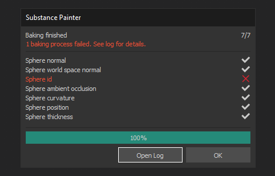
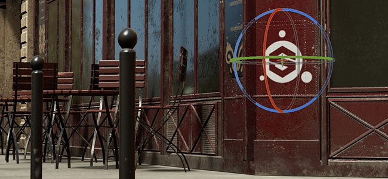

# 版本 2019.2

**Substance Painter 2019.2** 為其烘焙師帶來全新強大功能，並在貨架上推出全新智慧材料與智慧口罩。

上映日期： *2019年7月25日*

## 主要特色

### 烘焙師工作流程改進

這次版本的烘焙工作流程有了改進，新增了一些功能。 這些改進將加快並簡化 Substance Painter 的日常工作。

* **烘焙過程視覺化**\
  預設情況下，任何烘焙過程都會在視窗中顯示。 它允許即時預覽烘焙師的成果，甚至必要時取消，無需等待流程結束後提供更快的迭代。 這個行為可以透過進入主設定，並在「**烘焙選項**」區塊中取消勾選「**啟用即時預覽烘焙過程**」設定來停用。

  

  {width="500px"}
* **改進的烘焙對話**\
  烘焙對話框經過重新設計，現在顯示出目前烘焙過程的狀態。 現在有一個計數器來顯示將計算的紋理數量，並且每個烘焙者和紋理集都有明確的清單列出正在計算的材質。 若有錯誤，麵包師名稱旁會顯示紅色叉號。 流程結束時，有一個新按鈕可以快速開啟日誌視窗，以了解更多問題資訊。\
  
* **取消正在烘焙** 的過程 烘焙過程不再鎖定應用程式。 Substance Painter 現在更靈敏，意味著你可以取消正在進行的烘焙，而不必等它結束。 不過取消並非立即生效，可能需要幾秒鐘才能生效。 這是因為內部烘焙過程是分塊處理材質，無法在計算區塊時停止。 取消烘焙過程時，烘焙視窗會自動重新開啟。\
  

### 烘焙師的績效提升

隨著工作流程的改進，我們也趁機更新烘焙師並提升他們的表現。 我們也加入了 DXR 和 Optix 的支援，讓 GPU 光線追蹤比以前更快完成烘焙。 不過請注意，GPU 光線追蹤只影響環境遮蔽和厚度烘焙器。

* **CPU 光線追蹤已改進**\
  CPU 上的光線追蹤計算速度現在比以前快了 2 到 3 倍。 所以即使你的 GPU 不支援 GPU 光線追蹤，整體效能還是會提升。
* **GPU 光線追蹤支援 DXR 與 Optix**\
  有了相容硬體，烘焙師現在能直接在 GPU 上計算，大幅縮短計算時間，尤其當啟用抗鋸齒並定義大量光線時。 DXR 是預設選項（若有），否則會使用 Optix。 你可以進入主設定[&#128279;](../../interface/settings/settings.md)並尋找「**烘焙選項**」來關閉 GPU 光線追蹤：

  

>[!NOTE]
>
> 要啟用 GPU 光線追蹤功能，請務必更新到以下驅動程式： **Nvidia 驅動程式 430.86**。\
> DXR 支援 RTX GPU 和 [GeForce GTX 10xx GPU](https://www.nvidia.com/en-us/geforce/news/geforce-gtx-dxr-ray-tracing-available-now/)。 DXR 也要求 Windows 10 是最新版本（版本 1809）才能存取，詳情請參見此頁面。

>[!WARNING]
>
> 使用 GPU 光線追蹤時，若高多邊形網格無法放入 VRam，烘焙器可能會失敗。 當發生這種情況時，建議進入[主設定](../../interface/settings/settings.md)，在「**烘焙選項**」區塊中關閉「**GPU 光線追蹤**」設定。之後你就可以重新啟動烘焙過程。

### 其他新功能與改進

在這個版本中，我們也新增並重新設計了一些功能，以提升 Substance Painter 的生活品質。

* **改良旋轉機械手**\
  過去旋轉操控器有點慢，導致旋轉有時變得繁瑣。 旋轉速度現在與攝影機和場景大小掛鉤。
* **在高 DPI 螢幕上使用視窗降細的效能提升**\
  在主設定[&#128279;](../../interface/settings/settings.md)中現在有一個名為「Viewport Scaling」的新參數，值為「**None**」和「**Auto**」（預設值）。當 Substance Painter 偵測到螢幕使用 HDPI 縮放（例如 MacOS的 Retina 螢幕）時，會自動將視窗解析度除以 2。 這種行為避免了視窗繪製過大，並提升整體效能，且不會明顯損耗品質。

  
* **新的 Console 腳本外掛**\
  我們創建了一個新外掛，方便從腳本 API 執行指令。 該文章可在 Github 上取得： <https://github.com/AllegorithmicSAS/painter-plugin-console>。 主機也支援自動補全。

  

### 新內容

預設書架新增了一套智慧材料與智慧口罩，以涵蓋各種用途。 以下是新增資產的完整清單：

* **40 種新智慧材料**

  * 布料
    * 布料畫布有摺痕
    * 布料複合材料加強版
    * 布料牛仔布被洗掉了
    * 布料法蘭絨格子花紋
    * 布料亞麻摺痕
    * 布料亞麻所穿
    * 布料合成點
    * 所用布料合成運動
  * 皮革
    * 皮革小牛紋
    * 皮革摺痕
    * 皮革 自然色
    * 皮革粗糙暗色
  * 大理石 - 花崗岩
    * 綠阿爾卑斯大理石
  * 金屬
    * 金色受損表面
    * 鐵鍛古老
    * 鋼鐵塗漆，剝落髒污
    * 鋼材塗漆粗糙損壞
    * 鋼鐵 塗漆 刮擦 骯髒
    * 鋼鐵塗成刮擦綠色
    * 鋼鐵 塗漆 磨損
    * 鋼鐵毀滅
  * 有機物
    * 異形藍生物皮膚
    * 生物皮膚 綠色光滑
    * 生物牙齒
    * 生物之舌
  * 塑膠 - 橡膠
    * 塑膠塵埃
    * 塑膠光面刮痕
    * 塑膠光面染色
    * 塑膠顆粒軟
    * 塑膠粗糙刮痕
    * 塑膠熱成型
    * 塑膠 厚重 裂開
    * 磨損的塑膠工具
    * 塑膠 軟質
  * 石頭
    * 藍寶石剛玉
  * 半透明
    * 玻璃薄膜 髒鏡
  * 木頭
    * 木炭
    * 森林阿卡朱
    * 木船船體北歐
    * 木船舊船體
* **20 款全新智慧口罩**

  * 皺紋
  * 泥土空洞
  * 泥土地面
  * 泥土洩漏 乾涸
  * 泥土軟邊
  * 泥土飛濺
  * 泥地點
  * 塵埃塑膠
  * 塵埃柔軟邊緣
  * 塵埃表面
  * 灰塵寬邊
  * 邊緣髒裂縫
  * 邊緣石裂縫
  * 邊緣堅韌，刮痕
  * 布料線
  * 油漆受損
  * 油漆細微刮痕
  * 沙空
  * 沙塵
  * 水滴聲

## 發行說明

### 2019.2.3

*（2019年10月23日發行）*\
摘要： **錯誤修正**

**補充：**

* [材質集合列表]新增按鈕可快速啟用/關閉對焦模式
* [日誌]在日誌檔中新增 Windows 10 版本號
* 更新至最新版本的 Substance Engine。
* [MacOS]公證軟體以符合新的 MacOS Catalina 發行需求

**修正：**

* [外掛]外掛來源無法運作
* [MacOS]&#x200B;[著色器]Mac OS 10.14.5 與 AMD：材質分層無法如預期運作

**已知問題：**

* 帶有細分的 Alembic 檔案無法匯入
* 匯入某些 Alembic 檔案時罕見地當機
* 在 Pascal GPU 上用 DXR 烘焙時，UI 暫時沒有反應

### 2019.2.2

*（2019年9月20日發行）*\
摘要： **錯誤修正**

**修正：**

* 透過腳本匯入資源可能導致當機
* [外掛]從原始碼下載素材可能導致當機

### 2019.2.1

*（2019年9月17日發行）*\
摘要： **錯誤修正**

**修正：**

* [Mac]&#x200B;[美元]從 MacOS 匯出的 USDZ 檔案無法開啟
* [貼圖集]無法用 ALT 修飾鍵分離貼圖集
* [書架]預設、智慧材料與智慧口罩在退出應用程式時都會被修改
* [圖層堆疊]刪除其他效果後無法選擇效果
* 在工具屬性面板中使用滑桿時閃爍
* 匯出預設到架子時當機
* 匯出空間不足的預設時會當機
* 建立空間不足的預設時會當機

**已知問題：**

* 帶有細分的 Alembic 檔案無法匯入
* 匯入某些 Alembic 檔案時罕見地當機
* 在 Pascal GPU 上用 DXR 烘焙時，UI 暫時沒有反應

### 2019.2

*（2019年7月25日發行）*\
摘要： **重大發行，包含烘焙師在效能上的更新，以及新的預視覺化模式+新內容**

**補充：**

* [Bakers]新增對 GPU 光線追蹤的支援，支援 DXR 與 OptiX（環境光遮蔽、厚度）
* [Bakers]CPU 光線追蹤的優化與加速
* [烘焙師]&#x200B;[視覺模式]&#x200B;[使用者介面]視窗新增烘焙視覺化模式
* [烘焙師]&#x200B;[偏好設定]&#x200B;[使用者介面]啟用或關閉 GPU 光線追蹤的新烘焙選項
* [烘焙師]&#x200B;[使用者介面]進度條對話重製
* [麵包師]警告與錯誤訊息的改進
* [烘焙師]允許更靈敏的烘焙取消流程
* [烘焙師]點擊取消後重新開啟烘焙視窗
* [計畫]&#x200B;[使用者體驗]旋轉操作器的可用性提升
* [設定]透過降低 HDPI 螢幕的視窗解析度來提升效能的選項
* [腳本操作]更改材質集解析度
* [腳本]取得選取的材質集
* [腳本]允許使用者選擇材質集
* [腳本]用來知道貼圖集選擇何時被更改的功能
* [書架]新增40種智慧材料
* [書架]新增20個智慧口罩

**修正：**

* [圖層堆疊]多重選取圖層時 UI 凍結
* [圖層堆疊]將大量圖層分組會讓 UI 凍結時間比平常更長
* [圖層堆疊]在某些情況下，圖層與效果可同時被選擇
* 繪畫工具中使用的物質圖並非以正確解析度產生
* [烘焙師]當沒有選擇烘焙者時，「烘焙所有材質集」按鈕並未被關閉
* [MacOS]關閉關於拼接的警告訊息
* 投影工具搭配遮罩使用時沒有預覽功能
* 當嘗試儲存且磁碟空間不足時，專案會當機和損壞
* [架子]在磁碟上透過空間不足的架子匯入資源時會當機
* [書架]恢復會話預設時會當機
* [書架]匯入一個以空格結尾的預設會導致當機
* [書架]匯入以空格結尾的前綴資源會導致當機

**已知問題：**

* 帶有細分的 Alembic 檔案無法匯入
* 匯入某些 Alembic 檔案時罕見地當機
* 在 Pascal GPU 上用 DXR 烘焙時，UI 暫時沒有反應
