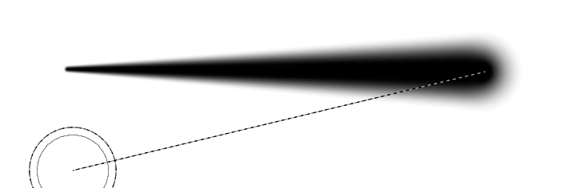
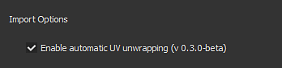
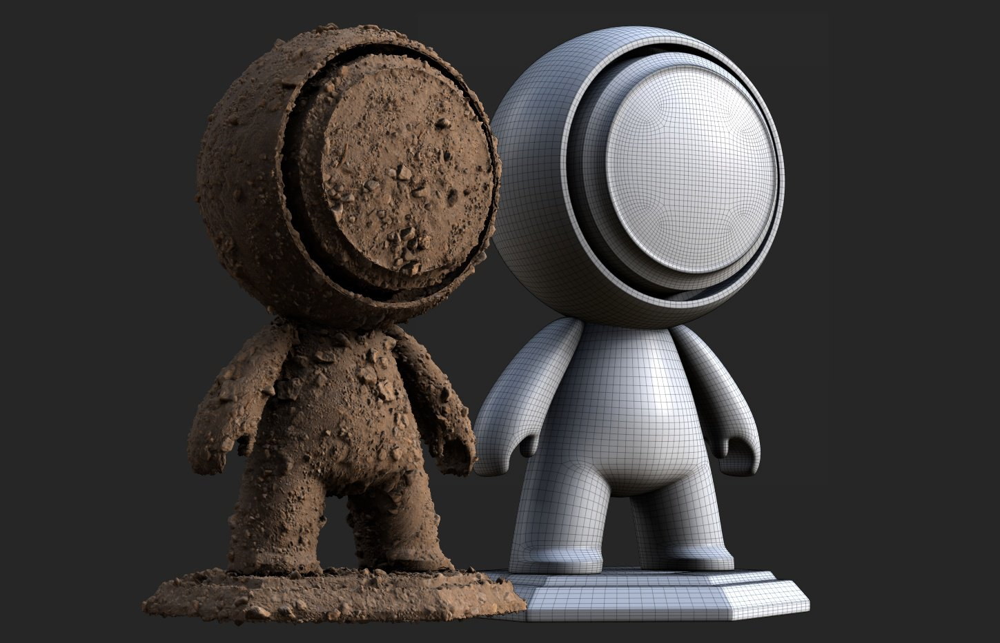
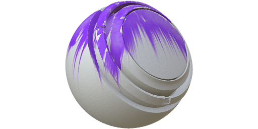
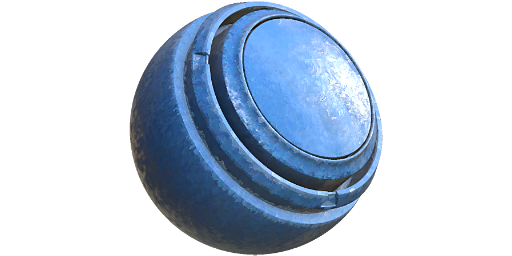
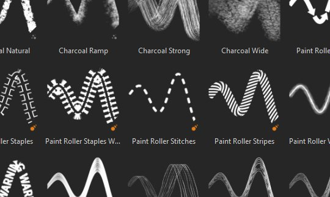

# 2019.3 版本

**Substance Painter 2019.3** 新增了 Photoshop 筆刷預設支援與自動 UV 展開網格功能，並帶來多項生活品質提升，例如更佳的繪圖板處理。

發行日期： *2019年12月17日*

## 主要特色

### Photoshop 筆刷預設支援（ABR）

你現在可以在 Substance Painter 中使用你的 Photoshop 筆刷。 只要匯出預設檔成 ABR 檔，你就可以匯入成一般的筆刷預設。 ABR 檔案中包含的預設會以獨立的筆刷預設形式出現在 Shelf 中。

如果你沒有 ABR 檔案可以匯入，網路上有很多：

* [Adobe 上的 Kyle 筆刷預設](https://www.adobe.com/products/photoshop/brushes.html)
* [ArtStation 上的刷子預設](https://www.artstation.com/marketplace?q=photoshop%20brush&sort_by=trending)
* [DeviantArt 上的筆刷預設](https://www.deviantart.com/search?q=photoshop%20brush)
* [Cubebrush 上的刷子預設](https://cubebrush.co/marketplace?categories=354,57)

為了支援 Photoshop 筆刷，繪製工具屬性新增了多項功能：

* **新的尺寸與流量最小參數**\
  現在你可以在啟用筆壓時指定工具的最小尺寸和最小流量。 此參數以百分比計算，基於當前最大流量定義。 這些設定在使用 Photoshop 筆刷預設時會自動校正。\
  
* **新位置抖動參數**\
  為了符合 Photoshop 筆刷的行為，我們新增了幾個設定。 現在可以定義抖動被套用在哪個軸上，以及隨機位置的分布方式（選擇 **統一** 以匹配 Photoshop）。\
  \
  
* **新的 alpha 混合模式**\
  Photoshop 的筆觸合成方式與 Substance Painter 不同，因此我們新增了一個混合模式（Lighten）以更貼近繪畫效果。 當印章重疊時，這種混合模式不會過度累積，這能改善在低流量/不透明度值下上色時的壓力感。\
  \
  
* **支持圓度與翻轉**\
  新增了名為 **Brush Maker Photoshop** 的 Substance Alpha，支援圓度（縮放 Alpha 高度）和翻轉（雙軸鏡像影像）等參數。 當點擊來自 ABR 檔案的筆刷預設時，這個 Substance Alpha 會自動載入。\
  \
  
* **層中α通道的新伽瑪校正**\
  Photoshop 不會在線性伽瑪空間中混合筆觸，這表示用 Photoshop 筆刷預設繪製時，混合和不透明度可能會看起來不對勁。 可以在圖層上啟用新設定以匹配該行為並套用伽瑪校正。 這會影響用於繪製筆觸的 alpha 值，以及該圖層遮罩如何與其他圖層混合，但圖層的混合模式仍會在線性伽瑪空間中運作。\
  要 **啟用此設定**，只需右鍵點擊圖層，選擇 **Gamma 修正的 alpha/mask**。 圖層旁邊會出現一個新圖示，表示此設定啟用時會顯示。\
   \
  
* **增加間距與位置抖動的最大值**\
  為了正確匹配 Photoshop 筆刷預設參數，以下參數的最大值已提高：

  * **間距**：最大值現在可設定為 1000。
  * **位置抖動**：最大值現在可以設定為 1000。

如需更多資訊，例如如何匯出 ABR 檔案並匯入，請參閱 [Photoshop 筆刷預設](../../painting/presets/photoshop-brush-presets/photoshop-brush-presets-abr.md) 文件。

>[!NOTE]
>
> 目前並非所有 Photoshop 筆刷參數都支援，詳情請參閱 [相容性清單](../../painting/presets/photoshop-brush-presets/photoshop-brush-parameters-compatibility.md) 。

### 繪畫與繪圖板支援改進

除了支援 Photoshop 筆刷預設外，還有許多與繪圖板相關的改進與修正。

* **直線的第一張郵票不再重複列印**\
  畫直線時，第一張印章不會再重複（不需要為了把直線放到位置就還原印章）。\
  
* **直線壓力插值**\
  直線現在支持壓力。 壓力值會在第一枚與最後一枚之間插值。\
  
* **新的筆刷預覽模式**\
  視窗中的筆刷預覽現在可以切換成不同的視覺化模式。 要更改模式，只需點擊情境工具列中的新下拉按鈕即可。

  
* **筆壓曲線**\
  在情境工具列中，現在可以定義筆壓應如何解讀。 這些新設定控制壓力累積的速度，允許不同的繪畫風格。

  * **線性**：無變形，取回的壓力由繪圖板筆提供。 如果平板驅動程式設定中已經定義了筆壓曲線，請使用此設定。
  * **緩入** （預設）：放慢壓力的起點，讓畫出細或淡的筆觸更容易。
  * **緩緩進出**：放慢壓力的起始速度，加快結束速度，使畫出柔和或有力的筆觸更容易。

  
* **壓力按鈕不再是下拉選單了**\
  我們把筆壓控制改成簡單的開關按鈕。 這使得開啟與關閉壓力變得更簡單且快速。

  
* **提升對繪圖板的支援與轉換為 Windows Ink**\
  我們重新設計了繪圖板的處理方式。 這應該能提升與近期繪圖板型號的相容性，並減少過去遇到的問題。 在 Windows 上，我們也改用 Windows Ink 取代 Wintab，以提升相容性。

  >[!NOTE]
  >
  > 請確保你的 Wacom 驅動程式是最新的，且繪圖板設定中啟用了「Windows Ink」。

### 自動紫外線展開（測試版）

Substance Painter 現在會自動展開缺少 UV 座標的網格。 這樣就能匯入任何幾何體，並立即開始繪製。 我們的 UV 展開系統會為每個子網格產生一個 UV 島嶼，同時仍依照材質指派建立貼圖集。 此功能目前仍處於測試階段，未來版本將持續演進。 自動展開只會套用在不使用 UDIM 工作流程&#x200B;**的專案**&#x200B;上。

* **自動紫外線展開**\
  預設情況下，Substance Painter 會自動為缺少 UV 座標的網格產生 UV 座標。 這適用於專案建立和網格重新匯入。 不過，你可以進入[主設定](https://helpx.adobe.com/substance-3d/unlisted/documentation/spdoc/general-71008262.html)，在&#x200B;**匯入選項**&#x200B;中關閉「啟用自動 UV 展開」****&#x200B;來關閉此行為。

  
* **UV 展開進度條**\
  匯入網格時會有一個進度條，顯示程序目前的狀態。 這也包括紫外線展開的過程。

  
* **目前已知的問題**\
  由於這項新功能目前仍處於測試階段，預期會有一些問題。 請參閱下方的發行說明，了解目前已知的問題清單。 若應用程式當機並產生錯誤結果，我們建議透過應用程式傳送當機或錯誤報告，協助我們調查問題並改進流程。

>[!NOTE]
>
> 架子上新增了一個 **產生器** ，幫助視覺化自動拆包裝的過程。 使用方法是建立一個新圖層，加入產生器效果，然後載入新的 **UV 檢查** 器資源。

### 物質整合改進

我們持續改進 Substance 格式的整合，支援一些期待已久的功能，同時也改進了現有系統，如動態筆觸功能。

* **非夾具，搭配軟音區滑桿**\
  直到現在，Substance 圖表中裸露的滑桿總是像被夾住一樣。 也就是說，可以輸入的值不能超過參數定義的預設最小值和最大值。

  
* **對參數中定義的階梯的支持**\
  現在調整滑桿時會考慮有明確步驟參數的實體圖。
* **浮動滑桿的數字精度提升**\
  浮點滑桿現在可以有小數點以下到 6 位的輸入值。 然而，這受限於浮點精度，意味著在某些情況下輸入值可能會被四捨五入。
* **新隨機種子控制與動態筆劃**\
  現在可以在定義範圍內請求多個隨機種子值。 這讓玩家能創造獨特且隨機的物質變體，同時透過快取回收獲得良好效能。\
  在動態筆劃群組中，將隨機種子類型&#x200B;**參數切換**&#x200B;為&#x200B;**隨機每筆劃**&#x200B;或&#x200B;**隨機每個印章**&#x200B;以存取新參數。**隨機樣本量**&#x200B;定義總共會產生多少物質變體。一旦產生了金額，組合中會隨機選擇變體。

  
* **新增使用者資料靜態動態筆劃**\
  新增一項優化功能，允許指定何時某物質可視為動態筆觸。 類似於 Visible If，現在可以在 userdata 欄位新增條件，指定 Substance Painter 應在何種條件下透過動態筆劃功能產生新的 Substance 變化。 更多資訊請參閱 [userdata 文件](../../content/creating-custom-effects/user-data.md) 。
* **新增使用者資料，指定輸出節點作為所有通道的遮罩**\
  現在可以在輸出節點新增一個使用者資料，作為所有其他通道的 alpha 遮罩。 這與現有 **通道/_Alpha** 系統類似，但不需要在 Substance 圖中建立新的專用輸出。 更多資訊請參閱 [userdata 文件](../../content/creating-custom-effects/user-data.md) 。

### 其他改進

應用程式的其他部分也做了多項改進，有助於 Substance Painter 的日常工作。

* **獨立視窗焦點**\
  2D 與 3D 對焦（F 快捷鍵）已修改為以下行為：

  * **滑鼠移到2D視圖**&#x200B;上：按F只會聚焦2D視圖。
  * **滑鼠移到3D視圖**&#x200B;上：按F只會聚焦3D視角。
  * **滑鼠在**&#x200B;視窗外：按 F 可以同時聚焦 2D 和 3D 視角。

  {width="400px"}
* **烘焙視窗鍵盤與選單快捷鍵**\
  烘焙窗口可以用兩種新方式開啟：

  * 按 **Ctrl+Shift+B** 鍵。
  * 進入編輯選單，點選 **「烘焙網格貼圖**」即可。

  
* **用 Ctrl+Alt+左鍵快捷鍵在 Scroll Docks 和 Windows 上**\
  新增了一個快捷鍵，可以不用滑鼠滾輪就能捲動視窗和底座。 這個捷徑現在可以用繪圖板的筆來滾動。

  
* **性能改進**\
  在背後，已經進行了許多優化，應該能提升 Substance Painter 的整體效能（從開場專案到繪畫）。

### 新內容

這次釋出新增了許多內容：

* **更新版「Meet Mat」範例專案**\
  Mat 已更新為新的拓撲結構，使其對位移更友善。 ID 地圖已重新設計，提供更多遮罩可能性，專案中新增一組攝影機以提供新的視角。

  {width="500px"}
* **新濾波器**\
  新增了3個篩選器，讓風格化內容更簡單：

  * **MatFx 漫畫書**\
    此濾波器根據輸入（從底色/漫射到曲率）模擬陰影與邊緣線。

    
  * **MatFx 水彩**\
    此濾鏡透過讀取輸入顏色，模擬水彩繪畫的色彩滲透與紙張吸收。

    
  * **MatFx 油畫顏料**\
    受Emrecan Cubukcu](https://www.artstation.com/emrecancubukcu)研究啟[發，此濾鏡讀取輸入的色彩資訊，並根據各種參數轉換成筆觸。有多種預設可供選擇，方便嘗試不同的變化。 我們建議搭配烘焙光影環境&#x200B;**濾鏡，**&#x200B;或手動烘焙/繪製陰影，以最大化效果。

    

    

    >[!NOTE]
    >
    > 這是一個非常昂貴的濾波器，計算起來可能需要一些時間。 迭代時建議先停用包含該效果的圖層，再調整下方的圖層。
* **新的畫筆預設**

  * **102 個 Photoshop 筆刷預設**\
    隨著 Photoshop 筆刷支援的推出，新增了一套預設來展示這個功能。 這些預設是從 Kyle T. Webster 在 Adobe 網站上](https://www.adobe.com/products/photoshop/brushes.html)提供的[套件中挑選出來的。

    {width="500px"}
  * **18 種新刷子預設**\
    除了 Photoshop 筆刷預設外，還新增了更常見的預設：

    * 基本硬壓力
    * 木炭精細
    * 炭筆全幅
    * 炭光
    * 炭媒介
    * 木炭天然
    * 炭屑坡道
    * 擺動筆觸密集
    * 搖擺的點
    * 與分手的搖擺中風
    * 搖擺的節奏
    * 油漆滾筒箭頭
    * 油漆滾筒釘書針
    * 油漆滾筒釘書針
    * 油漆滾筒針法
    * 油漆滾輪條紋
    * 油漆滾筒脈管長而窄
    * 油漆滾筒警告文字

    {width="500px"}
* **新工具預設**\
  新增了兩個模擬水粉顏料的新工具預設。

  * 不透明濃密。
  * 水粉色褪色了。

  
* **新阿爾法**\
  除了用於創建新筆刷預設的 alpha（見上文）外，還整合了兩個重要的 Alpha：

  * **刷具製作 Photoshop**\
    這個新的 Substance 圖表複製了 Photoshop 中透過動態筆觸功能提供的部分特定筆刷參數。 透過此，可以控制圓度和翻轉，或輸入影像。 也有一些抖動參數可用來創造更多變化。 當點擊來自 ABR 檔案的 Photoshop 筆刷預設時，這個 Substance 圖表會自動插入 Alpha 區塊。

    
  * **刷子製造者油漆滾筒**\
    這個新的物質圖模擬了油漆滾筒（或簡單的緞帶工具），用來連續繪製帶有旋轉且不會斷裂的圖案。 為了讓設定更簡單，可以看看現有的預設或參考圖表描述。 我們建議啟用 [Lazy 滑鼠](../../painting/lazy-mouse.md) ，讓滾筆筆能正確繪製，避免造成斷線。

    

    {width="290px"}
* **全新「UV檢查器」產生器**\
  一個名為「UV checker」的新產生器已被整合，以協助分析網格的 UV 座標。 這讓我們自動 UV 展開產生的 UV 更容易理解。

  
* **新範本與匯出預設**

  * **關鍵攝影 9+**\
    這個匯出預設讓匯出的材質與新的 Keyshot 9 功能相容，該功能簡化了材質與材質的載入與分配。 更多資訊請參閱 [Keyshot 文件](https://luxion.atlassian.net/wiki/spaces/K9M/pages/1124335675/Material+Importer)。
  * **Spark AR 工作室**\
    這個新的專案範本和匯出預設讓使用 [Spark AR Studio](https://sparkar.facebook.com/ar-studio/) 變得更簡單。

>[!WARNING]
>
> * 此版本不再支援 MacOS 10.11（El Capitan）。
> * 此版本不再支援 CentOS 6.x。
> * 在 CentOS 7.5（或更低版本）中，應用程式可能因某些相依性問題無法啟動，若要解決問題，請更新系統或複製 [安裝資料夾中的以下函式庫](https://centos.pkgs.org/7/centos-x86_64/freetype-2.8-12.el7.x86_64.rpm.html) 。

## 發行說明

### 2019.3.3

*（2020年2月6日發行）*\
摘要： **升級至 Iray 2019.3 的錯誤修正**

**補充：**

* 升級至 Iray 2019.3
* [日誌]顯示 Ryzen CPU BIOS 過時，導致烘焙時當機
* [ABR]將ABR阿爾法提取至架上

**修正：**

* [烘焙師]如果高多邊形網格沒有 UV，烘焙失敗
* [Linux]自訂滑鼠捷徑不會被儲存
* [刷子]輪廓隨著一些阿爾法形狀消失
* [平板]移動滑桿時偵測不良
* [捷徑]無法設定任何「Ctrl+Alt+MouseClick」的捷徑。
* [書架]使用繪圖板時無法看到資源提示
* [2D 視圖][匯出]2D 視圖預設不考慮一般資訊
* 用某些畫筆在 UV 對齊時會凍結
* 在濾鏡下作畫會在持續的筆觸上產生假象
* [視窗]重新匯入網格後，視窗中的貼圖快取錯誤
* [當機]匯出到 Photoshop 後儲存時出現錯誤
* [撞擊聲]匯入資源時在前綴中寫入特殊符號
* [撞擊聲]點擊錨點屬性中的參考資料
* [錨點]當錨點與參考點之間存在過濾器時，通道不會更新
* 說明選單中的 Iray 網址連結無法使用

**已知問題：**

* [UV展開]處理高多邊形網格可能需要很長時間
* [UV展開]完全相同座標的頂點會合併
* [UV 展開]在某些罕見情況下，某些網格部分的 UV 生成可能會失敗
* [UV展開]在某些情況下，單一UV島的像素比不均勻或高度失真
* [UV 展開]貼圖集間的非均勻像素比
* [UV 展開]產生的 UV 島嶼有時會非常拉長，在某些情況下無法放入 UV 空間
* [UV 展開]退化面或非三角形網格面且邊緣小或重疊，可能無法展開 UV

### 2019.3.2

*（2020年1月21日發行）*\
摘要： **錯誤修正**

**修正：**

* 開啟以單通道模式儲存的專案時，網格不會顯示
* 用複製工具在圖層下繪製時，視窗並不總是更新

**已知問題：**

* [Bakers]與 Ryzen CPU 多執行緒相關的當機
* [UV展開]處理高多邊形網格可能需要很長時間
* [UV展開]完全相同座標的頂點會合併
* [UV 展開]在某些罕見情況下，某些網格部分的 UV 生成可能會失敗
* [UV展開]在某些情況下，單一UV島的像素比不均勻或高度失真
* [UV 展開]貼圖集間的非均勻像素比
* [UV 展開]產生的 UV 島嶼有時會非常拉長，在某些情況下無法放入 UV 空間
* [UV 展開]退化面或非三角形網格面且邊緣小或重疊，可能無法展開 UV

### 2019.3.1

*（2019年12月20日發行）*\
摘要： **熱修正**

**修正：**

* 在處理具有特定 UV 投影的網格時會當機
* [ABR]切換 Photoshop 預設時會當機
* [Linux]由於 libGLX 依賴性問題，無法在 CentOS 7.4 上啟動 Substance Painter
* [烘焙師]使用檔案>清潔後烘焙時當機
* [烘焙師]烘焙進度對話在取消後凍結
* [烘焙者]匯出材質後烘焙網格無法運作
* [烘焙師]使用「依姓名匹配」與黑色網格地圖結果
* [麵包師]凱奇未被納入考量
* [書架]匯入 PSD 檔案會導致圖片損壞
* [範例]「Mat」範例專案有壞掉的攝影機和錯誤的匯出預設

**已知問題：**

* [Bakers]與 Ryzen CPU 多執行緒相關的當機
* [UV展開]處理高多邊形網格可能需要很長時間
* [UV展開]完全相同座標的頂點會合併
* [UV 展開]在某些罕見情況下，某些網格部分的 UV 生成可能會失敗
* [UV展開]在某些情況下，單一UV島的像素比不均勻或高度失真
* [UV 展開]貼圖集間的非均勻像素比
* [UV 展開]產生的 UV 島嶼有時會非常拉長，在某些情況下無法放入 UV 空間
* [UV 展開]退化面或非三角形網格面且邊緣小或重疊，可能無法展開 UV

### 2019.3.0

*（2019年12月17日發行）*\
摘要： **重大釋出，提升手繪使用者體驗、與平板相容、自動 UV 展開（測試版 0.3.0）及多元新內容**

**補充：**

* 在 Substance Painter 中整合自動 UV 展開 0.3.0 版本
* [UV 展開]Substance Painter 中當無 UV 存在或部分 UV 時，自動展開 UV
* [紫外線展開]一個全域設定可啟動或關閉
* [UV 展開]日誌檔報告版本
* [UV 展開中][使用者介面]顯示 UV 展開進度
* [使用者介面]情境工具列新增設定以選擇筆刷預覽：完整預覽、筆刷輪廓與準星
* [工具]alpha 區新增進階混合模式：除普通外，還要用 Lighten（最大）
* [圖層堆疊]每層的 Gamma 修正選項，用於 alpha 或遮罩（右鍵選單）
* [圖層堆疊][使用者介面]當層 alpha 經過伽瑪校正時，請新增「i」圖示
* [平板][工具]以最小壓力來調整尺寸和流量
* [繪圖板][使用者介面]情境工具列新增設定，可選擇曲線壓力：線性、易入、易入易出
* [平板][使用者體驗]新增 Ctrl+Alt+點擊以捲動
* 匯入 Photoshop 筆刷預設（ABR 格式）
* [ABR]支撐形狀參數
* [ABR]支撐形狀動力學參數
* [ABR]支持傳輸參數
* [ABR]支持散射參數
* [ABR][動態筆觸]支撐圓潤與翻轉
* [ABR][書架]在濾鏡編輯器中揭露刷子資料夾結構
* [ABR][書架]在縮圖中新增 Photoshop 圖示
* [ABR][書架]在 ABR 詳細縮圖中加入未支援參數清單
* [工具][動態筆劃]新的動態筆劃設定，用來控制產生多少隨機種子
* [工具][使用者介面]新增散射抖動的分布與軸設定
* [捷徑]新增 Ctrl+Shift+B 以開啟烘焙視窗
* [使用者介面][選單]在「編輯」選單中新增條目以開啟烘焙視窗
* [使用者介面][設定]改進捷徑清單的對齊
* [使用者介面]將壓力控制（大小與流量）圖示替換為開關按鈕
* [視窗]允許分別聚焦 2D 與 3D 視窗
* 更新至 QT 5.12.5
* [使用者介面]顯示網格載入進度
* [物質]用滑桿支撐非夾具和柔和範圍
* [物質]將物質參數精度提升至小數點數6位
* [實質]考慮由參數定義的步驟
* [內容]在使用者資料中支援條件優化動態筆劃產生
* [內容]允許透過使用者資料將圖形輸出指定為所有通道的遮罩
* [內容]更新「Mat」範例專案，加入位移友善拓撲、新識別地圖及新相機
* [內容]整合三種新濾鏡（MatFx）：漫畫、水彩、油畫（靈感來自Emrecan Cubukcu的作品）
* [內容]整合 Kyle T. Webster 的 102 個 Photoshop 筆刷預設
* [內容]整合18個新筆刷預設：油漆滾筒箭頭、油漆滾筒警告文字、炭筆精細等
* [內容]整合9個新alpha：Brush Maker Paint Roller、Brush Maker Photoshop、Brush Pattern 等
* [內容]整合兩個新工具預設：水粉濃密與水粉淡化
* [內容]整合 1 個新產生器：UV 檢查器（標示 UV 島嶼與接縫）
* [內容]整合兩個新的匯出預設：Keyshot 9+ 與 Spark AR Studio
* [內容]整合 1 個新專案範本：Spark AR Studio（Facebook）

**修正：**

* [繪圖板]還原觸控筆筆觸（Ctrl+Z）比還要延遲
* [平板]畫直線時未考慮起始與結束壓力
* [平板]使用直線時，第一枚郵票會畫兩次
* [平板]提升對Huion平板捷徑的支援
* [平板]提升對輝光筆按鈕的支援
* [平板]筆刷預覽與繪製郵票之間的錯位
* [平板]用筆修改刷具的捷徑在罕見情況下會導致效能下降
* [平板]在特定圖層上繪製時延遲
* 在切換視窗時，偶爾會出現模糊的貼圖
* [使用者介面][物質]影像輸入不一定會顯示
* Clean 不會移除專案中已匯入的預設
* [工具][動態筆劃]調整郵票週期數時的效能問題
* 在 3D/2D 視窗模式下繪製時，偶爾會出現刷新率問題
* 畫一筆很長的筆觸可能會導致凍結
* [工具]使用特定動態筆觸繪製時的效能問題
* [使用者介面]選擇資料夾時，情境工具列仍會顯示筆刷屬性
* 對稱軸值不會重置
* 匯入帶有浮點數值的 EXR 貼圖會完全黑
* Alt+點擊頻道來隔離，對濾波器和產生器都沒用
* [匯出]特定專案在匯出時當機
* [內容]如果參數被可見隱藏，下拉選單預設值不正確
* [著色器]透過材質分層定義的通道在使用者介面中排序方式不同
* [書架]預設的元資料不會儲存在磁碟上

**已知問題：**

* [UV展開]處理高多邊形網格可能需要很長時間
* [UV展開]完全相同座標的頂點會合併
* [UV 展開]在某些罕見情況下，某些網格部分的 UV 生成可能會失敗
* [UV展開]在某些情況下，單一UV島的像素比不均勻或高度失真
* [UV 展開]貼圖集間的非均勻像素比
* [UV 展開]產生的 UV 島嶼有時會非常拉長，在某些情況下無法放入 UV 空間
* [UV 展開]退化面或非三角形網格面且邊緣小或重疊，可能無法展開 UV
* Meetmat 範例在進口攝影機時有一些問題
