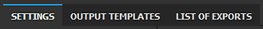
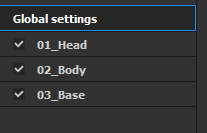
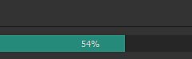
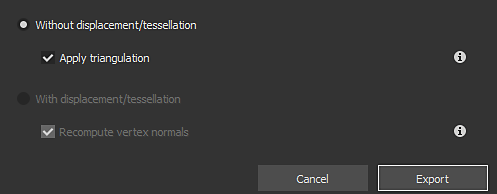
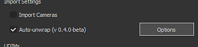
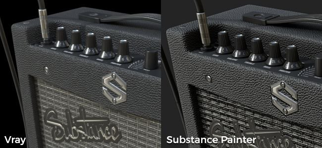

# 版本 2020.1 （6.1.0）

**Substance Painter 2020.1（6.1.0）** 帶來了全新的匯出器、Python 腳本、新的曲率烘焙器、新內容，以及許多其他工作流程的改進。

發行日期： *2020年4月22日*

>[!NOTE]
>
> 從本版本開始，應用程式版本號將開始改變格式。 **2020.1** 現在改為 **6.1.0**。

## 主要特色

### 新的匯出材質視窗

匯出視窗已完全重製，提供更簡單且直接的方式來設定和匯出專案中的材質。 它也帶來了一些新功能，讓出口變得更加方便。 新的匯出視窗現在分為三個分頁：

**場景設定**

這個分頁控制每個貼圖集的一般和具體設定。

* **全新全域設定**\
  全域設定是一組在所有材質集間共享的參數。 它們可以用來快速指派或更新參數，而不必逐一手動編輯每個貼圖集。 全域設定有以下參數：

  * **輸出目錄**：定義了將生成貼圖的目標位置。
  * **輸出範本**：定義用來設定匯出材質命名與打包的預設。
  * **檔案類型**：定義匯出材質的檔案格式與位元深度。
  * **Size**：定義 Texture Set 匯出時的最大材質解析度。
  * **填充**：定義紫外線島外資訊的產生方式。
  * **匯出著色器參數**：啟用時會匯出一個 json 檔案，裡面儲存著色器設定及其貼圖集指派。

  
* **依材質集設定與參數覆蓋**\
  在全域設定下方是目前已開啟專案的貼圖集清單。 一般匯出參數區塊顯示繼承自全域參數的設定。 也可以在每個材質集&#x200B;**選擇不同的**&#x200B;匯出預設。

  

  點擊筆圖示可以覆蓋特定參數以改變其數值。 再點一次會停用覆寫，並將數值重設回預設值（繼承自全域設定）。

  
* **選擇要匯出哪些材質**\
  在 Texture Sets 匯出參數下方，有一份將被產生的材質清單。 透過此清單，您可以透過勾選或取消勾選來精確選擇要產生哪個檔案。 該清單同時顯示每個紋理的檔案格式與位元深度，這些內容繼承自匯出設定或輸出範本。 使用筆圖示來覆蓋特定材質的檔案格式和位元深度。
* **儲存設定但不匯出**\
  現在可以透過新的 **「儲存設定** 」按鈕，儲存專案的匯出設定，而不必匯出貼圖。 當你想調整專案但又不想重新生成貼圖時，這很有用，因為這可能需要一些時間。

  
* **點擊並拖曳即可快速啟用或停用匯出功能**\
  使用滑鼠點擊加拖曳快速啟用或停用貼圖集與貼圖：

  

  

**輸出範本**

這個分頁允許建立設定預設，為匯出的材質命名。

* <b>建立匯出預設</b>\
  <b>輸出範本</b>標籤頁和<b>舊匯出器的設定</b>標籤完全一樣。它可以用來建立匯出預設，快速命名和打包貼圖。 想了解如何建立自訂匯出預設，請參考我們的文件頁面。
* **設定檔案格式與匯出預設中的位元深度**\
  匯出預設新增了一項功能，可以設定檔案格式和每個貼圖的位元深度，讓跨專案共享設定變得更方便。

  
* **控制輸出模板中匯出的貼圖**\
  在設定匯出流程時，請使用新的「基於輸出範本&#x200B;**」選項**，從匯出預設中定義材質屬性。

  

**出口列表**

這個分頁會顯示匯出過程中的進度，以及所有已匯出材質的全局摘要。

* **匯出材質列表**\
  該分頁列出每個要匯出的材質，並考慮覆蓋參數及忽略/排除的材質。 這是確保一切正常、再啟動匯出流程的好方法。 當匯出流程開始時，介面會自動切換到這個分頁。

  
* **出口流程與記錄**\
  分頁右側有一個主控台，會輸出正在進行中的匯出流程細節。 它會顯示哪些材質成功匯出，以及任何警告和錯誤。 介面底部還會顯示一個進度條，顯示程序的當前狀態：

  

  

### 新貼花層模式

當從素材](../../interface/assets/assets.md)拖放[材質時，新增&#x200B;**了一個貼花**&#x200B;模式。它在平面投影&#x200B;**模式下建立新的填充層**，讓圖案和影像的位置更為輕鬆。使用方法是，按下 **ALT 鍵盤快捷鍵**，將任何材質從架子&#x200B;**拖放**，預覽操作手，當貼紙放到你想要的位置時放開滑鼠。放開滑鼠按鈕後，會建立新的填充層。

這次我們也在預設的 Shelf 上附上了 5 張從 Substance Source 選的貼紙。 如果你想了解更多關於這個新貼紙工作流程，可以參考 [這篇文章](https://magazine.substance3d.com/effortless-grunge-look-with-new-substance-source-parametric-decals/)。

>[!NOTE]
>
> 為了讓貼紙更容易使用，我們實作了一個新的 [user-data 關鍵字](../../content/creating-custom-effects/user-data.md) ，允許在建立圖層時指定每個通道的預設混合模式。

### 新 Python 腳本

現在可以用 Substance Painter 撰寫並執行 **Python** 腳本和模組。 我們整合了 Python 3.7 和 PySide2 與 Substance Painter，並且透過專用 **的 Substance\_painter** 模組提供自訂的 Python API。 此外，我們也藉此機會重新思考 JavaScript 版本的 API，使其更清晰且易於使用。 它們有相似之處，應該能讓現有使用者輕鬆製作 Python 外掛。

想了解更多關於 Python API 的資訊，請參考應用程式內的說明選單所取得的文件。

* **安裝 Python 模組**\
  Python 模組可以安裝在使用者帳號下的專用 Documents 資料夾中，但我們也提供透過專用環境變數新增輔助路徑位置的方法，讓整個工作室的設定更輕鬆。
* **Substance Painter Python 子模組**\
  以下子模組已公開（更多將於稍後提供）：

  * Substance\_painter.display
  * 內容\_painter.事件
  * Substance\_painter.exception
  * substance\_painter.export
  * Substance\_painter.logging
  * Substance\_painter.Project
  * substance\_painter.resource
  * Substance\_painter.textureset
  * 內容\_painter.ui
* **Python 直譯器**\
  新增一個 Python 主控台視窗可供試用模組和/或執行 Python 腳本：

  {width="500px"}

### 改良烘焙師

在這個版本中，曲率烘焙器有所改進，環境遮蔽烘焙器也新增了一些參數。

* <b>網狀烘焙機的新曲率</b>\
  舊的曲率烘焙器現已被棄用，並被最近加入 Substance Designer 的新「from mesh」版本取代。 想了解更多關於新烘焙設定的資訊，請參考文件頁面。\
  新烘焙師具備以下特點：

  * <b>更精確</b>：計算出的曲率更精確，能產生更真實的數值。
  * <b>網格接觸</b>：網格間的穿透現在產生曲率資訊（之前的烘焙器沒有這種情況）。
  * <b>高多邊形網格</b>：細節現在是直接從高多邊形網格烘焙，而不是從法線貼圖轉換。
  * <b>效能：新 Baker 採用</b>光線追蹤來計算細節，這代表它受益於 GPU 光線追蹤加速（RTX/Optix）。

  {width="500px"}

  為了相容性，仍可透過 Curvature Baker 設定存取舊版 Curvature Baker。 選擇「從法線貼&#x200B;**圖生成」這個設定**，使用舊的烘焙軟體。

  
* <b>改善環境遮蔽</b>\
  環境遮蔽烘焙器已改進以支援新設定：

  * <b>地面平面</b>：模擬網格下方的平面，產生來自地面的陰影。 欲了解更多資訊，請參閱環境遮蔽文件。
  * <b>忽略背面</b>：有一個新的網格名稱後綴，可以在烘焙環境遮蔽時忽略特定物件。 例如，這允許忽略浮動幾何細節。 欲了解更多資訊，請參閱「姓名配對」文件

  {width="500px"}

### 改良網格匯出（含細分）

匯出網格已透過新功能與設定進行改進：

* **匯出原始網格拓撲或匯出帶有剖面的網格**\
  匯出網格時，現在可以選擇套用為位移效果產生的細分。 可能的設定包括：

  * **沒有位移/拼貼：**&#x200B;匯出不使用網格細分的基礎網格。 如果 **停用 Apply Triangulation** ，原始的網格三角形、四邊形或 n 邊形會被匯出。
  * **用位移/拼貼：**&#x200B;匯出網格並用細分。 如果 **啟用**&#x200B;了重新計算頂點法線，網格法線會調整以匹配位移的偏移量。

  
* **場景階層與網格名稱**\
  原本的場景階層和匯入網格的物件名稱現在會被保留並重新套用到匯出的網格上。
* **以 FBX 檔案格式匯出**\
  專案網格現在可以匯出成 FBX，還有其他檔案格式。\
  **注意**：與 Substance Painter 不相容的資料在匯入時仍會被丟棄（例如：蒙皮、關節）。

### 改良的自動紫外線展開

現在可以透過新增設定，更容易控制自動UV展開：

* **在專案建立時使用自動 UV 展開**\
  在建立專案時，現在有一個新設定可以啟用或停用新的自動 UV 展開流程。 此設定在將 3D 網格重新匯入現有專案時也可用。

  
* <b>進階展開設定</b>\
  在啟用自動 UV 展開的勾選框旁邊，有一個新的 <b>選項</b> 按鈕。 它會開啟一個新視窗，裡面有進階設定來控制展開過程，讓它能保留流程不同階段的現有網格資訊，而不是像以前一樣每次都重新計算。 欲了解更多資訊，請參閱專門的文件。 目前的設定如下：

  * <b>煤層</b>：定義現有煤層是被保留還是再生。
  * <b>UV 島</b>：定義現有的 UV 展開是否被保留或再生。
  * <b>填充：</b>定義紫外線島填充是被保留還是再生。
  * <b>邊距大小</b>：定義每個紫外線島之間的間距（百分比）。

  

### 新內容

這次版本我們加入了一些新素材，並更新了許多匯出預設以符合新軟體版本。

* **5 種新貼紙材質**\
  我們新增了5種直接來自Substance Source的新材料，來試用新的貼紙功能：

  * 大面積鏽蝕滲漏
  * 中型土荺地衣
  * 稀有的血跡洩漏
  * 小子彈擊中混凝土牆
  * 噴漆標籤

  
* <b>新的 Vray 著色器、專案範本與匯出預設</b>\
  我們與 [Chaos Group](https://www.chaosgroup.com/) 合作，整合了兩個新的著色器，模擬 VrayMtl 的行為。 他們在嘗試匹配用 Vray 製作的渲染圖時，應該能提供更準確的外觀。 使用專案範本可以輕鬆設定任何新的 Vray 專案。 可以看看相關文件了解更多。

  
* <b>全新 Maxwell 專案範本與匯出預設</b>\
  我們與 [Next Limit](http://www.nextlimit.com/) 合作，整合了新的專案範本與 Maxwell 渲染器的匯出預設。
* **更新的匯出預設**\
  許多匯出預設已更新，主要是為了使用新的檔案格式和位元深度設定，也為了配合新的軟體版本。

## 教學課程

歡迎觀看我們最新的影片教學，涵蓋新功能：

## 發行說明

### 2020.1.3

*（2020年6月16日發行）*\
摘要： **錯誤修正**

**補充：**

* [匯出]在 Shader 參數 json 檔案中新增位移設定

**修正：**

* [撞擊聲][引擎聲]嘗試抹除並替換現有通道時會當機
* [撞擊聲]在材質層疊上遮罩後更換著色器
* [撞擊聲][引擎聲]撞擊一些重項目
* [烘焙師]以姓名匹配無法用於從 zBrush 匯出的 OBJ
* [位移][SVT]當置換開啟時，貼圖不會在專案開啟時顯示
* [匯出]部分材質匯出為均勻灰色
* [匯出]停用的貼圖集不應匯出用於 Dimension 和 Sketchfab 匯出預設
* [腳本][JavaScript]使用 JavaScript API 存取 onProjectOpened 事件中的匯出設定時當機
* [腳本][JavaScript] onExportFinished（） 不會在匯出後呼叫

### 2020.1.2

*（2020年5月28日發行）*\
摘要： **Substance 引擎與 Bakers 更新的錯誤修正**

**補充：**

* [烘焙師]更新至最新版本
* [烘焙師]環境遮蔽、曲率、厚度烘焙機中的新型取樣方法
* 最新版本的Substance Engine更新
* [腳本][Python]允許為專案資源建立 ResourceID
* [腳本][Python]允許查詢頻道資訊
* [腳本][Python]新增試演和回調函式來模擬貼圖匯出

**修正：**

* [Bakers]世界空間法線中使用切線法線貼圖的 Baker 中出現錯誤法線
* [烘焙者]在沒有高多邊形的情況下，使用 Optix 烘焙環境遮蔽時出錯
* [動態筆觸]載入特定貼圖集時延遲
* [匯出]不應該匯出已停用的美金材質集，glTF
* [腳本][JavaScript]無法編輯新的 Curvature 烘焙器設定
* [腳本][JavaScript] alg.texturesets.addChannel（） 在某些情況下不會回傳錯誤
* [腳本][JavaScript]setProjectExportOptions（） 的 Javascript API 文件中有錯字
* [腳本][JavaScript]總是匯出所有材質集
* [腳本][Python] sys.executable 會回傳路徑到 python.exe，而不是 Substance Painter
* 紋理快取在 Mac OS 與 Windows/Linux 間不相容
* [Livelink UE4]合併網格中所有材質集只使用最後一個材質

**已知問題：**

* [匯出][維度][Skecthfab]不應該匯出已停用的貼圖集
* [撞擊聲]在材質層疊上遮罩後更換著色器

### 2020.1.1

*（2020年5月5日發行）*

**補充：**

* [匯出]TextureSet 上覆寫狀態視覺回饋

**修正：**

* [匯出]匯出器視窗在特殊解析度螢幕上過大，無法調整大小
* [匯出]匯出後選項不會被儲存
* [匯出]當機或無法用「從快取」匯出預設匯出
* [匯出]取消匯出會產生意想不到的額外空白地圖
* [匯出]修正虛擬匯出預設設定
* [Python]PYTHONPATH 環境變數不被考慮
* [Python][匯出]透過 Python 取消匯出會回傳例外錯誤
* [Python][匯出] 匯出\_project\_textures PSD檔案格式錯誤結果

**已知問題：**

* [JavaScript]無法編輯新的 Curvature 烘焙器設定
* [JavaScript][匯出]總是匯出所有材質集
* [Bakers]在 Linux 上使用 GPU 光線追蹤時當機
* [匯出][美元]不應該匯出已停用的貼圖集

### 2020.1.0

*（2020年4月22日發行）*

**補充：**

* 新的貼圖與網格匯出器
* [匯出]新的匯出介面
* [匯出][匯出分頁]允許選擇每個貼圖集匯出的地圖頻道
* [匯出][匯出分頁]允許一次操作修改所有材質集的貼圖集大小
* [匯出][匯出標籤]允許每個材質集使用不同的模板（除了 USD、glTF、Sketchfab 和 Dimension 之外）
* [匯出][匯出標籤]快速啟動與停用貼圖與貼圖集
* [匯出][匯出分頁]匯出解析度 8192x8192 不再實驗性
* [匯出][匯出標籤]允許修改檔案格式及每個映射的位元深度
* [匯出][匯出標籤]允許重置為預設參數值
* [匯出][匯出標籤]允許儲存設定而無需匯出
* [匯出][輸出模板分頁]將「設定」分頁改名為「輸出模板」分頁
* [匯出][輸出模板分頁]允許定義檔案格式與每個預設映射的位元深度
* [匯出][匯出列表分頁]新增預覽分頁，可摘要並檢視匯出流程
* [匯入/匯出網格]匯入/匯出時間效能優化
* [匯出網格]在 FBX 中匯出網格
* [匯出網格]帶位移與細分的匯出網格
* [匯出網格][使用者介面]重新計算法線頂點的新設定，套用三角測量
* [匯出網格]匯出原始網格拓撲，並由自動展開產生新的 UV
* 更新了自動 UV 展開，新增了更多控制項
* [UV 展開][使用者介面]新增設定，在新專案視窗中啟用自動 UV 展開
* [UV 展開][使用者介面]控制展開步驟（接縫、展開、包裝）的新選項
* [UV 展開][使用者介面]允許保留現有的展開接縫/展開/包裝
* [UV 展開][使用者介面]全新選項可完全重新計算展開步驟
* [UV 展開中][使用者介面]新增控制邊距大小的選項（無、小、中、大）
* 新麵包師
* [烘焙師們]用網狀的 Curvature 替換成新的 Curvature
* [烘焙師]在「環境遮蔽」烘焙器中新增以名稱匹配選項來忽略背面
* [Bakers]在「環境遮蔽」Baker中新增地面平面選項
* 新腳本 Python API（3.7.6）
* [Python][使用者介面]Python 新腳本選單
* [Python][使用者介面]說明選單中的新 Python 文件
* [Python]Expose Substance Painter Python 模組：substance\_painter、alg、display、project.setting、project、texturesets、ui
* [Python]揭露新的「物質\_painter」Python模組
* [Python]揭露新的 Python 子模組：alg、display、log、project、resource、textureset、ui
* [Python]專案變更監聽器
* [Python]Python 文件中的新範例
* [JavaScript][使用者介面]外掛選單被 JavaScript 取代
* [視窗]允許透過「拖放 + ALT」從書架上擷取資源來建立貼花投影
* 新內容
* [內容] 來自Substance Source的5個新貼紙材料
* [內容]新增專案範本並匯出 Maxwell 渲染器的預設
* [內容]新增 Keyshot 9 匯出專案範本
* [內容]更新 Keyshot 9 匯出預設以支援位移與發射
* [內容][匯出器]所有匯出預設更新，以匹配遊戲引擎與渲染器的最新版本
* [內容][匯出器]更新匯出預設檔以使用新的格式與抖動設定
* [內容]支援 VRay 材質的新模板與著色器（VRayMtl）
* [圖層堆疊]允許使用垃圾圖示或鍵盤快捷鍵刪除圖層效果刪除
* 移除 Substance Source 插件（使用具備「傳送」功能的啟動器）
* [Windows]高階 GPU 上不要顯示 TDR 警告

**修正：**

* 新專案檔案對話框中的翻譯問題
* [Bakers]設定「儲存預處理場景檔案」已經無法使用
* [烘焙師]用 Optix 烘焙時沒有高多邊形時會崩潰
* [平面投影]投影不適用於具有重複 UV 的網格
* [貼紙]使用不同填充層投影模式時，正常通道行為的差異
* [污漬][複製人]戴面具繪畫時可能會出現神器
* [引擎]特定圖層內容的崩潰
* [引擎聲]有些情況下油漆時會隨機撞擊
* [錨點]參考空遮罩總是返回白色
* [匯出]某些特定堆疊配置未考慮的層
* [匯出網格]無法匯出包含特殊字元的路徑
* [匯出網格]從 Linux 或 MacOS 匯出時無法讀取 glTF 檔案
* [匯入網格]重新匯入 DAE、PLY 或 glTF 無法如預期運作
* [撞擊聲]在材質層疊上遮罩後更換著色器

**已知問題：**

* [腳本][JavaScript]無法編輯新的 Curvature 烘焙器設定
* [Bakers]在 Linux 上使用 GPU 光線追蹤時當機
* [匯出][美元]不應該匯出已停用的貼圖集
