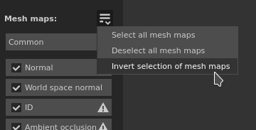

# 版本 2020.2 （6.2.0）

**Substance Painter 2020.2.0（6.2.0）** 引入了新的 UV Tile 工作流程，允許跨 UDIM 繪製。 同時也包含多項針對各類專案的效能與專案規模改進。

上映日期： *2020年7月23日*

&#x200B;>> 

藝術家作品：《龍》（Damien Guimoneau）著（https://www.artstation.com/damz）及《機器人》（Robot）作者[Jason Huang]（https://www.artstation.com/jasonhuang）。

## 主要特色

### 新的 UV 圖塊工作流程，跨 UDIM 繪製

在本版本中，我們向 Substance Painter 引入了新的 UV Tiles 工作流程，允許在 UDIM 圖塊上繪製。

有了新的工作流程， **UV 不再被拆分成獨立的貼圖集**。 相反地，UV 磚塊會包含在一個基於網格材質指派的貼圖集內。 同一材質集內的 UV 磚塊可以在 **2D 和 3D 視窗中無接**&#x200B;縫地繪製。

UV Tile 是用來泛指這種新工作流程的術語，因為 UDIM 主要是命名慣例。 雖然目前 UDIM 是唯一可用的慣例，但我們未來有計畫擴展（例如支援 Mudbox 或 ZBrush 命名）。 我們也在考慮支援座標為負的磁磚，這是 UDIM 方案無法做到的。 這也是為什麼我們選擇了更廣泛的術語來形容這個工作流程。

以下是這個新工作流程所帶來的變更概述：

* **建立 UV 圖塊專案**\
  建立新專案時，有一個新設定可以指定是否使用新工作流程。

  請注意，一旦工作流程決定並建立專案，之後就不能更改，這與其他設定相反。

  
* 2D 視口中的 UV 磚塊

  使用新的 UV 圖塊工作流程時，2D 視圖會顯示一個新的格子，每個 UV 圖塊都有專屬的 UDIM 編號。 每塊地磚都可以單獨上色。

  
* 在UV瓷磚上繪畫

  UV瓷磚

  這些都在同一個貼圖集裡，可以無縫地塗裝。 這允許透過乘以 UV 磚塊數量來提升資產的整體解析度與品質。
* 材質集合列表視窗中的 UV 磚塊

  該

  材質集合清單

  已更新為列出與匯入網格材質相關的 UV 圖塊。 每個 UV 圖塊都會依據 UDIM 慣例顯示其名稱。

  
* 每個 UV 圖塊的解析度變更

  雖然每個 UV 圖塊的預設解析度是基於其父材質集，但也可以針對每個圖塊覆蓋解析度。 只要在貼圖集清單中選擇圖塊，然後進入貼圖集設定視窗來更改解析度。 當圖塊的解析度被覆寫時，新的解析度會顯示在 2D 視圖中，與其編號旁邊一同顯示。

  
* 新的圖層堆疊圖示

  圖層堆疊新增了繪圖和填充圖示。 由於 UV Tiles 包含更多材質，無法在此小範圍內全部顯示。 這有助於效能，因為不再需要計算特定的縮圖。 這組新圖示也可用於一般專案，方法是在主設定中啟用設定（見下文）。

  
* 新的 UV 圖塊遮罩在圖層上

  UV Tile Mask 是一種新的遮罩方式，可以遮罩進出圖層，比一般遮罩更有效率。 它提供更好的效能，因為它允許完全捨棄特定 UV 磚塊的計算。 我們推薦使用此工具，幫助在處理多 UV 磚的專案中獲得舒適的體驗。 更多資訊請參閱 [文件中的專頁](../../interface/layer-stack/geometry-mask.md) 。

  {width="550px"}
* **透過遮罩的 UV 磚進行繪畫**\
  當多個 UV 磚塊在同一個材質集裡時，可能會因為幾何體的其他部分擋住，導致某些區域難以上色。 為了避免這種情況，情境工具列新增了一個繪畫設定，名為 **「繪畫筆觸忽略遮罩的 UV 圖塊**」。 啟用此設定後，任何透過 UV 圖塊遮罩排除的 UV 圖塊會在視口中隱藏，讓畫筆劃能通過或忽略它們。 修改 UV 圖塊遮罩會重新計算筆觸筆觸，因為它允許重新匯入可能修改了 UV 圖塊或需要排除的新幾何體的網格。 這樣就避免了重畫筆觸。

  

  
* 烘焙紫外線瓷磚

  烘焙師也支援 UV Tiles，烘焙視窗中現在有一個選擇清單

  用來指定哪些圖塊和材質集要烘焙。 選擇可透過點擊拖曳勾選框或使用新的下拉選單快速更改。

  

  
* 用新的 $udim 標籤匯出 UV Tiles 貼圖

  輸出範本新增了一個標籤，允許匯出帶有 UV 圖塊編號的檔案。 目前僅有UDIM公約。 當標籤無法使用時，也可以使用括號來定義檔名中的可選元素。 例如，這允許建立僅在 UV Tile 專案中附加 UDIM 編號的檔名，使匯出預設與任何類型的專案相容。

  
* **匯入影像序列**&#x200B;一連串影像是一系列紋理，每個紋理對應特定的 UV 圖塊。 要匯入影像序列，只需拖放序列的第一個檔案到書架，或使用匯入資源視窗。 序列中剩餘的檔案也會自動匯入。 這些序列會以單一資源的形式顯示在書架中，並以數字表示它們包含多少檔案。 使用序列時，只要拖曳到填充圖層即可。 投影模式會自動設定為&#x200B;**填充（每個 UV 圖塊匹配）。**

  {width="600px"}

  
* 支援 Alembic 網格的 Facesets

  Alembic 面板集現在會匯入成材質，拆分成貼圖集。 此變更使 Alembic 網格與新的 UV Tiles 工作流程相容。 如果 Alembic 網格包含不在 Facesets 中的面，這些面會自動放入名為 DefaultMaterial 的貼圖集。

想了解更多關於新 UV Tile 工作流程的細節，請參考 [專門的文件](../../features/uv-tiles/uv-tiles.md)。

>[!NOTE]
>
> UV Tile 的工作流程可能非常繁複，我們建議使用 SSD 來同時儲存快取和專案檔案，以減少載入時間並獲得流暢的使用體驗。

### 新暫停引擎

現在可以在工作時暫停 Substance Painter 引擎。 引擎暫停時，任何材質計算、視窗更新或繪畫筆觸都會被註冊，但不會被計算。

此新動作允許設置與調整複雜的層堆疊，並將計算延遲至最後一刻。 暫停引擎的主要優點是避免中間計算，只計算最終結果。 這讓應用程式反應更快，更新也更快速。 缺點是引擎未暫停前不會有視覺回饋。

要暫停引擎，只需點擊 **視窗上方情境工具列** 中的按鈕，或使用 **快捷鍵 Shift + Escape** （可在設定中修改）。 要解除引擎暫停，請關閉按鈕或重複使用捷徑。

### 性能改進

* **更快速的材質匯出**\
  匯出貼圖的速度應該會快很多，尤其是那些產生大量貼圖的重型專案。 材質的生成、生成和撰寫方式都有多項改進。 在我們內部測試擁有多塊貼圖集或複雜圖層堆疊的專案中，我們發現匯出過程通常快&#x200B;**了四**&#x200B;到五倍。
* **開啟專案**&#x200B;時快取計算延遲 Substance Painter 採用快取系統，允許快速調整與混合圖層。 在先前版本中，每次開啟專案時（可由視窗底部的綠色載入列可見）計算此快取。 現在快取計算只會在嘗試編輯圖層時觸發（例如透過繪圖或調整填充層參數）。 此變更允許專案開啟時無需等待或切換到所需的材質集即可開始運作。 計算也更細緻，只計算所需的部分。 例如，包含 UV 磚塊的專案，只計算需要修改的磚塊。
* **網格貼圖**&#x200B;的非同步載入 網格貼圖現在是非同步載入的。 這表示在等待網格貼圖載入期間，應用程式不會再被阻擋。 這在顯示網格貼圖於視窗時尤其明顯（如下圖所示）。 這也讓開啟專案更快，因為不再需要等待網格地圖。

  
* **改良的遮罩視圖模式編輯**\
  當使用 ALT+Click 遮罩（或專用檢視模式）在視埠中顯示時，材質更新現在只針對遮罩進行。 這表示使用此視圖模式時，繪製和編輯效果會更順暢，因為其他計算會延遲到視窗回到材質模式。

  
* **新圖層堆疊縮圖**\
  如前所述，圖層堆疊現在可以使用一組新的圖示。 使用這些圖示可以提升整體效能，因為不需要計算縮圖。 雖然 UV Tile 專案會自動使用這些圖示，但一般專案也可以選擇使用這些圖示，方法是進入 **編輯>設定** ，並啟用 **替換圖層疊疊縮圖與圖示**。

  
* **較快的增量儲存**&#x200B;隨著專案規模較小且儲存過程更細緻，資料變更變得更細緻，增量儲存（按 CTRL+S 鍵）現在快得多。 這在大型專案中尤其明顯。
* **改進的 Iray 啟動效能**\
  切換到 Iray 渲染模式應該會更快，因為我們改進了管理應用程式內共享記憶體的方式。

### 專案規模改進

專案檔案以佔 [用](../../technical-support/workflow-issues/project-issues/projects-are-really-big.md)量大聞名。 我們花時間調查這個問題的根本原因，並設計了幾個解決方案。 此版本引入了第一組變更：

* **將 Baker 輸出切換成灰階影像**\
  在先前版本中，烘焙者無論如何都會輸出 RGB 影像。 現在灰階烘焙器（曲率、環境遮蔽）只會輸出灰階影像。 這項簡單的調整可將專案規模從20%降低至60%。 為了利用這項變更，現有專案中的網格貼圖需要重新生成。
* **更改烘焙師的預設擴散與膨脹設定**\
  以前烘焙師會先產生 1 像素的膨脹，然後產生擴散圖案（UV 島外的模糊像素）。 這種設定會產生相當厚重的貼圖，因為漸層很難壓縮。 因此，預設設定已被更改以減少這個問題。 預設情況下，擴散是關閉的，放大設定為 32 像素（應該符合 4K 解析度）。 我們建議將現有專案切換到這些新設定並重新烘焙，以利用這些改進。

### 其他改進

這個新版本包含了一些額外的變更：

* **烘焙選擇**\
  為了讓新的 UV 圖塊工作流程更簡單，烘焙視窗稍微修改，加入了一個新的選取清單，裡面包含了每個材質集的 UV 圖塊清單。 因此，「烘焙當前材質集」按鈕已被移除。 為了方便選擇烘焙食材，下拉選單新增了幾個選項：

  

  
* **材質集設定中的著色器實例**\
  隨著材質集清單的重製，包含了 UV 磚塊，UI 也做了一些小幅調整，讓介面變得更不雜亂。 過去允許建立和切換到不同著色器實例的功能，現在已移至貼圖集設定中。

  

## 教學課程

以下是我們全新介紹新功能的影片教學。 更多關於新 UV Tile 工作流程的影片可在 [Substance Academy](https://www.youtube.com/playlist?list=PLB0wXHrWAmCx1fWbUyBFcjtfL8xhxZFnv) 上觀看。

## 發行說明

### 2020.2.0

*（2020年7月23日發行）*

**補充：**

* UV 瓷磚（UDIM 系統）
* [UV瓷磚]在UV瓷磚上塗漆
* [UV 圖塊]允許在新的與舊有的 UV 圖塊工作流程間選擇
* [UV 圖塊]將 UDIM / UV 圖塊影像序列匯入為資源
* [UV 圖塊]在 Texture Set List 視窗中新增每個材質集的 UV 圖塊清單
* [UV 圖塊]允許在貼圖集設定中同時編輯多個 UV 圖塊的解析度
* [UV圖塊]&#x200B;[2D視圖]以格子形式顯示UV圖塊
* [UV 圖塊]&#x200B;[2D 視圖]新增視窗按鈕以顯示或隱藏 UV 圖塊資訊
* [UV 磚塊]UV 磚塊專案預設將繪畫工具切換為單通道
* [UV 圖塊]在情境工具列新增按鈕，可以在繪畫時忽略遮罩的 UV 圖塊
* [UV 圖塊]&#x200B;[圖層堆疊]新增圖層堆疊圖示以提升效能
* [UV 圖塊]&#x200B;[圖層堆疊]改善工具列中的繪圖與填充圖示
* [UV 圖塊遮罩]&#x200B;[2D 視圖]允許一次包含或排除多個 UV 圖塊（左鍵點擊，Ctrl+左鍵）
* [UV 圖塊遮罩]新增 UV 圖塊遮罩，並以新圖示排除每層圖塊
* [UV 磚塊遮罩]&#x200B;[圖層堆疊]當 UV 磚塊遮罩圖示中未包含所有 UV 磚塊時，請顯示 UV 磚塊的數量
* [UV 圖塊遮罩]&#x200B;[2D/3D 視圖]新增懸浮效果以視覺化游標下方的 UV 圖塊
* [UV 圖塊]&#x200B;[烘焙者]允許選擇並烘焙特定的 UV 圖塊
* [UV 圖塊]&#x200B;[烘焙者]新增材質集/UV 圖塊的選擇選項
* [UV 圖塊]&#x200B;[Bakers]右鍵選單選項，可在材質集中選擇 UV 圖塊
* [UV 圖塊]&#x200B;[烘焙者]透過拖曳讓貼圖組/UV 圖塊中快速選擇
* [UV 圖塊]&#x200B;[烘焙者]將網格地圖中的「全部」和「無」按鈕替換成更明確的選取選項
* [UV磁磚]&#x200B;[烘焙師]顯示待烘焙的材質數量
* [UV 圖塊]&#x200B;[匯出]允許選擇並匯出特定的 UV 圖塊
* [UV 圖塊]&#x200B;[匯出]透過拖曳快速選擇 UV 圖塊
* [UV 圖塊]&#x200B;[匯出]新增 UV 圖塊的下拉選單選項
* [UV 圖塊]&#x200B;[匯出]如果某些匯出預設不支援 UV 圖塊（Adobe Dimension、Sketchfab、glTF、USD），請將其停用。
* [UV 圖塊]&#x200B;[內容]更新匯出預設以使用新的 $udim 標籤
* [UV 圖塊]在匯入有重疊 UV 島的網格時，改善錯誤回報
* [UV 磚塊]UV 磚塊在 Iray 中相容
* [UV 磚塊]&#x200B;[腳本操作]將 UV 磚塊匯出文件加入 Python 文件
* 性能
* [效能]情境工具列新增按鈕，可在工作時暫停引擎運算（SHIFT+ESC）
* [效能]透過延遲紋理集快取計算來加快專案開啟速度
* [效能]打開專案時不要等網格貼圖載入
* [效能]&#x200B;[2D/3D 視圖]當遮罩通道未被使用時，請不要在視窗中計算
* [效能]載入視窗中顯示的網格地圖時，請勿阻擋該應用程式
* [效能]在儲存專案時提升增量儲存速度
* [效能]&#x200B;[烘焙師]更改預設膨脹設定以提升節省時間與專案規模
* [效能]&#x200B;[烘焙師]切換到特定烘焙師的灰階，以提升節省時間與專案規模
* [效能]&#x200B;[匯出]提升引擎效能以更快匯出貼圖
* [效能]&#x200B;[匯出]在開啟大量材質集的匯出對話框時，提升反應速度
* [效能]&#x200B;[匯出]切換到「匯出清單」分頁時提升效能
* [表演]&#x200B;[Iray]縮短 Iray 啟動時間
* 其他
* [烘焙師]新增材質集的選擇選項
* 將著色器實例管理移至貼圖集設定
* [2D/3D 視圖]在視窗底部新增訊息，指示被編輯的遮罩類型
* [圖層堆疊]設定中新增在舊有縮圖與新縮圖間切換的選項
* [圖層堆疊]新增視覺回饋以指示縮圖的載入狀態
* [Proj]新增投影模式「Fill（Match Per UV-Tile）」以載入影像序列
* [專案]在特定情況下，將填充圖層投影模式改為「填充（每個 UV 圖塊匹配）」
* [內容]優化 Charcoal 筆刷預設以提升效能
* 更新 Iray 至 2020.0.0 版本
* [匯出]當沒有選擇任何東西時，請停用匯出清單標籤
* 自動展開
* [自動展開]提升縫線位置的品質
* [自動展開]改良參數化以提升速度與穩定性

**修正：**

* [Alembic]匯入檔案時會忽略面集
* [Alembic]特定檔案的無限載入時間
* [匯入]當僅檔案副檔名不同時，匯入錯誤的 UDIM 影像序列
* [當機聲]嘗試開啟被其他程序鎖定的專案會導致當機
* [匯出]發射通道不會以 USD 格式匯出
* [內容]智慧材料「炭筆」包含繪畫筆觸

**已知問題：**

* [材質集合列表]無法隱藏描述
* [材質集合列表]使用者介面問題
