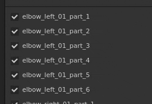
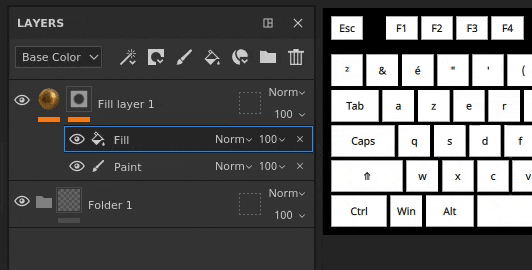
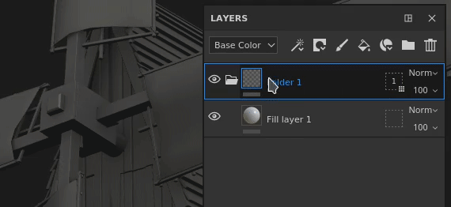
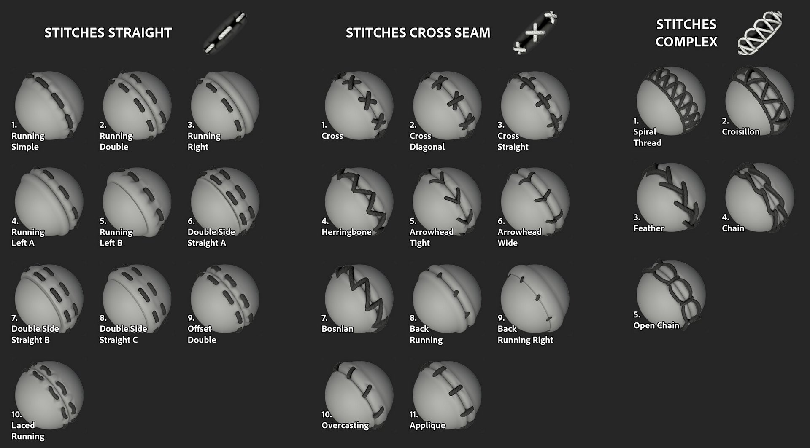

# 版本 2021.1 （7.1.0）

**Substance Painter 2021.1（7.1.0）** 引入多項新功能與改進，如幾何遮罩及圖層堆疊中特效的複製貼上功能。

發行資料： *2021年1月28日*

>[!NOTE]
>
> 此版本將 Ubuntu 支援的最低版本提升至 18.04，MacOS 提升至 10.14。 更多細節請參閱 [技術要求](../../getting-started/system-requirements.md)。

## 主要特色

### 新幾何遮罩

幾何遮罩是圖層堆疊中的一個新遮罩工具，允許根據網格名稱或 UV 圖塊隱藏幾何體。 它是先前稱為 UV 圖塊遮罩的演進，該遮罩是根據 UDIM 數字來遮罩幾何形狀的。

這個新工具比一般塗裝（或使用 [多邊形填充](../../painting/tool-list/polygon-fill.md)時）更適合遮罩幾何體，因為它受益於多項引擎優化。 它也是非破壞性的，因為它不會儲存幾何體資訊（像是面或頂點），只會儲存網格名稱或 UV 圖塊編號，所以重新匯入網格不會破壞遮罩。 另一個好處是隱藏幾何體允許在貼圖集中之前無法存取的表面上繪製，這避免了拆分多個貼圖集的麻煩。

* **圖層上的新幾何遮罩**\
  幾何遮罩會自動在圖層堆疊[&#128279;](../../interface/layer-stack/layer-stack.md)中的任何圖層上使用。預設情況下它沒有效果，意思是該圖層是完全可見的。\
  幾何遮罩有自己的情境選單，可以快速選取或取消所有項目，也能將其數值複製到另一個圖層。

  

  

* **編輯幾何遮罩屬性**&#x200B;幾何遮罩遵循與其他圖層上下文相同的邏輯（如編輯遮罩或實例屬性）。 要進入幾何遮罩版模式，只需點擊圖層右側的虛線方形即可。 要退出幾何遮罩，點擊同一圖層的內容或繪製遮罩。

  

* **以網格名稱或 UV 圖塊遮罩**\
  在 Geometry Mask 屬性的頂端有一個下拉選單，可以控制遮罩模式。 你可以選擇依 UV 圖塊編號或網格名稱來遮蔽。 這個下拉選單是停用的，只設為網格名稱，以防專案沒有使用 UV Tile 工作流程。

  

* **透過屬性遮罩幾何**\
  編輯幾何遮罩時，屬性視窗會顯示根據與目前材質集相關的幾何體，列出網格名稱（或 UV 圖塊）。

  * 列表中的數字表示在可用總數中，有多少網格/UV 圖塊被解除遮罩。
  * 數字旁邊的選單提供快速控制，可以選擇全部或不選取所有項目，甚至反轉當前選擇。
  * 以下清單定義哪些項目是遮罩的，哪些不是。 和應用程式中的其他清單一樣，可以點擊拖曳來同時啟用或停用多個項目，或在事件中使用 **ALT+Click** 來隔離項目。

   

* **透過視窗遮罩幾何**\
  幾何遮罩的選擇也可以在 2D 和 3D 視圖中更改。 只要將滑鼠移到應該可見或隱藏的部分，點擊它即可切換狀態。 編輯幾何遮罩時，遮罩幾何會以灰色與斜線效果顯示。 也可以透過點擊和拖曳來同時選取多個項目，進行矩形選取。\
   

* **繪製隱藏/無法觸及的幾何形狀。**\
  在幾何遮罩中選擇幾何要遮罩後，可以在視窗頂端啟用 **隱藏/忽略排除幾何** 體按鈕（或按 **ALT+H** 快捷鍵）。 啟用後，排除的幾何體（以及其他材質集）會被隱藏，只顯示包含或可繪製於當前圖層的幾何體。 此選項允許塗上先前被阻擋或無法觸及的區域。 這個選項也適用於任何類型的圖層。

  >[!NOTE]
  >
  > 使用遮罩幾何體的繪畫仍然是動態的：如果某些阻擋畫作的幾何在畫筆劃畫時被隱藏，後來解除遮罩，該幾何會再次阻擋先前的筆觸。

  

### 新的複製貼上圖層堆疊效果

效果現在可以像一般圖層一樣跨層複製。

現在也支援多重選擇，讓玩家能同時複製並貼上多個效果。

為了方便起見，複製或移動遮罩的效果到沒有遮罩的圖層會自動新增遮罩。 這是因為圖層內容和遮罩的效果彼此不相容。 這表示從遮罩複製效果到圖層內容時，會自動切換到遮罩（或建立遮罩）。

* **透過情境選單複製貼上**\
  右鍵點擊貼圖集圖層堆疊中的任何效果，選擇切割或複製動作。 然後再右鍵點擊任意圖層，選擇貼上來移動或複製想要的效果。 我們也藉此機會重新設計了情境選單，並提供更多功能存取：

  

* **用鍵盤快捷鍵複製貼上**\
  與任何圖層相同，鍵盤快捷鍵 **CTRL+C** （複製）/**CTRL+X** （剪輯）和 **CTRL+V** （貼上）可用來根據當前選取複製效果。 和圖層一樣，效果會插入在當前選取的上方。

  

* **用鍵盤快捷鍵快速複製效果**\
  使用 **CTRL+D** 複製當前選取，或按下並維持 **ALT，拖曳** 任何效果以複製到指定位置：

  

* **跨層移動效果**\
  除了複製與複製之外，現在還可以直接拖放效果從一個圖層移動到另一個圖層：

  

### 新的一般功能與改進

本版本進行了多項改進：

* **為每個 UV 圖塊新增描述**\
  現在可以透過材質集合清單為每個 UV 磚塊新增描述。 這讓專案更易於導航，尤其是在匯出和烘焙時，因為描述也會在這些情境中看到。\
  要新增或編輯描述，只要在貼圖集清單視窗點選 UV 圖塊，然後進入貼圖集設定視窗編輯即可。

  

   

* **新圖層堆疊縮圖**\
  優化的圖層堆疊縮圖已經改進。 現在填充圖層會顯示材質球體，讓即使在使用 [UV Tiles](../../features/uv-tiles/uv-tiles.md) 工作流程時，也能更輕鬆地瀏覽和看到每個圖層的主要屬性。 縮圖是根據圖層資訊產生的，但不會考慮效果，以避免頻繁重新計算。

  

* **改良的幾何遮罩在圖層堆疊中的退出**\
  如果沒有遮罩，退出幾何遮罩（前稱 UV Tile 遮罩）在圖層堆疊中的資料夾可能會很困難。 這是因為除了選擇另一層外，沒有其他情境可以開啟。 現在可以點擊資料夾縮圖以退出幾何遮罩。 編輯幾何遮罩時，也可以將材料或智慧材質從書架拖放到視窗中。

  

  

* **烘焙視窗中新增的Alt-Click 選擇**\
  烘焙視窗中的網格貼圖清單現在 **可以用 Alt + 滑鼠點擊** 隔離特定貼圖烘焙，而不必手動排除。 同樣的捷徑可以用來重新啟用所有網格貼圖。

  

* **新的烘焙目前材質集按鈕**\
  烘焙視窗底部新增了一個按鈕，讓重新烘焙材質組變得快速且簡單。 使用這個按鈕不會影響先前定義的自訂選取，反而會烘焙整個材質集（包括所有 UV 圖塊，如果有的話）。

  

### 新物質引擎更新

Substance 引擎已更新至 8 版，以支援最新的 Substance 檔案格式及其功能。

想了解更多關於新 Substance Engine 功能的細節，請參考 [這份文件頁面](https://helpx.adobe.com/tw/substance-3d/unlisted/documentation/sddoc/version-2020-2-10-2-0-200574252.html)。

### Iray 新增 Nvidia RTX 3000 支援

[Iray 渲染器](../../features/iray-renderer/iray-renderer.md)已更新至最新版本，現支援新的 Nvidia Ampere GPU（RTX 3000 系列與 Quadro A 系列）。

>[!NOTE]
>
> 這次更新後，Kepler GPU（GeForce 600 和 700 系列）不再支援，Iray 渲染改由 CPU 完成。

### 新內容

本次版本新增了三種縫法工具，可用來創作複雜的圖案與逼真的針法。 要找到它們，只要進入書架的工具區，並尋找：

* 縫合複合體
* 針腳交叉縫線
* 縫合直線

建議在情境工具列啟用 [懶人滑鼠](../../painting/lazy-mouse.md) 功能，以提升繪製針法的品質。

以下是這些新工具中所有預設的概述：

{width="800px"}

### 新的 Python 功能

Python API 新增了多項功能。 文件也經過重新整理，尤其是範例，讓理解與學習 API 變得更容易。

* **資源與書架管理**\
  資源模組已改良，現在能：
  * 建立並管理書架。
  * 在書架和專案中搜尋或匯入資源。
  * 知道是否有貨架被爬行（這樣可以判斷資源何時準備好使用）。
  * 為書架上的資源指派自訂縮圖。

* **UV 瓷磚資訊**\
  現在可以查詢貼圖集的 UV 圖塊清單。 這開啟了對特定範圍 UDIM 磁磚建立自訂匯出的可能性。

* **專案版本狀態**\
  新增了一個功能和事件，用來判斷專案是否可以被編輯。 這對於判斷計算是否正在進行且無法修改專案屬性非常有用。

>[!NOTE]
>
> Python API 文件可從應用程式的說明選單存取。

## 教學課程

以下是我們介紹新功能的影片教學：

## 發行說明

### 2021.1

*（2021年1月28日發行）*\
摘要： **重大版本，新增 Geometry Mask，允許選取並繪製幾何部分，圖層堆疊中複製/貼上特效，改進 UV 圖塊工作流程，更新 Iray、Bakers、Substance Engine 及新增內容**

**補充：**

* 新的幾何遮罩，並繪製選取的幾何部分
* [幾何遮罩]允許以網格名稱繪製幾何體的部分
* [幾何遮罩]兩個視窗的矩形選取
* [幾何遮罩]允許隱藏/忽略任意圖層中被排除的幾何體
* [幾何遮罩]&#x200B;[屬性]點擊與拖曳快速選取勾選框
* [幾何遮罩]&#x200B;[屬性]&#x200B;[使用者介面]在屬性視窗中使用下拉選單包含/排除所有
* [幾何遮罩]&#x200B;[屬性]允許以 ALT+LEFT 點擊快速選取列表中的一個項目
* [幾何遮罩]&#x200B;[屬性]在屬性視窗中懸停網格名稱/UV 圖塊時，在視窗中疊加
* [幾何遮罩]&#x200B;[圖層堆疊]為幾何遮罩新增複製/貼上選項
* [幾何遮罩]隱藏/忽略排除幾何按鈕的新圖示
* [幾何遮罩]隱藏/忽略排除幾何的新提示
* [幾何遮罩]鍵盤快捷鍵 ALT+H 可切換「隱藏 忽略排除幾何」按鈕
* [UV 圖塊]&#x200B;[圖層堆疊]新填充圖層球體預覽縮圖，UV 圖塊與簡化模式
* [UV 圖塊]&#x200B;[圖層堆疊]允許輕鬆退出 UV 圖塊遮罩
* [UV 圖塊]&#x200B;[材質集合列表]允許對每個 UV 圖塊提供描述
* [UV 圖塊]&#x200B;[材質集設定]&#x200B;[使用者介面]下拉選單新增兩個章節標題以更改 UV 圖塊解析度
* [UV 圖塊]&#x200B;[視窗]拖曳材質進入視窗時，退出 UV 磚塊遮罩
* [圖層堆疊]新增特效的複製/貼上選項
* [圖層堆疊]允許將效果從一個貼圖集複製/貼上到另一個
* [圖層堆疊]允許多重選擇效果
* [圖層堆疊]新增複製/貼上選項作為圖層效果的捷徑
* [圖層堆疊]拖曳效果到另一圖層時，會自動在遮罩和內容之間切換
* [圖層堆疊]貼上其他圖層的遮罩時，自動建立遮罩
* [圖層堆疊]在效果的情境右鍵選單中新增移動效果動作
* [圖層堆疊]允許將效果從一層拖到另一層
* [圖層堆疊]將物品拖曳到資料夾上，會將它們放在資料夾的最上方
* 更新 Iray 至 2020.1.0 版本
* [烘焙師]更新烘焙者至版本 2.5.4
* [烘焙師]在烘焙進度視窗中顯示個別的 UV 圖塊
* [烘焙者]&#x200B;[使用者介面]允許用新按鈕快速烘焙目前的材質集
* [烘焙師]允許使用者透過 Alt+Left Click 快速選擇其中一位烘焙師
* 更新 Substance Engine 至 8.0.8 版本
* [物質引擎]支援新 .sbsar 檔案中的預設顏色
* [自動展開]性能提升
* [匯出]新增視覺回饋，以標示哪個 UV 圖塊的解析度與專案預設不同
* [匯出]在匯出後的著色器 JSON 檔案中加入場景大小因子
* [語言]新增日文翻譯
* [使用者介面]關於具有內部相依版本控制的視窗更新
* [腳本]&#x200B;[Python]允許管理架子資源
* [腳本]&#x200B;[Python]讓專案準備好烘焙與匯出時可知
* [腳本操作]&#x200B;[Python]允許知道 Shelf 何時完成在磁碟上的資源爬取
* [腳本]&#x200B;[Python]允許查詢每個材質集的 UV 圖塊清單
* [腳本操作]&#x200B;[Python]允許將自訂預覽指派到書架資源
* [腳本撰寫]&#x200B;[Python]允許管理自訂書架
* [腳本撰寫]&#x200B;[Python]在文件中的每個子模組中新增方法索引
* [腳本]&#x200B;[Python]文件的新風格
* [腳本]&#x200B;[Python]資源與 Shelf 文件的改進
* [內容]三個新工具預設，用來製作針腳
* [書架]暫時移除「匯出至Substance Share」，並轉換至新的Substance Share平台

**修正：**

* 使用不同解析度的螢幕時會當機
* Substance Engine 的崩潰與一些罕見專案
* 切換圖層時，視窗刷新會因隱藏/忽略排除幾何而失敗
* [2D 視圖] 有些專案可能缺少 2D 視埠
* [烘焙中]「依網格名稱匹配」會忽略物件的部分
* [圖層堆疊]點擊圖層效果會開啟資料夾
* [幾何遮罩]即使重新匯入沒有遮罩的 UV 圖塊，遮罩中仍然會計入 UV 圖塊
* [幾何遮罩]視窗中的右鍵選單無法提供正確的工具
* [引擎聲]某些專案嚴重延遲
* [腳本操作]Windows 上遠端 JSON POST 請求時延遲很高
* [Linux]特定整合顯示卡的 VRAM 容量無法正確偵測
* [自動展開]某些專案會崩潰或展開時間長
