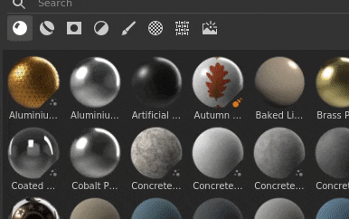
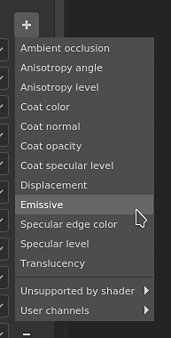

# 版本 7.2

**Substance 3D Painter 7.2** 帶來了新的渲染功能，採用 Adobe Standard Material 工作流程，並新增跨 Substance 3D 應用程式](https://www.adobe.com/products/substance3d/3d-augmented-reality.html)內容共享[方式，以及全新改造的資產視窗。

上映日期： *2021年6月23日*

## 主要特色

### 新資產視窗

舊的書架視窗已被改良並重新命名為資產視窗。 這次重新設計著重於讓內容更快速取得，並透過新的專用圖示更容易篩選。 它還附帶更簡單的導航系統，搭配麵包屑。 這次重新設計也著重於讓體驗類似其他 Substance 3D 軟體，讓跨應用程式內容管理更為簡便。

>[!NOTE]
>
> 此版本引入了我們管理應用程式偏好設定及書架/資產內容方式的變更。 想了解如何遷移您的資料，請參考 [專門的頁面](../../pipeline-and-integration/resource-management/preferences-and-content-migration.md)。

* **新設計與佈局**\
  新設計強調簡潔，同時也讓窗戶的組織更為簡便。 視窗現在可以垂直停靠，不會浪費空間。 新增的「清單」顯示模式讓使用者能更輕鬆地依名稱搜尋資產。

  

* **新的麵包屑導航**\
  導航資源在介面小時有時會比較困難。 有了麵包屑，現在在資料夾間跳躍變得不方便，而不必顯示完整的資料夾階層。

  

* **新的使用篩選器**\
  資產視窗裡有很多不同的內容，使用方式是篩選特定資源的好方法。 要選擇特定用途，只需點擊專用按鈕即可。 要新增或移除多項使用，請按住並按住 CTRL 並點擊按鈕。

  

* **縮圖呈現的改進**\
  我們花時間重新設計縮圖生成系統，提升品質，讓它們在 Substance 3D 生態系統中看起來更一致。 我們也加入了流離失所的支持。

  {width="500px"}

* **載入來自 Substance Archives （sbsar） 的縮圖**\
  嵌入 Substance 檔案中的自訂縮圖不會在資產視窗中載入並顯示。 現在共享自訂資源變得更容易，因為不需要包含自訂圖示的資源元資料。

* **效能提升：**&#x200B;縮圖的載入與產生時間在多方面都有所提升，現在應該會更快。

* **增加預覽記憶體預算以載入更多縮圖**\
  預設情況下，為了節省效能，縮圖顯示會分配有限的記憶體。 然而，擁有大量資源的函式庫可能會導致不斷載入和卸載縮圖，這會讓導航和搜尋資源變得困難。 現在有一個新的 [環境變數](../../pipeline-and-integration/configuration/environment-variables.md) 可以覆蓋預設預算值。

### 全新 Adobe Standard Material 工作流程

新增了一個名為 **Adobe Standard Material** （ASM）的著色器，支援多項功能，能在單一材質集內建構更複雜且精確的材質。 有了這個新著色器，我們也藉機新增了通道，讓材質的製作變得更簡單。

* **全新 Adobe 標準材質著色器**\
  新的 ASM 著色器是一個重新整合多項功能的著色器，同時也是我們 PBR 渲染技術的演進。 同時支援：
  * **各向異性**
  * **透明塗層**
  * **希恩**
  * **鏡面邊緣顏色**
  * **其他地下散射方法**
  * 當然還有其他現有功能，例如Parralax遮蔽、位移等。

* **新頻道與用戶頻道**\
  為了支援新的 ASM 著色器，新增了通道。 我們也將使用者頻道數量加倍，以擴展自訂資訊與自訂著色器的可能性。
  * 毛色
  * 毛髮粗糙度
  * 毛色正常
  * 毛皮不透明度
  * 被殼鏡面水平
  * 散射色彩
  * 光澤色
  * 光澤粗糙度
  * 光澤不透明度
  * 鏡面邊緣顏色
  * 用戶頻道範圍從8到15

* **改良材質集設定**\
  貼圖集設定中的通道列表選單現在會根據通道與當前著色器的相容性來分組。 這有助於辨識哪些通道會影響視窗。

  

* **新的著色器 API 功能，包含可見的 if 與重新編譯功能**\
  隨著 ASM 著色器的開發，API 也做出了一些變動，包含兩項顯著功能：
  * **Visible If**： 著色器參數可以根據條件顯示或隱藏，讓著色器使用者介面更易閱讀。
  * **重新編譯**：透過以特定方式宣告參數，現在可以停用部分著色器，並在參數變更時重新編譯以優化。 這允許捨棄未使用的功能。

### 新物質三維生態系統交換

透過這個新工作流程，Substance 3D 應用程式間的資源與資產傳送變得更簡單且一鍵可及。 現在可以從 Substance 3D Designer 或 Substance 3D Sampler 接收 Substance 檔案，或非常輕鬆地將專案送入 Substance 3D Stager，以便快速迭代內容。

>[!WARNING]
>
> 這些發送與接收功能僅能透過 Creative Cloud Desktop 版本提供，因為它依賴特定技術來實現。 這表示 Steam 或 Substance 3D 獨立版本不支援這些功能。

* **畫家到斯塔格**\
  從 Painter 匯出到 Stager，並使用更新的匯出預設，或使用 **「送至 Substance 3D Stager** 」動作自動匯出並匯入目前專案到 Stager。 不需要手動設定。

* **從舞台設計師到畫家**\
  從 Stager 直接接收模型到貼圖，並以類似的一鍵操作直接從 Stager 進行。

* **從設計師或取樣者到畫家**\
  一鍵即可直接從設計師或取樣器接收物質材質、篩選器等資料，直接進入資產視窗。

* **Substance 3D 資產到 Painter**\
  可直接從 Creative Cloud Desktop 接收 Substance 內容至 Painter 的資產視窗。

* **橋牌表演**\
  位於 Adobe Bridge 管理的函式庫中資產視窗中的資源，可透過右鍵選單在特定資源上方直接開啟。

### 新內容

本次發布新增了內容：

* **Adobe 支架材質（ASM）新專案範本**\
  為了讓使用者更容易開始使用新的 ASM 著色器，已建立新的專案範本以加快專案建立速度：
  * ASM - PBR 金屬粗糙度
  * ASM - PBR 金屬粗糙度各向異性角
  * ASM - PBR 金屬粗糙塗層
  * ASM - PBR 金屬粗糙度 SSS
  * ASM - PBR 金屬粗糙光澤

* **新環境地圖**\
  新增了多個環境貼圖來照明你的專案，包括用來渲染新資產縮圖的 Studio 06：
  * 內部：
    * 工作室
  * 工作室：
    * Studio 06
    * Studio 80 年代恐怖片 A
    * Studio Black Soft
    * Studio White Soft
    * Studio White Umbrella

### 改良的自動紫外線展開

自動 UV 展開系統新增了更新，新增了對 UV 磚塊的支援，並對 UV 產生有更多控制：

* **UV Tile 的數量**\
  在產生 UV 時，現在可以指定想要建立的最大 UV 圖塊數量。 這也允許將 UV 產生搭配 UV Tile 工作流程使用。

* **紫外線島的方向**\
  新增了一個ew參數，用來對包裝時UV島的方向施加限制。 這讓 UV 島嶼能更對齊，讓某些物件更容易貼圖（例如：木門來對齊木紋圖案）。

* **包裝性能提升**\
  打包功能也有所提升，以提供良好的效能，並支援新的 UV Tile。

### 一般改良

這個新版本新增了多項生活品質的改進：

* **提升繪圖板筆滑桿效能**\
  用筆拖曳滑桿現在應該會更靈敏。 滑桿應該不會再黏膩了。

* **已繪製圖層後的效能提升**\
  現在用大量既有筆觸的圖層上色應該會快很多，也不會再造成畫面變慢。

* **開啟專案後更快上色**\
  在剛開啟專案後，立即在圖層堆疊頂端的圖層上繪製，現在是立即完成的。 引擎快取的計算已延後，使得在此情境下舊專案的重製速度稍快。

* **銳利正規法**\
  在 Texture Set 設定中新增了一個 Height to Normal 方法參數，可以控制 Height 通道如何轉換成法線貼圖。 這個新參數有助於提升細節變化多端的表面品質，例如布料材質。

  {width="450px"}

* **新的介面風格**\
  整體介面稍作調整，以更貼近 Substance 3D 生態系統。 這讓從一個應用程式跳到另一個應用程式變得不那麼令人驚訝，也更容易導航。

* **新譯本**\
  新增三種語言以翻譯程式介面：
  * 法語
  * 德語
  * 簡體中文

## 發行說明

### 7.2.0

*（2021年6月23日發行）*\
摘要： **重大版本，新增資產面板更新、新增著色器以存取新通道與參數、整體介面更新、期待已久的效能提升、擴充語言支援等多項功能！**

**補充：**

* [圖書館]新資產面板取代書架
* [函式庫][使用者介面]新資產面板佈局
* [函式庫][使用者介面]更改預設資產面板方向與使用者介面
* [函式庫][使用者介面]引入函式庫的清單檢視選項
* [圖書館][使用者介面]資產面板新增麵包屑導航
* [函式庫][使用者介面]選擇已儲存的搜尋時，選擇「所有函式庫」
* [函式庫][使用者介面]當所有資料夾取消選取時，選擇「所有函式庫」
* [函式庫][使用者介面]粒子刷子的新標籤
* [圖書館][使用者介面]應用程式中「書架」被「所有圖書館」取代
* [函式庫][使用者介面]允許隱藏空資料夾
* [函式庫][使用者介面]預設使用者函式庫即使為空也應該可見
* [函式庫][使用者介面]透過資產類型圖示進行新的篩選方法
* [函式庫]快捷鍵「CTRL」可選擇多種資產類型
* [函式庫]新增環境變數以控制資產預覽記憶體預算
* [函式庫][內容]新環境地圖
* [函式庫][內容][使用者介面]預設材質的渲染位移
* [函式庫][內容]將 Adobe 標準材質（ASM）著色器設為預覽產生的預設
* [函式庫][內容][ASM]新 ASM 著色器的專案範本
* [函式庫][縮圖]使用新的 Studio 6 環境地圖
* [函式庫][縮圖]在資源中讀取縮圖，而不是產生
* [函式庫][縮圖]在縮圖生成中加入位移
* [材質設定]
* [貼圖集設定][使用者介面]將新高度暴露於一般轉換方法
* [材質集設定][使用者介面]通道介面組織的重製
* [材質設定]使用者頻道限制提升至 16 個
* [貼圖集設定][使用者介面]請指出哪些通道與目前選擇的著色器相容
* [著色器][ASM]新 Adobe 標準材質著色器
* [著色器][ASM]新增支援各向異性、透明塗層、次表面散射、鏡面邊緣色彩及光澤
* [著色器][ASM]更改預設通道的顏色值
* [著色器][ASM][匯出]更新的匯出範本Adobe Dimension為Adobe Substance 3D Stager
* [著色器][ASM]新增著色器和 MDL 參數的標籤與工具提示
* [著色器][ASM]即使不支援 SSS，也要讓散佈顏色在 2D 視圖中可見
* [著色器][ASM][Iray]用新的 MDL 支援 Iray 中的 ASM 著色器
* [著色器][ASM][Iray]更新的 Subsurface Scattering 於舊有 PBR 規格光澤與塗層中
* [著色器][ASM][內容]更改了樣本的預設 SSS 類型
* [著色器][ASM]新增 ASM API 文件
* [著色器][ASM]優化著色器以忽略未使用的通道
* [著色器]暴露新的貼圖集通道
* [著色器]改良的次表面散射
* [著色器]隱藏了部分著色器的新著色器參數
* [著色器]對於著色器參數，則可見
* [表演]
* [函式庫]資源預覽載入時間與計算效能提升
* [引擎]油漆性能提升
* [自動拆包]包裝性能提升
* [自動展開]
* [自動展開]自動展開與 UV Tile 工作流程相容
* [自動展開]新增根據網格方向定位 UV 的選項
* [其他]
* [設定]更改預設縮放方向
* [使用者介面]整體介面刷新
* [使用者介面]說明選單的重製
* [使用者介面]替換反轉圖示
* [使用者介面][外掛]替換外掛 DCC 連結的圖示
* [使用者介面][AMD 版]更新最低所需版本與彈出訊息
* [圖層堆疊]在選取的空資料夾內建立新圖層
* 更新 Python 文件
* [烙印]
* [品牌標示][使用者介面]應用程式名稱更新為 Adobe Substance 3D Painter
* [品牌標示][使用者介面]更新為「Substance 版」的獨立版本
* [品牌形象][使用者介面]更新的應用程式執行檔名稱、安裝路徑、套件與圖示
* [品牌標誌][使用者介面]重新命名預設函式庫與路徑
* [品牌標誌][使用者介面]關於 Windows 的最新資訊
* [品牌標誌][使用者介面]更新的歡迎畫面
* [品牌標示][使用者介面]移除基於年份的版本號
* [在地化]德文、法文及簡體中文的新翻譯
* [互通性]不支援 Steam 和 Substance 版本
* [互通性]與 Adobe 生態系統的互通性：Designer、Sampler、Stager 與 Bridge
* [互通性][使用者介面]從 Designer 接收並更新資產
* [互通性][使用者介面]從 Sampler 接收資產
* [互通性][使用者介面]派資產給Stager
* [互通性][使用者介面]Adobe Bridge 中的展示
* [互通性][使用者介面]允許快速存取 Adobe 3D 資產
* [互通性]SBSAR 的新使用標籤
* [互通性]處理接收資產類型
* [互通性]從 Adobe Substance 3D Designer 或 Adobe Substance 3D Sampler 接收的資產會儲存在使用者預設選擇的函式庫中
* [互通性][使用者介面]左側工具列新增圖示，可傳送給 Stager 或 Photoshop

**修正：**

* [平板]用壓力作畫時效能低
* [平板]滑桿控制平板的問題
* [當機聲]材質集合列表與匯出器名稱不符
* [撞擊聲][圖書館]雙擊子圖書館
* [圖書館]爬取圖書館目錄時的問題
* [函式庫]強制預覽生成命令列無法如預期運作
* [函式庫][內容]烘焙光環境濾鏡預設為黑色
* [Linux][MacOS][匯出網格]無法匯入在 Linux/MacOS 上建立的 glTF
* [Linux]將檔案拖放到資產面板可能會導致當機
* [自動展開]即使未選擇網格進行重新載入，自動展開仍可用
* [粒子]與重力的錯誤粒子行為
* [圖層堆疊]等級直方圖只能在某些通道中使用亮度
* [幾何遮罩]編輯幾何遮罩時，右鍵選單無法使用。
* [投影]具有球面投影與雙線性濾波的接縫
* [UV 圖塊]匯出遮罩到檔案只會匯出圖塊 0， 0
* [匯出網格]FBX 網格匯出為空
* [Iray]新專案渲染時不會考慮法線貼圖
* [儲存]共享磁碟存檔問題
* [烘焙中]重新烘焙一個參數修改過的網格會顯示警告
* [烘焙中][迴歸]當高多邊形網格的全域包圍框未包含場景原點時，結果錯誤
* [Python]自訂使用者函式庫不被考慮

**已知問題：**

* [函式庫]若未開啟專案，則未儲存的搜尋
* [NVIDIA]即使驅動程式是最新的，仍會收到過時驅動的訊息
