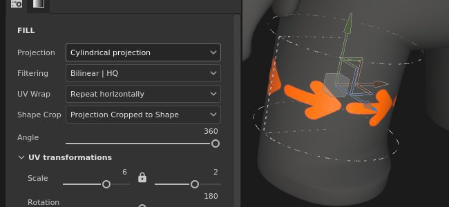

# 版本 7.3

**Substance 3D Painter 7.3** 帶來了新的網格貼圖方式，新增了填補層的曲速與圓柱投影。

上映日期： *2021年10月13日*

## 主要特色

### 新曲速投影

此版本引入了新的 3D 變形投影技術，用於填充層與填充效果。 這種投影可以利用變形網格和可控點來扭曲紋理或影像。

* **快速設定：拖放**&#x200B;從素材庫中選擇材質、alpha、材質或程序化，拖放到網格的目標部分（材質需快捷 **鍵 ALT** ）。 如果你的資產不是材質，彈出視窗詢問你想指派到哪個頻道。\
  一旦圖層建立，你會看到新的 *Warp 投影* 會自動被選中。 該圖層具備標準的3D投影模式控制，並新增 *投影深度* 參數，可設定曲速投影的深度（以綠色箭頭作為視覺排隊表示）。\
  你也可以在任何填充層或效果上手動選擇此投影模式，無需拖放資產到視窗中。

  

* **使用表面工具**&#x200B;自動放置 當新的扭曲圖層建立時，你會看到該曲面工具自動被選取。 這讓你可以移動影像，使其始終停留在網格表面。 不過你隨時可以切換到其他操作手，調整它的平移（快捷 **W**）、旋轉（快捷 **E**）或縮放（快捷 **R**）。 要回到 Surface 工具，請使用快捷鍵 **SHIFT + W**。切換到 *編輯頂點* 模式時，Surface 工具也是預設選擇，並會將頂點移動直接套上到網格表面。 不過你可以暫時且快速地覆寫表面工具，只要 **按住 CTRL** ，這樣可以讓選取的點往任何方向移動，不只是表面上。

* **易於編輯的扭曲格線**&#x200B;一旦影像的全域擺放完成，也可以編輯扭曲格線本身，以提升精度與彈性。 要進入格子編輯模式，你可以使用新增的曲速選單，或是快捷鍵 **SHIFT + V**。這樣可以編輯格子上現有的頂點。\
  你可以平均細分整個網格，但要記得如果你之前移動過頂點，它們會被重置回原本的位置。 網格細分可以透過新的曲速選項選單完成。\
  另外，也可以加入個別放置的分割，這樣只有在需要時才能有更詳細的畫面。 要加入分割，請在跳躍選單中選擇三個選項中的任一——橫向、水平或垂直。 當選中其中一個時，將游標懸停在扭曲投影上並點擊其中任意位置，會新增一個新的分割。 這不會改變現有點的位置。

  
* **自動調整頂點方向**&#x200B;預設情況下，個別頂點的切線會調整到網格表面，這表示無論它們被拖到哪裡，都會保持正確的方向。 這個自動切線選項可以透過上下文工具列中的新按鈕關閉，這樣方向就會一直保持不變。

  

欲了解更多關於 Warp 投影設定與屬性的資訊，請參閱 [專門的文件頁面](../../painting/fill-projections/warp-projection.md)。

### 新圓柱投影

此版本新增了圓柱形投影方法，用於填充層與填充效果。 這種新投影方式允許將影像或材質貼合在柱子、柱子或更有機的形狀如角色手臂周圍。

* **將一張影像包裹在網格上**\
  你可以用填充圖層或填充效果，在投影下拉選單中選擇 *圓柱投影* ，輕鬆將影像包裹在圓柱形表面上。 如果影像不需要在投影裝置外重複，你需要選擇 UV 包裹&#x200B;*的「無」**，並在* Shape Crop *中選擇*「裁切為形狀&#x200B;**」，以確保影像不會越界。接著你只需要用操作器調整投影到想要的位置。

* **調整投影角度**\
  一旦你的影像就位，就會有一個新的角度設定。 此設定可用來調整影像是否完全投射繞圓柱形狀，或限制於特定角度。 它不會裁切影像，而是縮小其寬度。

  

欲了解更多資訊，請參閱 [專門的文件頁面](../../painting/fill-projections/cylindrical-projection.md)。

### 改良的選色器

這次版本為色彩選擇器帶來了多項生活品質的提升。

* **新視窗配置**\
  改良的色彩選擇視窗已重新設計，以配合更垂直的版面設計，類似 Sampler 最新版本。 它分為三個部分——主色區，包含目前及最後的選擇、六角格區、滴管與色相滑桿;手動 RGB/HSV 滑桿區;以及色樣區。\
  

* **新的 0-255 RGB 值**\
  除了移植現有的色彩輸入方式外，改良的色彩選擇器也允許在 0-255 RGB 值中運作。 當 *滑桿區塊下拉選單中取消勾選浮點數值* 時，此選項可用。

  
* **儲存色片**\
  色片現在可以儲存在 Painter 裡！ 選定目標顏色後，可按下色彩選擇器色表區的加號鍵，顏色會被儲存在不同工作階段與專案間。 試色可以透過右鍵點擊清除，或者也可以透過本區的下拉選單一次性批量刪除所有試色。 可以保存的色片數量沒有限制。

  
* **色彩選擇視窗保持開啟**\
  色彩選擇視窗現在可以移動並放置於任何地方，甚至在不同畫面，只要沒有上下文切換，視窗就會保持開啟，這表示當你在手繪貼圖時切換圖層時，可以保持色彩選擇視窗開啟，方便存取。

  

* **更容易使用滴管**\
  現在，選色吸管可以直接在色域旁邊找到，但你也可以在選色器中找到它。 較易取得的吸管保留了所有先前的功能——你仍可點擊長按，選擇螢幕上任意的顏色。 這個裸露的吸管可以在 Painter 的所有色場旁邊找到，而不只是圖層通道。

  

欲了解更多資訊，請參閱 [專門的文件頁面](../../interface/color-picker.md)。

### 其他功能與改進

* **資產拖放改進**\
  隨著Warp的推出，貼紙功能（可在維持ALT狀態下將資產從庫拖放至視窗）也進行了調整。 現在，當貼花以這種方式製作時，它不再使用平面投影，而是使用扭曲投影。 自動選擇曲速投影應該能提升網格貼花調整的速度與效率。\
  此外，現在不僅可以拖放材質，還能拖放影像類型的資產到視窗中。 選擇 alpha、材質或程序式時，不需要使用 ALT 修飾符。 它可以直接放在網格上——這會跳出一個選單，讓你選擇這張圖片要用在遮罩或圖層的任一通道中。

  

* **自動儲存外掛改進**\
  自動存檔在較長或較重的操作中不再觸發，例如網格重新載入、烘焙或匯出。

* **性能改進**\
  為了調整滑桿操作和繪製效能，也做了一些維護與優化。

* **Python API 新增函式**\
  Python API 最近有一些新增功能，允許重新載入網格、更新資源，並透過腳本設定和查詢 UV Tiles 的解析度。

* **Substance 引擎更新 8.3.0**\
  除了一些修正和整體改進外，這次 Substance 引擎更新現在也考慮了新的圖形類型。 也可以驗證 .sbsar 檔案版本，這將有助於提升對 Substance 3D Assets 版本的使用與下載。

* **從 CC Desktop 接收 Substance 3D 資產**\
  現在可以從 CC 桌面應用程式存取 Substance 的 3D 資產，如材質、地圖集和貼紙。 而且，這些作品可以直接寄送到畫家圖書館。

## 發行說明

### 7.3.0

*（2021年8月13日發行）*\
摘要： **重大發行。 它包含了新的 3D 扭曲投影、新的圓柱投影、色彩選擇器的改進、Python API 的新函式以及錯誤修正**

**補充：**

* [投影][扭曲]將3D扭曲曝光為一種新的投影模式
* [投影][扭曲]允許在視窗中拖放的 Alpha、材質與程序化作品的貼花模式
* [投影][扭曲]使用帶有貼紙捷徑的曲速投影（ALT）
* [投影][曲速][工具列]將曲速轉換為整體或依頂點
* [投影][扭曲][工具列]新增格點，並可選擇橫向、水平或垂直分割扭曲
* [投影][扭曲][工具列]專用的重置選單
* [投影][扭曲][工具列]移動點時自動調整切線的選項
* [投影][扭曲][工具列]格子版專用選單（大小、重置、顏色與握把大小）
* [投影][扭曲]全新鍵盤快捷鍵可切換整個頂點的曲速版模式（SHIFT+V）
* [投影][扭曲]點擊 + Ctrl 可切換表面工具與其他工具
* [投影][圓柱形]揭示圓柱形投影模式
* [投影][工具列]群組操作器設定（大小、格柵步進、角度步進）
* [色彩選擇器]新的色彩選擇器使用者介面
* [色彩選擇器]在色彩選擇器元件中使用 sRGB 值
* [色彩選擇器]允許儲存與刪除色片
* [色彩選擇器]滴管可從彩色和普通插槽開啟
* [色彩選擇器]允許編輯 0 到 255 之間的動態色彩
* [色彩選擇器]讓 HSV/RGB 狀態在整個應用程式中通用
* [色彩選擇器]色彩選擇器視窗是半持久的
* [色彩選擇器]按下 Esc 會關閉色彩選擇視窗
* UI 互動及繪製時的效能提升
* [引擎]更新至新版 Substance 引擎（8.3.0）
* [腳本][Python]允許重新載入目前專案的網格
* [腳本操作][Python]允許更新專案中的資源
* [腳本操作][Python]允許設定並查詢 UV 磚塊的解析度
* [互通性]不支援 Steam 和 Substance 版本
* [互通性]從橋接接收多重資源

**修正：**

* 色彩選擇器無法顯示正確的顏色
* [烘焙中]材質曲目清單的順序不正確
* [FBX 匯入] 3ds Max 群組的樞軸轉換不被考慮
* [物質引擎]進口損壞的SBSAR墜毀
* [MacOS]專案設定選項不支援不同語言
* 自動存檔可能會在長時間的過程中凍結 Painter

**已知問題：**

* [投影][扭曲]分裂完成後，分割選項仍保留
* [投影][扭曲]當變換設定為世界空間時，翻轉無法運作
* [投影][扭曲]在某些罕見情況下，補丁間會出現遺物線條
* [投影][UV]翻轉投影時，樞軸點會被重置
* [Mac M1]智慧素材無法正確顯示
* [M1][退化]材料層疊不起作用
