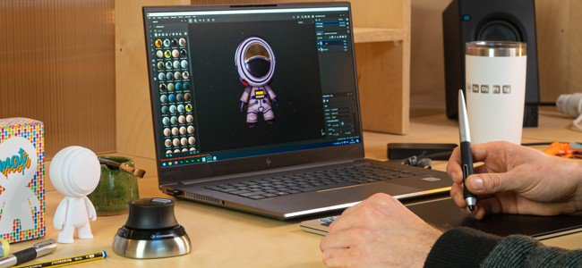

# 版本 7.4

**Substance 3D Painter 7.4** 新增了對 OpenColorIO 的支援，新增了色彩管理工作流程。

上映日期： *2021年11月24日*

## 主要特色

### 新的色彩管理

此版本引入了色彩管理，並支援 [OpenColorIO](https://opencolorio.org/) （簡稱 OCIO）第二版。

這個新工作流程允許從匯入到匯出以及視口內部管理與校準色彩，讓不同應用程式間的內容匹配更為輕鬆。

* **專案設定**\
  建立新專案時，現在可以啟用色彩管理。 現有專案也可以透過專案設定啟用色彩管理。\
  要啟用色彩管理，請從 **Legacy** （預設）切換到 **OpenColorIO** ，並使用其中一個預設設定或自訂設定。

  {width="400px"}

* **視窗顯示設定**\
  在 2D 與 3D 視圖的頂端有兩個色彩管理控制器：\
  **顏色按鈕**：啟用或停用視窗的色彩轉換。\
  **顯示變換下拉選單**：選擇使用哪個顯示變換來轉換顏色。

  {width="500px"}

* **色彩選擇器設定**\
  啟用色彩管理後，色彩選擇器會提供新的控制功能。 色彩會在設定中指定的工作色彩空間中編輯。\
  在 HSV/RGB 滑桿下方顯示最終色彩值，從工作區轉換為顯示色域。

  

  

* **匯入帶有自訂色彩空間的點陣圖和 Substance 材質**\
  有專門設定可用來指定資源處理方式，包括物質材料輸出的解讀方式。\
  也可以透過解析檔名來知道資源使用的色彩空間。

  

* **匯出設定**\
  在匯出貼圖時，色彩管理通道會在檔案名稱中顯示所使用的色彩空間名稱，並輔以新關鍵字 **$colorSpace**。

  {width="250px"}

  

>[!NOTE]
>
> 想了解更多關於應用程式內部色彩管理的運作方式，請參閱 [專門頁面](../../features/color-management/color-management.md)。

### 新的 2D 與 3D 視窗脫離

2D 和 3D 視角現在可以脫離底座，移動到其他地方。 例如，3D 視角在主螢幕上，而 2D 視角則放在另一個螢幕。

使用非擴充包視圖更容易組織應用程式的版面，也能在不會損失太多繪製區域的情況下持續監控。

* **脫離一個景觀**\
  要解除一個視角，只要打開視圖選單，選擇兩個選項中的一個即可。 每個選項會開啟一個新視窗，視窗內有其視角，而另一個視角則停放在主介面中。

  

* **即使視角是未插接的，也要切換**\
  當視圖脫離底座時，可以透過檢視選單中的切換操作來交換視圖。

  {width="500px"}

* **相容於色彩管理**\
  非底座視角有自己的色彩管理顯示轉換，讓在不同螢幕上更容易管理。

  {width="500px"}

### 3Dconnexion 對 SpaceMouse® 的新支援

**SpaceMouse®** 是 3Dconnexion 推出的裝置，能以更直覺且友善的方式操作 3D 視窗攝影機。現在已原生支援，且可直接使用 Painter 即插即用。

欲了解更多資訊，請參閱專門的文件 [頁面](../../features/spacemouse-by-3dconnexion.md)。

>[!NOTE]
>
> * 版本 7.4.2 及以上版本提供。
> * 務必安裝最新的 SpaceMouse® 驅動程式，以享受 Painter 的控制方案。

### 新內容

應用程式預設內容新增了一組資產：

* 新貼紙、工具預設與濾波器（由 Käy Vriend **製作**）：
  * **貼紙**
    * 疤原直路
    * 口袋貼片常規
  * **預設音色**
    * 拉鍊進階膠帶
    * 拉鍊進階止具
    * 拉鍊進階滑桿
    * 繩索蕾絲的緊緊
    * 繩眼緊緊
    * 閃耀之星金色
    * 閃耀派對
    * 亮粉粉彩
  * **發電機**
    * 充氣收縮/包覆

* 新 grunge 點陣圖（作者 **：Emiel Sleegers**）：
  * 垃圾灰泥漆
  * 灰泥灰泥褪色
  * 垃圾搖滾油漆剝落
  * 垃圾搖滾濕度
  * 垃圾搖滾浮言
  * 垃圾搖滾蜘蛛網
  * 垃圾搖滾灌木
  * 垃圾搖滾木質軟
  * 垃圾搖滾紙撕裂
  * 深陷垃圾搖滾
  * 垃圾搖滾刷塵

### 改良的自動紫外線展開

自動 UV 展開功能已更新，新增一個選項，以提升對 3D 模型擴展表面的支援。

這個名為 **「避免延長UV島」的新設定，** 透過拆分可能過長的UV島，更好地利用UV空間。

以下是未使用與實際使用新設定的範例：

{width="500px"}

### 改良版 Python 腳本

Python API 有一種新方法，可以呼叫 Javascript API。

這種新方法讓舊外掛遷移到新的 Python API 變得更容易。 它還解鎖了一些 Python 尚未公開的功能，例如 **烘焙** 和 **著色器** 管理。

要從 Python 執行 Javascript 指令，請使用 **javaluate（）** 函式，來自新的 **js** 子模組。 更多資訊可參考 API 文件（可透過應用程式的說明選單取得）。

## 發行說明

### 7.4.2

*（2022年3月8日發行）*

**補充：**

* [太空鼠][視窗]在 3D 視窗中支援 3Dconnexion SpaceMouse 以進行導航
* [太空滑鼠][Windows]Pro 與 Enterprise SpaceMouse 模型在 3D 視窗中的基本快捷鍵
* [太空滑鼠][視窗]3D 視窗中的專用旋轉中心圖示
* [色彩管理]使用OCIO設定中的角色來更改預設設定
* [色彩管理]色彩管理屬性視窗中的顏色管理
* [色彩管理]材質預覽時的屬性窗選色彩管理
* [色彩管理]在色彩選擇器中管理色片
* [色彩管理]新增設定以定義標準 sRGB 色彩空間
* [色彩管理]從 OCIO 設定中加入標準的 sRGB 色彩空間，並加入色彩選擇器顯示選擇器清單
* [色彩管理]色彩空間覆蓋選單的改進
* [色彩管理]允許在顯示設定中覆寫環境貼圖色彩空間
* [色彩管理]根據目前顯示繪製色彩選擇器漸層
* [色彩管理]在色彩編輯器中預設為 HDR 限制值
* [色彩管理]在舊有模式下，使用直通（無色彩空間）來控制濾鏡
* [色彩管理]在色彩編輯器中限制漸層顯示，使其與 [0-1] 範圍相符
* [色彩管理]在舊有模式的色彩選擇器中隱藏顯示選擇器
* [色彩管理]讓顏色選擇器的十六進位欄位始終在 sRGB 色彩空間中
* [色彩管理]停用資料通道的色彩選擇顯示下拉選單
* [優化]Warp 網格只重新計算覆蓋的 UV 圖塊
* [匯出]允許匯出 Sketchfab、USD 和 glTF 的 UV 圖塊專案
* [腳本][Python]允許更改音色映射函數

**修正：**

* [Sketchfab]更新現有模型會產生新的模型
* [Sketchfab]搜尋先前更新的模型時當機
* 匯出成美元時當機
* 在 Geometry Mask 建立新著色器實例或幾何體被隱藏時會當機
* [匯入資產視窗]更改匯入資源類型時當機
* 法線網格貼圖在層堆疊中使用時會被反轉
* [內容]使用者資料混合模式未被考慮
* [色彩管理]檔名中帶有色彩空間的位圖會以 UV 圖塊序列匯入
* [色彩管理]Substance 圖的色彩管理輸出出現在錯誤的色彩空間
* [色彩管理]多邊形填充工具顯示錯誤的顏色
* [色彩管理]ACES 音色映射器適用於單聲道模式
* [色彩管理]工具預覽球體光照並非色彩管理
* [色彩管理][匯出]轉換後的地圖會套用錯誤的轉換
* [腳本][Python][色彩管理]使用模板與 OCIO 環境變數建立的專案皆處於 Legacy（舊有模式）
* [腳本][Python]啟動時無法使用 JavaScript 的 evaluate 函式
* [3D Adobe 提供]使用預設不支援語言的區域設定時無法啟動 Painter

**已知問題：**

* 3Dconnexion SpaceMouse 不支援 MacOS
* [使用者介面]部分情況下，在新專案視窗中會出現帶有色彩管理功能的水平捲動列
* [烘焙師]「平均法線」設定在 UV 圖塊專案中沒有影響
* [Mac M1]智慧素材無法正確顯示
* [色彩管理]投影模式下使用的資源不會在覆蓋層中進行色彩管理

### 7.4.1

*（2021年12月14日發行）*

**補充：**

* [色彩管理]在匯出檔名中使用資料角色
* [色彩管理]當在新專案與專案設定視窗中選擇 OCIO 時，預設展開色彩管理區塊
* [色彩管理]在舊有模式中新增 ACES tonemapper
* [色彩管理]調整預設設定
* [色彩管理][匯出]在資料通道的檔名中填$colorSpace
* [匯出]將 UV 圖塊專案匯出到 Stager
* [互通性]不支援 Steam 和 Substance 版本
* [互通性]允許將 UV 圖塊專案傳送到 Stager

**修正：**

* [MacOS][撞擊聲]Painter 不會從 Catalina 開始
* [色彩管理][當機]在使用者通道上使用資料類型/色彩管理時，隨機當機
* [色彩管理]在遮罩中作為灰階使用的資源顯示色彩空間 新選單
* [色彩管理]使用者通道在傳統模式 + 單視圖中，視窗會變暗
* [色彩管理]在 iRay 中使用環境貼圖時，環境貼圖總是線性的
* [色彩管理]在舊有模式下，色彩選擇器無法為資料通道選擇正確的值
* [色彩管理]在舊有模式下，Substance 內部的色彩選擇器壞掉了
* [色彩管理]在視窗中切換單通道視圖時，使用下拉選單時確實會顯示出正確的色彩空間
* [色彩管理]在舊有模式下，匯出對色彩管理的使用者頻道套用錯誤的轉換
* 切換回材質視圖時，單視遮罩下的筆觸不會顯示
* [匯出]轉換後的地圖不會匯出為色彩管理頻道
* [材質集]在更名的使用者頻道中缺少原始名稱的提示
* [Steam]在檢查 Steam 檔案完整性時檔案遺失

**已知問題：**

* [Mac M1]智慧素材無法正確顯示

### 7.4.0

*（2021年11月24日發行）*

**補充：**

* [色彩管理]支援色彩管理 OpenColorIO 版本 2
* [色彩管理]在專案設定中新增色彩管理設定
* [色彩管理]開啟專案時關於色彩管理設定變更的警告視窗
* [色彩管理]若選取無效的 OCIO 設定檔，會顯示錯誤訊息
* [色彩管理]允許以 OCIO 環境變數覆蓋設定
* [色彩管理]多種 OCIO 配置預設整合於應用程式中
* [色彩管理]從匯入的點陣圖檔名中擷取色彩空間名稱
* [色彩管理]允許在屬性視窗中用一個色彩空間覆蓋該色彩空間的設定
* [色彩管理]在材質集設定中新增色彩管理選項
* [色彩管理][視窗]允許分別管理 2D 與 3D 視圖的色彩管理
* [色彩管理]載入並轉換環境貼圖為工作色彩空間
* [色彩管理]根據當前色彩空間調整色彩選擇器和編輯器
* [色彩管理]允許在視窗中選擇顯示變換色彩空間，並新增下拉選單
* [色彩管理]用 Iray 渲染結果套用顯示轉換
* [色彩管理]匯出具有不同色彩空間的貼圖
* [色彩管理][Python ]將環境變數（OCIO）中的色彩管理設定套用到新專案
* [視窗]允許將 2D 或 3D 視窗脫離對接
* [自動展開]新的選項，避免拉長島嶼
* [Python 腳本]呼叫 Python API 中的 JavaScript 函式
* [新專案視窗]讓匯入的地圖區塊可摺疊
* [投影][扭曲]允許在扭曲設定中隱藏法線
* [內容] 11張新的垃圾搖滾地圖
* [內容] 8 個新工具預設（拉鍊、緊繩、亮粉）
* [內容] 8 種新材料（疤痕、口袋等）
* [內容] 1個新發電機（膨脹縮小扭曲）

**已知問題：**

* [Mac M1]智慧素材無法正確顯示
* [色彩管理][當機]在使用者通道上使用資料類型/色彩管理時，隨機當機
* [色彩管理]在舊有模式下，色彩選擇器無法為資料通道選擇正確的值
* [色彩管理][Iray]在視窗啟用色彩管理時，儲存在 EXR 或 TIFF 渲染時，渲染永遠會儲存在線性
* [色彩管理]在遮罩中用作灰階的資源顯示錯誤的色彩空間選單
* [色彩管理][Iray]在 Iray 中使用環境貼圖時總是線性的
* [色彩管理][匯出]轉換後的地圖不會匯出為色彩管理頻道
* [色彩管理][匯出]匯出忽略使用者通道是否在傳統模式下被色彩管理
