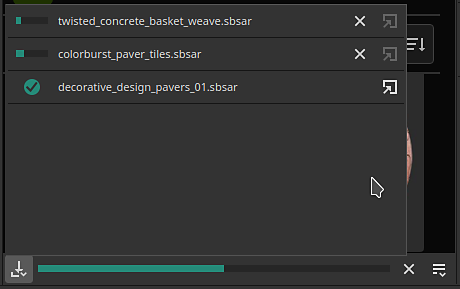
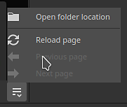

# 版本 10.0

<b>Substance 3D Painter 10.0</b> 支援 Illustrator（.ai）檔案，整合 Substance 3D 資產，透過文字資源匯入字型，並在 Python API 中加入圖層堆疊功能，並帶來多項生活品質提升。

上映日期：*2024年5月16日*

## 主要特色

### 新文本資源

這個新版本引入<b>了 Text 資源</b>，這是一種載入字型檔案，以便在不同情境（如刷子、填充投影、Substance 影像輸入等）書寫文字的方式。 用來裝飾你的紋理。

* <b>在資產視窗瀏覽你的字型</b>\
  字型現在會在資產視窗中以自己的篩選條件列出。 它們來自作業系統的不同位置（以及函式庫）。

  
* <b>拖放字型就像其他資源一樣</b>\
  字型可以像其他資源一樣，作為文字資源使用。 拖放它們即可自動建立填充投影。 它們也可以用於刷子或作為Substance濾鏡的輸入。

  
* <b>文字資源參數</b>\
  在建立文字資源時，你可以調整一些參數來調整文字的外觀：垂直與水平對齊、自動或手動大小、行距與字元間距、顏色等。

  
* <b>支援多種字元與功能</b>\
  文本資源支援從右到左的書寫以及 [連字](https://en.wikipedia.org/wiki/Ligature_（寫作）)。 （若要書寫非拉丁字母，必須使用相容的字型。）

  
* <b>像一般資源一樣匯入自訂字型</b>\
  你可以像其他資源一樣，直接匯入自己的字型檔案到你的函式庫或專案中。 不過，部分字型類型不支援，欲了解更多資訊請參閱此[文件頁面](../technical-support/workflow-issues/shelf-issues/font-import.md)。

>[!NOTE]
>
> 欲了解更多關於文本資源的<b>資訊，請參閱[專門的文件頁面](../painting/text-resource.md)。</b>

### Illustrator 檔案的新匯入 （.Ai）

繼支援 <b>.svg</b> 檔案後，此新版本也新增匯入 Illustrator 檔案（<b>.ai</b>）的功能。

* <b>插畫師（.Ai）檔案支援</b>\
  在這個新版本中，.ai 檔案現在可以匯入並渲染到 Painter，作為筆刷、填充投影或 Substance 影像輸入的資源。
* <b>.svg 和 .ai 檔案共享共同設定</b>\
  SVG 與 Illustrator 文件設定相似，特別是解析度、裁切區域及範圍選擇參數。 這表示向量資源也可以以類似方式管理。

  
* <b>美術板選擇</b>\
  Illustrator 文件支援美術板，使用 .ai 檔案時，你也可以選擇專用設定中的不同美術板。

  
* <b>改良的瞄準鏡選擇</b>\
  瞄準鏡選擇視窗已透過縮圖功能改進，使瀏覽與選擇特定元素變得更方便。\
  出於效能考量，縮圖預設是關閉的，可以透過「顯示縮圖</b>」勾選框啟用<b>。

  

>[!NOTE]
>
> 目前僅支援 Windows 和 MacOS 支援匯入 Illustrator （<b>.ai</b>） 檔案。

### 新 Substance 3D 資產整合

新增一個視窗，直接嵌入 Substance 3D 資產網站於 Painter 內。 這種整合讓你更容易直接在自己的圖書館中瀏覽和下載資源。

* <b>新的 Substance 3D 資產視窗</b>\
  介面中新增了一個擴充底座，可瀏覽 Substance 3D 資產。 如果底座看不到且關閉，可以在介面右側的底座工具列中重新找到。

  
* <b>下載管理器</b>\
  你可以透過視窗左下角的按鈕，透過專用管理員查看目前下載的資產。 可能無法下載的資產可以從此清單重新開始。

  
* <b>輕鬆找到你下載的資產</b>\
  視窗右下角的按鈕會開啟一個選單，裡面有幾個操作幫助網站導航，也能顯示資產已經被大量載入的地點。

  

>[!NOTE]
>
> 首次啟動時，下載資產需登入帳號。 此登入資料會被快取以供未來使用。

>[!NOTE]
>
> Substance 3D 資產底座在 Steam 版本中無法使用。

### Python API 中的新層堆疊模組

這次版本新增了 Python API 中的層堆疊模組。 此 API 允許控制專案的層堆疊，開啟進階層堆疊插件與自訂工具的創建。

* <b>新層堆疊 API</b>\
  新的 <b>layerstack</b> 模組允許以多種方式控制專案的層疊。 你可以：

  * 查詢並設定圖層與效果的選擇。
  * 建立新的圖層、資料夾和效果（包括濾鏡、錨點等）。
  * 實例化層次。
  * 取得並設定圖層和效果的參數，並載入資源。
  * 取得並設定物質參數。
* <b>瞄準鏡改裝與引擎暫停</b>\
  操作層堆疊可能會導致長時間計算，這也是為什麼我們也公開了可以暫停與解開引擎與 API 的功能（就像 UI 裡一樣）。 我們也讓修改能將組合在一起，既是為了效能考量，也為了撤銷一次性多次操作。
* <b>基本色彩管理</b>\
  在介紹圖層堆疊後，我們需要在 API 中引入色彩管理的概念。 新增了一個<b>色彩管理</b>模組，用來創建、調整顏色並選擇點陣的色彩空間。 （此部分 API 尚未完成，未來版本將擴充。）
* <b>查詢匯出預設資訊</b>\
  匯出預設現在已在我們的 API 中公開，允許查詢預設列表（包含預設與自訂）。 它們的內容也能以類似我們現有的匯出材質 API 格式檢索。
* <b>新的可能性即將到來！\
  </b> API 的新部分允許做許多新功能，例如儲存並還原部分圖層，或更改專案中所有資源的隨機種子：

  

>[!NOTE]
>
> 欲了解更多 API 資訊，請參閱應用程式附帶的文件（透過 <b>Python API</b> >> Help Scripting 文件），其中包含許多程式碼片段，方便上手。

>[!NOTE]
>
> 圖層堆疊插件的範例也可在我們的[線上文件](https://adobedocs.github.io/painter-python-api/)中找到。

### 改良的法線貼圖繪製

在這個版本中，我們重新設計了法線貼圖繪製的工作流程。 我們明顯改變了累積和混合普通刷印的方式。 這些變更是為了解決與繪製流程圖相關的問題。

* <b>固定累積問題</b>\
  在正常通道中反覆塗漆不會再飽和或夾住，也不會造成孔洞或瑕疵。 也不需要再將正常通道切換到 RGB32F。

  
* <b>固定還原，斷裂畫筆劃</b>\
  收回一筆筆觸不再破壞其他已畫好的筆觸。

  
* <b>零 alpha 透明度</b>\
  若材質材質 alpha 為零，刷印現在會顯示為透明。 以下範例展示了刷子印章（左）與平面投影（右）的對比。

  

>[!NOTE]
>
> 欲了解更多關於繪畫流程圖的資訊，請參閱[文件頁面](../painting/advanced-channel-painting/flow-map-painting.md)。

### 改良型轉換操作器

為了提升變形操控器的使用，已有多項改進。

* <b>精確度模式搭配 CTRL</b>\
  同時拖動操作手的同時按住 Control 會進入新的精準模式，讓操作更加細緻。 此變更適用於平移、旋轉與縮放操作器。\
  以下是拖曳時按下 CTRL 前後的範例：

  
* <b>新尺度行為</b>\
  尺度強度現在是基於當前的尺度值，而不再是場景大小。 這使得相對變化更容易進行，尤其是在小值下。 配合精準模式，讓縮放過程更加愉快。\
  另一個改變是縮小到 0 後，不再變成負值。 這樣可以避免你想縮小投影結果卻意外翻轉的問題。

  
* <b>改良的表面操作手旋轉</b>\
  表面貼紙操作器在拖曳時現在穩定許多。 只是來回平移時，它不會增加旋轉。\
  這是 <b>舊</b> 行為與 <b>新行為</b> 的比較：

  

  
* <b>拖放相機對齊投影</b>\
  將資源拖放到視窗中，可以直接在網格表面建立扭曲投影。 這個投影之前被錯誤旋轉，現在已經對齊到相機。

  

還有其他幾項改進，特別是：

* <b>更新的圖塊產生器</b>\
  <b>圖塊產生器的</b>混合模式參數現在可以更改，並會如預期般修改結果。該資源也已更新至Substance 3D Designer</b>中<b>可用的最新版本。
* <b>已修正部分濾鏡的條紋/品質問題</b>\
  有幾個濾波器卡在 8 位元精度而非 16 位元，導致使用時出現條紋/失真（像是直方圖掃描或方向模糊）。 這問題現在已經解決了。
* <b>SBSAR 輸出中的色彩空間</b>\
  當啟用 Legacy 或 OCIO 色彩管理工作流程時，SBSAR 匯出將參考專案中所使用的色彩空間名稱。
* <b>更快的資源發現</b>\
  隨著 Text 資源</b>的引入<b>，我們新增了一個快取，讓下次啟動時能更快爬取磁碟上的資源。當資源安裝在硬碟上或函式庫擁有數GB資源時，這點尤為明顯。 這個新快取可以用命令列停用，詳情請參見專用[文件頁面](../pipeline-and-integration/configuration/command-lines.md)。

非常感謝網站 [，這是阿拉伯語嗎？](https://isthisarabic.com/) 這對該版本的開發幫助很大。

上述媒體中使用的藝術品參考：

* [穿黑襯衫](https://unsplash.com/photos/man-wearing-black-shirt-aoEwuEH7YAs) 的男子，作者：Lucas Gouvêa
* [Pawel Czerwinski 的粉紅與綠色](https://unsplash.com/photos/pink-and-green-abstract-art-ruJm3dBXCqw)
* [unDraw illsutrations](https://undraw.co/illustrations)
* 克勞德·莫內

## 教學課程

## 發行說明

### 10.0.0

上映日期： <b>2024/05/16</b>\
摘要： <b>重大版本，圖層堆疊版本加入 Python API，閱讀原生 Illustrator 檔案，整合 3D 資產及新文字資源</b>

<b>補充</b>：

* [插畫家]在 Painter 中使用 Illustrator 檔案搭配藝術板
* [插畫家][SVG]在範圍選擇中加入預覽
* [Substance 3D 資產]直接在 Painter 中瀏覽、選擇並下載 3D 資產
* [Substance 3D 資產][使用者介面]新面板
* [物質3D資產]支援環境地圖與材質
* [Substance 3D 資產]允許重新載入、導航，並在新的 Substance 3D 資產面板中開啟位置資料夾
* [Substance 3D 資產]新增下載管理器
* [文字資源]允許使用可嵌入字型
* [文字資源]允許在網格上渲染字型/文字
* [文字資源]在資產面板中以新類別顯示使用者及其他共享路徑的字型
* [文字資源][屬性]新增對進階字型屬性的支援
* [文字資源]允許在迷你書架中搜尋/查看字型
* [文字資源]匯入不相容字型時新增錯誤訊息/對話框
* 其他
* [填充投影]在使用小數值時改善 Scale 操作器的行為
* [操控手]按下CTRL快捷鍵時新增精準模式
* [操作手]提升平移時的表面操作手穩定性
* [匯出]在 SBSAR 輸出中加入色彩空間名稱
* [效能]提升磁碟上資產的函式庫發現時間
* [Substance]Substance 引擎版本 9.1.2 更新
* [拖放]在視窗中放置貼紙時，將貼紙旋轉對齊到鏡頭
* [Python]圖層堆疊版本
* [Python]允許在 UI 中選擇圖層、效果、遮罩、幾何遮罩
* [Python]允許取得/設定圖層混合模式
* [Python]允許取得/設定填充層投影設定
* [Python]允許查詢填充層中的 Substance 材質顏色
* [Python]允許查詢並設定圖層與效果中的統一顏色與資源
* [Python]允許在圖層堆疊中建立與編輯文字資源
* [Python]允許編輯圖層與效果上的活動通道
* [Python]允許批次操作進行單一的復原/重做
* [Python]允許載入/編輯向量來源參數
* [Python]允許透過色彩管理編輯圖層與效果的色彩屬性
* [Python]允許查詢並建立實例化圖層
* [Python]允許加入色彩選擇效果
* [Python]允許控制點陣圖影像色彩管理
* [Python]允許暫停/解除暫停引擎
* [Python]允許導覽至兄弟節點與父節點
* [Python]允許建立濾波器/產生器效果
* [Python]允許加入關卡效果
* [Python]允許在圖層上新增智慧遮罩
* [Python]允許建立/編輯錨點
* [Python]允許在圖層上取得/設定遮罩
* [Python]允許建立比較遮罩效果
* [Python]允許查詢並使用 Substance 資源中的預設值
* [Python]允許透過 Internal\_properties 函式列出 Substance 資源的預設及其值
* [Python]允許列出預先定義的匯出預設
* [Python]允許列出函式庫中可用的匯出預設
* [Python]允許擷取匯出預設的內容

<b>修正</b>：

* [撞擊聲]用 Ctrl-Z 還原「移除著色器實例」
* [撞擊聲]如果最後選擇是效果，則在空堆疊上建立圖層
* [SVG]自訂裁切區域值的問題
* [自動展開]只重新計算包裝而不改變 UV 方向會導致當機
* [拖放]外部資源延遲會多次預先載入
* [使用者介面]拖放資源縮圖可以在圖層堆疊中隱藏警告訊息
* [效能]遮蔽紫外線圖塊仍會被計算
* [美元]範圍選擇的標註錯誤
* [資源]點陣圖影像在正常通道繪製並儲存專案後會損壞
* [美元]支援左手頂點網格排序
* [物質]重置為預設，角度小工具時總是回到零
* [引擎聲]用SVG在模板上畫是行不通的
* [引擎]法線貼圖筆觸在復原後會中斷
* [內容]圖形轉材質濾鏡的 alpha 混合和色彩空間不正確
* [內容]圖塊產生器的混合模式無法運作
* [內容]直方圖掃描濾波器在某些情況下會產生條紋
* [內容]風格化的烘焙光影不考慮繪畫高度
* [Python]著色器更換後，取回實例層資訊時出現意外錯誤

<b>已知問題</b>：

* [色彩管理]在 Linux 上使用 ACE 進行 HDR 色彩空間轉換會產生壓縮色彩
* [當機聲][Linux][AMD 版]在 Wayland OS 的層堆疊中拖放資源
* [回歸][使用者介面]在 HD 螢幕上右鍵選單太小了
* [當機聲][Python]由 TextureStateEvent 觸發的美元匯出
* [儲存]當「另存為」失敗時，SPP 專案檔案會遺失
* [MacOS Intel]匯入某些預設時會當機
* [插畫家]伺服器當機後無法匯入 AI 檔案，除非重啟 Painter
* [匯入]同名但不同副檔名的資產會被覆蓋
