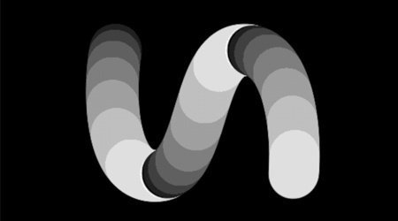
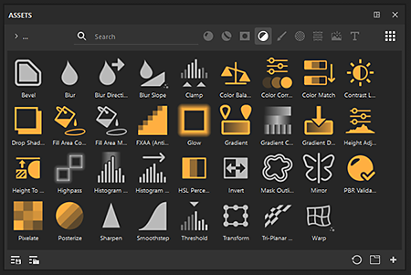
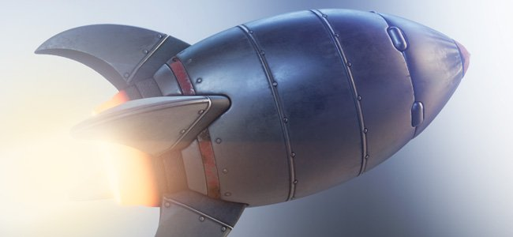
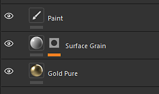

# 版本 10.1

<b>Substance 3D Painter 10.1</b> 新增了強大的濾鏡、改良的 USD 功能，以及更新的 VFX 平台與 Linux 支援。

上映日期：*2024年9月17日*

>[!NOTE]
>
> 此版本 Painter 現在使用 Qt 版本 6，影響了 Python 與 JavaScript 外掛的支援。 詳情請見下方。

## 主要特色

### 新的預設過濾器

在此版本中新增了數個濾鏡，大幅擴充貼圖流程：

* <b>新刺繡貼紙材質</b>\
  在資產視窗的材質區塊中，你可以找到新的刺繡貼紙材質。 把它拖放到網格上方，插入任何資源（像是貼圖或字型），你就能輕鬆建立新的布料細節。

  
* <b>新的填充區域色彩/遮罩濾鏡</b>\
  這兩個新濾鏡允許填滿任何封閉路徑或輪廓。 這對於快速填充 3D 路徑非常有用。 由於是濾鏡，也可用於手動刷筆或其他場合。

  
* <b>全新 FXAA 濾波器</b>\
  這個新濾鏡能快速減少鋸齒，特別是在關卡後出現的硬邊或使用色彩選擇效果製作的遮罩上。

  
* <b>新的高通濾波器</b>\
  用這個通用濾鏡，你可以產生灰階貼圖，用來做更進階的效果（像是柔化、模糊或銳化細節）。

  
* <b>新的像素濾鏡</b>\
  像素化濾鏡可以模擬解析度降低，這對於風格化色彩和圖案很有用。

  
* <b>新的海報化濾波器</b>\
  這個濾鏡有助於減少圖片中的顏色數量，有助於創造形狀對比並建立風格化效果。

  
* <b>新的閾值濾波器</b>\
  閾值濾波器是從灰階輸入快速產生銳利二元黑白遮罩的方法。

  
* <b>新的平滑階進濾波器</b>\
  平滑步進濾波器是另一種用來細化灰階資訊的水平或對比度的方法。 此濾波器同時對結果套用指數曲線，使線性梯度能轉換為平滑曲線成為可能。

  
* <b>改良型變換與鏡面濾波器</b>\
  轉換濾波器已更新，支援非均勻縮放、水平或垂直翻轉，且參數使用更簡單。 鏡面濾波器也更新了，參數更為直接。

  
* <b>改良圖示</b>\
  為了讓標準濾鏡更明顯且更容易找到，它們的圖示也重新製作。 帶有黃色調的圖示用於圖層內容，而灰階圖示則是通用圖示，既可用於圖層內容，也可用於遮罩。

  
* <b>濾波器的小型修正</b>\
  另外還有幾個過濾器已經調整過，以解決一些問題：

  * 高度調整濾波器影響了層的 alpha，在某些情況下讓它使用變得困難。
  * 模糊濾鏡在 Legacy 色彩管理模式下沒有使用線性色彩空間，導致輸入混合時產生錯誤的顏色。

### USD 與 VFX 平台支援更新

在這個版本的 Painter 中，許多第三方元件都被改進與更新：

* <b>以 Adobe Standard Material 匯出材質（USD）\
  </b>當你從 Painter 匯出材質到 USD 檔案時，你現在會跟著它們取得 Adobe Standard 材質屬性。 這讓這些 USD 檔案也能直接用於支援這些屬性的應用程式中。
* <b>從 USD 檔案匯入材質</b>\
  匯入 USD 檔案時，現在也會在它建立的專案中匯入其材質，讓在不同應用程式間的來回更方便。 如果 USD 檔案使用 Adobe Standard Material，也會設定著色器設定，使視窗中的結果與其他來源應用程式相符。
* <b>Gltf 變更\
  </b>美元更新後，GLTF 格式的行為必須做出一些調整以確保一致性。 匯入 gltf 檔案時，Painter 現在會假設法線貼圖是 OpenGL 格式。\
  有些 gltf 檔案可能會改用 DirectX 格式。 因此，在新專案視窗中新增了一個設定以考慮此情況（請注意，通常格式也可以從圖層堆疊中覆寫）。

  
* <b>更新後的相依關係</b>\
  Painter 使用的多個函式庫已更新，尤其是為了符合 VFX 平台的參考。 以下是 Painter 10.1 中使用的新版本：

  * Qt 6.5.6（以及 PySide6 6.5.6）
  * 物質引擎 9.1.3
  * OpenEXR 3.2
  * Python 3.11
  * OCIO 2.3.2
  * OpenSubdiv 3.6.0
* <b>更新的 Linux 支援\
  </b>這個新版本的 Painter 現在最低支援 Red Hat Enterprise Linux（RHEL）8.6 版本，但也應相容於 9.x 版本。

### 性能提升

應用程式的幾個部分已獲得一些效能提升：

* <b>專案開放時間改善\
  </b>以前用很多筆觸的專案，現在在 Painter 裡應該會更快打開。 這些專案的節省時間也應該稍作提升。\
  在我們的一些測試專案中，我們觀察到開啟專案時載入時間從 50 秒縮短到僅 6 秒。 開啟舊專案並轉換到最新版本時的記憶體消耗也有所改善。
* <b>改良的鑲嵌性能\
  </b>現在，當 Shader 設定啟用 tesselation（鑲嵌）時，我們會自動優化。 螢幕上小於像素的三角形將不再被鑲嵌，導致可繪製的三角形數量減少，渲染速度也更快。\
  這個改動不會產生視覺差異，也不會影響網格匯出流程。
* <b>簡化縮圖現在是預設</b>\
  在 6.2 版本中，我們為 UV Tiles 專案引入了簡化縮圖以提升效能，但一般專案仍可使用舊有的圖層縮圖計算方式。 這種行為是透過應用程式設定來控制的。\
  這個設定現在預設為優化縮圖，以提升專案效能。 如果需要，可以在主偏好設定中還原。

  

### Painter 10.1 遷移筆記

>[!NOTE]
>
> * Python 外掛在更新到 Qt6 後可能需要更新。 詳情](https://adobedocs.github.io/painter-python-api/guides/qt6-migration/)請參閱[此頁面。
> * <b></b>JavaScript 外掛現已移至使用者文件目錄內的子資料夾。現有的外掛將不再出現在應用程式中，因為需要手動移入該資料夾。
> * 在 Steam/Ubuntu 上，需要系統函式庫才能讓 Painter 正常運作。 啟動應用程式前，請確定已安裝 libxcb 游標。

## 發行說明

### 10.1.0

上映日期：<b>2024/09/17</b>

摘要：<b>重大版本，新增內容：填充區域遮罩/色彩濾鏡、刺繡貼紙濾鏡及六個通用 Substance 濾鏡，匯入帶有材質與著色器的 USD，效能提升，符合 2024 年視覺特效平台標準，並遷移至 Linux RedHat</b>

<b>補充</b>：

* [內容]新增填充區域遮罩/色彩濾鏡
* [內容]新增刺繡貼紙濾鏡
* [內容]新增 6 個通用 Substance 濾波器（FXAA、pixelate、highpass、posterize、smoothstep、threshold）
* [美元]輸出具有定義ASM材料的美元圖層
* [美元]匯入帶有材質與著色器屬性的美元
* [效能]預設啟用優化的圖層堆疊縮圖
* [效能]減少專案檔案開啟時間與記憶體消耗（資料解碼）
* 符合 2024 年視覺特效平台標準
* [VFX 平台 2024]更新至 Python 3.11
* [VFX 平台 2024]OpenEXR 3.2 更新
* [VFX 平台 2024][美元]更新 OpenSubdiv 3.6.0
* [VFX 平台 2024][色彩管理]OCIO 2.3.2 更新
* [Linux]遷移至 Linux RedHat
* [Linux]將 Nvidia 驅動程式的最小版本更新至 535.171.04
* [匯入]在匯入 GLTF 網格時新增翻轉法線貼圖的選項
* [使用者介面]使用作業系統預設值來表示拖曳事件偵測距離
* [物質引擎]新增呼叫條功能以移除可執行檔中的符號
* [啟動畫面]更新為新的啟動畫面格式
* 更新 Substance Engine 至 9.1.3 版本
* [Python]在圖層堆疊文件選單中顯示範例連結
* [JavaScript]將 Javascript 外掛移至 javascript/plugins 子資料夾

<b>修正</b>：

* [插畫家]在特定情況下匯出帶有 .ai 圖形的 UV 圖塊時會崩潰
* [動態筆劃][路徑]每筆劃隨機在路徑上不適用
* [使用者介面][屬性]當平鋪非均勻時，鎖定是啟用的
* 雙擊 Painter 專案時會建立除錯 TXT 檔案
* [美元][出口]有些材質可能缺少
* [ASM]散射色彩通道忽略金屬色
* [內容]模糊濾鏡在「工作」色彩空間中無法運作
* [內容]高度調整過濾器也會修改圖層的 alpha

<b>已知問題</b>：

* [色彩管理]在 Linux 上使用 ACE 進行 HDR 色彩空間轉換會產生壓縮色彩
* [Win][當機][ACE]顯示轉換時未使用 sRGB ICE 色域
* [回歸][使用者介面]右鍵選單在 HD 螢幕上太小了
* [當機聲][Python]由 TextureStateEvent 觸發的美元匯出
* [MacOS Intel]匯入某些預設時會當機
* [撞擊聲]重新定位資源與存檔計畫
* [引擎]用克隆工具在正常通道移色中繪製顏色錯誤
* [Python]幽靈小工具似乎被腳本刪除，但仍能運作
* [紅帽]色彩選擇器問題
