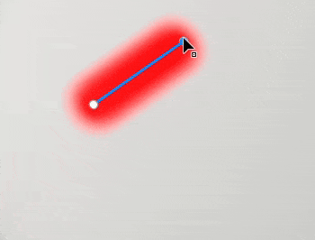
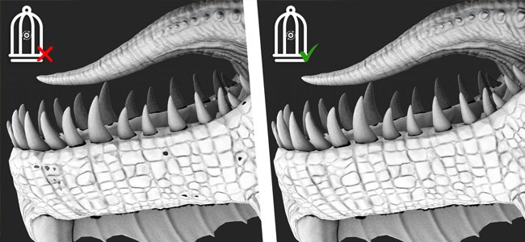

# 版本 11.0

<b>Substance 3D Painter 11.0</b> 新增了自動資源更新工作流程、填充路徑工具，以及路徑的一般改進、自動烘焙籠，以及多個用於創建風格化材質的新濾鏡。

上映日期： <b>2025年3月11日</b>

>[!NOTE]
>
> 此版本的 Painter 移除了對 Mac Intel 配置的支援。 詳情請見下方。
> 
> 此版本同時將 Windows 10 的最低支援版本提升至 22H2。
> 
> 欲了解更多資訊，請參閱我們的[系統需求頁面](../getting-started/system-requirements.md)。

## 主要特色

### 新的資源自動更新

透過新的自動更新工作流程，現在可以讓函式庫和專案隨時掌握資源的最新版本。 透過這個新流程，Painter 可以監控磁碟上的資源，尋找變更，並自動重新載入並替換成你的函式庫和專案。

* <b>在資產視窗啟用自動更新</b>\
  在資產視窗右下角，現在有一個按鈕和選單可以用來設定自動更新系統（小雙箭頭圖示）。 啟用「資產面板</b>」這個選項<b>來監控函式庫並重新載入它們。

  
* <b>專案資源更新</b>\
  重新載入資源不會自動更新專案中透過圖層堆疊、顯示設定、著色器設定等所用版本。要做到這點，請務必啟用<b>專案中使用</b>的資源選項。

  
* <b>更新頻率 </b>\
  Painter 應該多久尋找一次資源更新，可以透過專門設定在幾分鐘內定義。 使用 0 分鐘會讓應用程式每隔幾秒刷新一次。 不過要注意，這麼低的數值可能會導致效能問題。 應用程式在重新聚焦時也會自動刷新。
* <b>手動資源更新</b>\
  重新整理與更新過程也可透過自動更新選單底部的專用按鈕手動觸發。 這比起使用自動流程等待程序啟動更方便。

  
* <b>對數視窗中的不匹配與錯誤</b>\
  更新資源，尤其是當舊版與新版差異很重要時，可能會引發問題。 例如，材質結果可能會因為 Substance 資源參數的缺失或改變而大幅改變或失效。 這就是為什麼 <b>當資產的參數預設不符</b>時，就要跳過。 問題會在日誌視窗中回報。\
  要強制更新，只要停用這個設定即可。

  

  
* <b>提供 Python API 以自動化專案維護 </b>\
  自動更新的工作流程也被 Python 採用。 新增功能以協助列出過時資源並替換它們。\
  欲了解更多資訊，請參閱應用程式說明選單中的專用文件。

>[!NOTE]
>
> 欲了解更多資訊，請參閱[專門的文件頁面](../features/auto-update.md)。

### 新增填補路徑工具

填充路徑工具是一種新型路徑工具，允許在3D模型表面建立填充均勻顏色的形狀。 這使得複雜圖案的產生成為可能。

* <b>新增工具來建立帶有填充色彩的路徑</b>\
  一個名為<b>「填滿路徑</b>」的新工具可在路徑選單中取得。 這個工具在關閉時可以填滿路徑的內側區域。 填充時會為紋理集的每個通道使用統一的顏色。

  
* <b>自動適應地面</b>\
  填充路徑工具可以適用於任何類型的表面，並不限於平面區域。 它可以跨越縫隙和物體邊界。

  
* <b>與鏡面對稱與徑向對稱相容</b>\
  這個新工具也支援對稱特性，開啟了創造複雜形狀的可能性。

  
* <b>路徑工具間的切換很簡單</b>\
  在屬性視窗中新增了切換不同路徑工具的方式。 這讓你更容易嘗試工具和複製路徑。 例如，你可以建立一條路徑輪廓，然後複製它轉換成填充路徑，這樣就能快速做出帶有輪廓的形狀。

  

### 改良路徑工具，具備吸附、直線等功能

在這個新版本中，加入了許多行為與生活品質的改進，使路徑工具更易於使用：

* <b>路徑預覽（使用 Shift+P 切換）</b>\
  編輯路徑時，會出現一條新的虛線，表示當路徑在曲線末端新增點時的反應。 這使得變化更為可預測。 此預覽可透過專用設定選單或使用 <b>Shift+P</b> 鍵盤快捷鍵關閉。

  
* <b>直線與角度吸附</b>\
  <b>現在可以用 Shift </b>鍵盤修飾鍵自動在點之間創造直線。維持 <b>Ctrl </b>也能用來套用角度吸附，幫助製作幾何圖形。\
  角度吸附設定可以透過情境工具列中的路徑設定選單修改。

  
* <b>Snap Path 指向網格多邊形</b>\
  為了讓放置點更簡單，可以啟用新的吸附（磁鐵圖示）。 此選項允許在 3D 模型頂點上放置點，並跟隨曲面或邊。\
  打響指有三種不同的方式：

  * 吸附到頂點
  * 卡扣到邊緣
  * 吸附到邊緣中心

  所有這些模式都可以透過情境工具列中的路徑設定選單使用。

  

  
* <b>點擊最後一個頂點時會自動關閉</b>\
  為了讓 <b>填滿路徑工具</b>更易使用，點擊第一個頂點並選擇最後一個頂點，現在會自動關閉路徑。 要選擇點，不用關閉路徑，可以用 <b>CTRL </b>鍵。 （此行為在前一版本中被顛倒。）

  
* <b>複製路徑將從內容到遮罩的位置頂點</b>\
  現在可以在材質模式中複製<b></b>路徑，然後用<b>遮罩中「貼上路徑上的所有頂點</b>」來操作。這使得材質與遮罩之間能同步不同路徑成為可能。

  
* <b>改進顯示/隱藏介面顯示行為</b>\
  按下視窗操作器的鍵盤快捷鍵（<b>W</b>、<b>S</b> 或 <b>D</b>）現在會即時切換它們。 它們也可以從上下文工具列的專用按鈕中啟用或停用。 這項改變讓使用者能快速顯示或隱藏這些影像，而不必同時隱藏視窗中的其他視覺元素（如路徑曲線和點）。

  
* <b>旋轉與縮放現在可以在路徑頂點上存取</b>\
  在這個版本 <b>中，當選取多個頂點時，現在可以使用旋轉 </b>與 <b>縮放 </b>工具。 這開啟了調整和對齊頂點的可能性。

  
* <b>在屬性視窗中顯示路徑資訊</b>\
  現在選擇路徑工具時，屬性視窗會新增一個區塊。 這個新章節重新彙整路徑的資訊與動作，例如路徑長度、投影深度，以及切換類型時的動作。

  
* <b>從角度看的改良版切線版</b>\
  根據視角不同，編輯自訂的切線可能會比較困難。 現在這點已被改變，讓切線被限制在各自的計畫內。

  
* <b>保持路徑清單在各層間開啟</b>\
  在切換不同繪圖層和效果時，如果視窗中的路徑面板關閉，其他圖層也會保持關閉狀態。 該小組將持續開放，以使來回更方便。

  
* <b>專注於目前選擇的路徑 </b>\
  按下 <b>F</b> 鍵快捷鍵後，編輯路徑時會聚焦在路徑上，而非整個 3D 模型。
* <b>用退格鍵刪除路徑 </b>\
  現在可以透過按下 <b>退格 </b>鍵快捷鍵快速刪除路徑。

### 新物質濾鏡與貼圖產生器

新版本引入了一些新濾鏡以及一些程序式模式。

<b>篩選條件：</b>

* <b>風格化</b>\
  這個新濾鏡可以用來將現有的貼圖轉換成更具風格化的版本。 它模擬 3D 空間中的筆觸，並能套用其他效果以達到繪畫般的質感。 它包含多個預設，方便操作。

  
* <b>量子化</b>\
  量化濾波器可用來減少影像中的顏色數量，並創造具有硬性限制的平坦區域。 它也可以用來做貼圖的風格化。

  
* <b>各向異性桑原</b>\
  這個濾鏡套用[桑原濾鏡](https://en.wikipedia.org/wiki/Kuwahara_filter "https://en.wikipedia.org/wiki/Kuwahara_filter")，可用於降噪和風格化材質。

  
* <b>方向距離</b>\
  這是一種簡單的濾波器，用來在二維空間中拉伸特定方向的像素。 它可以用來模糊筆觸或輕易造成漏水。

  
* <b>斜角光滑</b>\
  斜面光滑是斜面濾波器的全新版本，提供更好的效果和控制。 它是在現有過濾器之外提供的。

  
* <b>灰階轉換 </b>\
  這個新濾鏡可以方便地將影像或通道轉換成灰階，必要時可以控制紅、綠、藍三色通道。

<b>材質產生器與音效</b>：

* <b>刮痕產生器 </b>\
  改良版的刮痕產生器，模擬細線，並具備多種隨機控制。
* <b>三角格網 </b>\
  一種由三角形連結組成的噪音，並有隨機性和平滑度的控制。
* <b>隨機牌 </b>\
  一個專門用於製作磚塊圖案的材質產生器。
* <b>沃羅諾伊與沃羅諾伊分形聲 </b>\
  這些新 2D 版本已以 3D 噪音形式提供，可用於 2D 或 UV 空間的工作與平鋪。
* <b>Designer 更新到最新版本的噪音 </b>\
  Painter 中大多數可用的音效已更新為 Substance 3D Designer 的最新版本。 噪音參數不再隱藏在群組中，讓編輯更快。

### 新型自動烘焙籠（實驗性）

當你將高多邊形網格烘焙到低多邊形網格時，現在可以在指定籠狀模式時選擇新的 <b>自動 </b>選項。 這種新方法嘗試計算一個自動籠狀網格，以最佳擬合高多邊形網格以避免失真。

* <b>常見烘焙參數的新設定 </b>\
  在共用烘焙參數中，籠子參數已被三個選項中的選擇取代：\
  <b>基於</b>距離：預設的正面/後方距離設定。\
  <b>自動（實驗性）：</b>新型自動籠。\
  <b>自訂檔案</b>：之前將自訂網格檔載入為籠子的方式。

  

>[!NOTE]
>
> 此功能被視為實驗性質。 我們計畫在未來版本中改進演算法。 我們也希望能收到對結果品質及可能錯誤的回饋。

### 在 Mac OS 上使用 Metal 進行渲染

本版本中針對 Mac 平台做出了具體變更：

* <b>Mac 上現已使用 Metal 圖形 API 取代 OpenGL </b>\
  從這個版本開始，Painter 現在在 Mac 上使用 <b>Metal </b>圖形 API，無論是渲染視窗還是處理材質。 此切換大幅提升應用程式的效能與穩定性。 隨著 OpenGL 在 MacOS 上已被棄用，未來整合新功能也會更容易。
* <b>Mac OS 上移除對 Intel 架構的支援 </b>\
  此版本移除了與 MacOS 上 Intel CPU 的相容性。 ARM 架構（M1、M2 等） 目前是唯一被支持的。

### 其他

此版本還新增了幾項其他功能：

* <b>只在新的補色層/效果上啟用基礎色彩通道</b>\
  現在預設情況下，建立新的填充圖層或效果時，只會啟用 Base Color 通道。 （這個變更不適用於拖放資源，該資源會自動產生填充層/效果。）\
  根據社群回饋，我們做出此調整，是為了避免觸發被停用的頻道計算，以提升效能。 這應該有助於在高解析度或使用UV磁磚時提升解析度。\
  請注意，你可以點擊 Base Color 按鈕快速重新啟用所有頻道，同時 <b>維持 ALT </b>鍵盤快捷鍵。

  
* <b>重新命名 UV Tiles 以輸出材質</b>\
  在貼圖集清單視窗中，無法在 UV 圖塊上新增自訂名稱。 與描述相反，自訂名稱可以透過專用標籤<b>$uvTileName</b>在匯出預設中取得。\
  此新功能允許在匯出時將 UDIM 號碼替換為特定名稱。

  
* <b>Dock 工具列新增匯出按鈕</b>\
  <b>「送出」</b>動作（可匯出至其他應用程式）移至專用視窗，現可從應用程式右側的 Dock 工具列使用。

  
* <b>改善複製/貼上路徑與圖層的命名</b>\
  在複製或複製貼上圖層與路徑時，圖層命名方式已改進，使其更一致且可預測。

  

## 教學課程

## 發行說明

### 11.0.0

上映日期：<b>2025/03/11</b>\
摘要：<b>重大版本，新增自動更新功能、填充路徑工具及其他路徑改進，以及新增篩選器與實驗性自動籠產生功能用於烘焙</b>

<b>補充</b>：

* 自動更新
* [自動更新]在資產面板中自動更新修改過的資產
* [自動更新]自動更新修改的資產遍及整個專案
* [自動更新]預設關閉自動更新
* [自動更新]若資源參數不符（.sbsar、.glsl、.ai、.svg）則可選更新
* [自動更新]新增環境變數以停用自動更新功能
* [自動更新]&#x200B;[SBSAR]若資源參數不符，則將更新設為可選
* 填土路徑
* [路徑]&#x200B;[填充]新增工具以建立填充路徑
* 步道改善
* [路徑]建立可吸附成多邊形的路徑
* [路徑]允許切換路徑類型
* [路徑]允許在內容與遮罩之間複製貼上路徑頂點資料
* [路徑]在建立新點時允許限制角度
* [路徑]允許 限制點建立到一條線
* [路徑]一聲合體
* [路徑]顯示路徑資訊
* [路徑]允許縮放並旋轉路徑頂點
* [路徑]&#x200B;[使用者體驗]讓變形裝置更容易取得
* [路徑]新增路徑預覽
* [路徑]使用 Shift + P 關閉路徑預覽
* [路徑]從側面視角改進切線版
* [路徑]允許聚焦於三維路徑
* [路徑]頂點在切換 UI 開關時應該會保留選取狀態
* [路徑]允許使用退格鍵刪除路徑
* [路徑]如果使用者擴充路徑清單，請保持開啟
* [路徑]&#x200B;[圖層堆疊]正確地在複製/貼上時重新命名重複物件
* [路徑]使用者介面與提示改進
* 性能
* [效能]在使用高鑲嵌層時提升視窗效能
* [效能]在新的填充層/效果中，僅啟用第一個聲道
* [效能]筆觸計算平行化
* 烘焙
* [烘焙中]新增全自動籠子生成選項，用於高多邊形網格烘焙（實驗性）
* 內容
* [內容]新增 6 個濾鏡：樣式化、量化、各向異性桑原、斜面平滑、方向距離、灰階轉換
* [內容]將Noises and Grunge更新至Designer的最新版本（新增2D Voronoi）
* [內容]新增 3 個貼圖產生器（Tile Random、三角形格子、刮痕產生器）
* [內容]重新命名 Unreal Engine 模板及匯出預設
* Python
* [書架]&#x200B;[Python]從 Python 儲存智慧素材或智慧遮罩到磁碟
* [Python]將烘焙自動籠功能加入 Python API。
* [Python]允許編輯材質集/UV 圖塊名稱與描述
* [Python]分享向量與字型來源的解析度設定
* [自動更新]&#x200B;[Python]在 Python 中公開專案自動更新功能
* 其他
* [匯出]讓「傳送到選項」更容易使用新面板
* [Nvidia]新增關於最新 Nvidia 驅動程式（572.16）的警告
* 角度吸附應該會受到物件/世界空間選擇的影響
* [材質集合列表]允許在 UV 圖塊中新增自訂名稱，並在匯出時使用它們
* 麥克
* [Mac]圖形渲染時用 Metal 代替 OpenGL
* [Mac]取消 Mac Intel 支援

<b>修正</b>：

* [Nvidia]&#x200B;[烘焙中]環境遮蔽烘焙結果出現雜訊
* [當機]Alt 點擊切換關閉材質集的可見性會導致當機
* [烘焙中]籠狀狀態在低多邊形時被視為高多邊形參數
* [烘焙中]ID 地圖的材質顏色烘焙器無法支援 USD 檔案格式
* [效能]在有網格且物件重疊的視窗中渲染緩慢
* [Qt]自訂的色彩選擇器沒有色彩管理設定
* [視窗] 啟用抗鋸齒時，3D 操控器閃爍
* 遮罩中橡皮擦的灰階槽
* [日誌]匯入網格時不會報告非常長的錯誤訊息
* [內容]Topstitches 工具預設中預設名稱列表中的錯字
* [Python]將 SVG/AI 檔案替換成另一個檔案並不會更新其屬性
* [Python]向量資源 Artboard ID 在 Python 查詢時在某些情況下是空的
* [Python]日誌中列印的錯誤有時會有大量回傳行

<b>已知問題</b>：

* [色彩管理]在 Linux 上使用 ACE 進行 HDR 色彩空間轉換會產生壓縮色彩
* [回歸]&#x200B;[使用者介面]右鍵選單在 HD 螢幕上太小了
* [當機聲]&#x200B;[Python]由 TextureStateEvent 觸發的美元匯出
* [引擎]用克隆工具在正常通道移色中繪製顏色錯誤
* [Python]幽靈小工具似乎被腳本刪除，但仍能運作
* [紅帽]色彩選擇器問題
