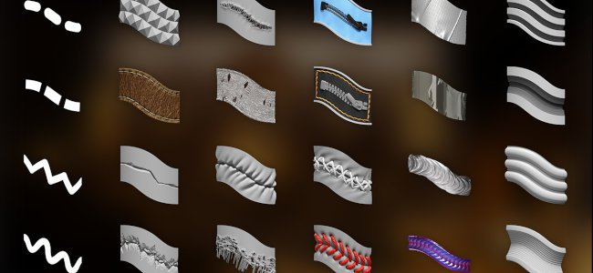
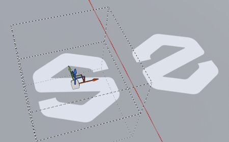
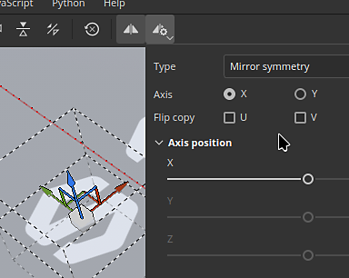

# 版本 11.1

<b>Substance 3D Painter 11.1 </b>帶來了全新的 Ribbon 路徑工具，具備專屬內容、填充圖層與效果的對稱性、位移物理大小，以及支援 Vulkan 圖形 API。

上映日期： <b>2025年11月18日</b>

>[!NOTE]
>
> 此版本的 Painter 將圖形 API 從 OpenGL 切換到 Vulkan。 此變更可能影響應用程式支援的 GPU，特別是用於基於 GPU 光線追蹤的烘焙。
> 
> 欲了解更多資訊，請參閱我們的 [系統需求頁面](../getting-started/system-requirements.md)。

## 主要特色

### 新的 Ribbon 工具

<b>帶狀路徑</b>是路徑工具家族中的一個新工具。色帶會沿著路徑轉換並重複材質，且沒有切割，開始和結束有額外控制，還有銳角選項。

這個新工具開啟了新行為的大門，例如沿路徑放置文字、沿路徑放置完美漸層，並輕鬆建立自己的進階修剪來包裹網格。\
簡言之，色帶是一種更乾淨的工具，能用路徑更精確地繪製。

* <b>新增的 Ribbon 工具，並列於其他路徑類工具旁</b>\
  新的 Ribbon 工具則在介面中其他路徑類工具旁邊可用。 它可以從工具列或路徑類型的捷徑中選擇。

  

  
* <b>緞帶是一條連續的路徑，能在各種表面上運作</b>\
  ItThe Ribbon 是一個工具，可以讓貼圖沿路徑重複或拉伸。 它能跨任何表面和幾何體運作，即使網格部分沒有連接。

  
* <b>重複的圖案與漸層</b>\
  這款新工具能以多種方式重複影像，且無接縫或切割，適合漸層與乾淨的圖案。

  
* <b>用自訂的起點和結尾拉伸影像</b>\
  <b>偏移</b>量間拉伸設定允許將影像的部分隔離出來，作為路徑上的起點和終點區段，而中間部分則沿著路徑其餘部分拉伸。這對於快速使用簡單的點陣圖，並將它們放置在無扭曲的路徑上非常實用，就像箭頭一樣。

  
* <b>可選多種角型</b>\
  在切斷切線以創造轉角時，根據需求有多種形狀可供選擇——從經典斷裂到平滑轉彎皆有。

  
* <b>拉伸與平鋪控制</b>\
  影像可以自動或手動沿著色帶路徑重複或拉伸。

  
* <b>沿路徑的文字</b>\
  字型資源可以直接在功能區路徑上使用。 文字會自動調整路徑，沿著曲線變形。 對齊設定可以用來更好地調整文字以適應各種情境。

  
* <b>長寬比與非正方形資源</b>\
  非方形的資源會自動調整以符合緞帶路徑的長度，因此非常適合用於延長圖案，如重複裝飾和裝飾。

  
* <b>與 Substance 動態筆劃工作流程相容</b>\
  帶狀路徑也相容於基於Substance的動態筆劃系統，使得產生複雜的結果成為可能。 一個值得注意的例子是可以自訂起點/結尾和左右角。\
  同時也提供了兩個新工具預設，分別是 <b>Custom Ribbon Grayscale</b> 和 <b>Custom Ribbon Material</b>，讓此功能更容易取得。

  
* <b>與對稱性相容</b>\
  與其他工具類型一樣，排狀路徑也與對稱功能相容。

  
* <b>自我重疊時的混合模式</b>\
  當緞帶路徑自相交時，可能會產生意想不到的結果。 Alpha、Normal 和 Height 通道的專用混合模式能幫助達成更好的效果。

  

所有路徑工具都有額外改進：

* <b>路徑上每個頂點的大小與不透明度分別</b>\
  現在可以調整路徑上每個頂點的大小和不透明度，且不再綁定壓力參數。 這兩個屬性現在分別處理，介面中有專用滑桿。

  
* <b>屬性視窗中的參數分組 </b>\
  現在 Painter 的大多數工具都有可摺疊的參數群組。 這項改動讓即時隱藏參數變得更容易，並縮短視窗長度。

  

>[!NOTE]
>
> 欲了解更多關於 Ribbon 工具的<b>資訊，請參閱[專門的文件頁面](../painting/tool-list/ribbon-tool.md)。</b>
> 
> 想了解更多動態<b>筆觸</b>的資訊，請參考[專門的文件頁面](../painting/dynamic-strokes/dynamic-strokes.md)。

### 功能區工具的新內容與分類

此版本包含 75 個全新工具預設，充分利用 Ribbon 的新功能。 為了讓預設更容易被發現，屬性視窗新增<b></b>了預設類別。

* <b>屬性視窗中的新預設類別捷徑</b>\
  現在使用任何路徑工具時，屬性視窗頂端<b></b>會出現一系列新的按鈕。每個按鈕都能存取依類別排序的工具預設。 收藏分類會重新組合你選擇的預設。

  

  點擊其中一個按鈕即可快速進入預先選定的預設。 點擊 <b>Assets</b> 中的「顯示更多」會在 Assets</b> 視窗中顯示更多路徑工具預設。<b>

  
* <b>快速切換預設</b>\
  為了讓切換預設更簡單，點擊預設不再是目前已編輯的路徑。

  
* <b>新內容</b>\
  此版本新增了 75 個專為 Ribbon 工具設計的新工具預設，作為預設內容的一部分。 這些預設可以直接在<b>資產</b>視窗的筆刷區塊內，或透過屬性</b>視窗中的新類別捷徑<b>取得。\
  這些預設包括：

  * <b>服裝</b>：改善了接縫皺摺和頂縫預設，以及拉鍊和布料撕裂。
  * <b>基本：</b>簡單的筆劃如線條和破折線，還有漸層和<b>基於<b>動態筆劃</b>系統的自訂色帶</b>預設。
  * <b>Grunge</b>：三種裂縫，用來模擬各種表面的損壞。
  * <b>硬質表面</b>：握把圖案、面板與閉鎖線細節、膠帶與焊接，或機械物件。
  * <b>有機</b>：包紮，乾淨與髒，可包裹皮膚及其他表面。
  * <b>顏料</b>：基於筆刷的漸層和不透明水彩預設。
  * <b>文字</b>：快速預設，用來設定沿路徑設定文字，並搭配 Ribbon 進行不同對齊模式和拉伸。
* <b>資產視窗中搜尋的新工具關鍵字</b>\
  現在可以在資產</b>視窗輸入「ribbon」、「paint」、「path」甚至「smudge」<b>，並幫助找到與對應工具相符的預設。

  

### 填充層與效果的新對稱性

填充圖層與效果現在支援其 3D 投影模式的對稱性。 可透過上下文工具列的對稱選單啟用，或在屬性</b>視窗新增的對稱區<b>段啟用。

* <b>填充層上的對稱性 </b>\
  在填充效果與圖層中使用基於 3D 的投影模式時，現在可以啟用對稱性。 鏡像對稱與徑向對稱皆可選。

  
* <b>透過情境工具列或屬性視窗啟用對稱性</b>\
  對稱可透過<b>上下文工具列</b>選單啟用，類似繪圖工具，或透過<b></b>屬性視窗中的新專屬區塊啟用。

  

  
* <b>文字與標誌的翻轉輸入資源</b>\
  填充層和效果對稱性也因為新增了可翻轉輸入影像或 X/Y 軸的新選項而受益。 這可以像是鏡像文字，同時讓正反可讀。

  
* <b>改良對稱設定介面</b>\
  對稱設定的介面經過重新設計，使其更易閱讀且使用更快速。 例如，軸滑桿各自有自己的線條，這有助於更精確。 放射狀顯示器也被縮小尺寸，以減少佔用空間。

  

欲了解更多對 <b>稱</b>性資訊，請參閱 [專門的文件頁面](../painting/symmetry/symmetry.md)。

### 排水量的物理尺寸

現在，位移可以用特定的單位來定義。 此變更使得在其他應用間對齊與匹配位移幾何形狀變得更容易。

* <b>排量設定中的新刻度單位選項</b>\
  在 <b>著色器設定</b>視窗中，調整位移強度時，會有一個新的比例單元設定可用。 此設定提供以下選項：

  * <b>正規化</b>：預設，與之前 Painter 的行為相符。 這個大小是根據目前專案內的網格邊界框設計的。
  * <b>場景</b>：使用網格檔案中儲存的單位作為參考點。
  * <b>實體尺寸（公分）：</b>使用專案 <b>設定</b>視窗中定義的專案單位。

  

### Windows 與 Linux 的新 Vulkan 圖形後端

延續我們先前版本從 OpenGL 轉為 Mac OS 上的 Metal 版本，這個新版本現在在 Windows 和 Linux 平台上使用 <b>Vulkan</b> 。

* <b>現在在 Windows 和 Linux 上，Vulkan 圖形 API 取代了 OpenGL</b>\
  Painter 現在使用 Vulkan 圖形 API 來在視窗中渲染並計算材質。 此切換應能提升應用程式的整體效能。 這也將使未來整合新功能變得更容易。
* <b>GPU 光線追蹤，用於 Vulkan 烘焙</b>\
  在我們的烘焙機中，DirectX 光線追蹤（DRX）和 Optix 已被 Vulkan 圖形 API 取代為光線追蹤。 這項變更意味著基於 GPU 的光線追蹤現已可在 AMD GPU 上以及 Linux 作業系統上使用。\
  切換到 Vulkan 也能提升烘焙渲染時間，尤其是在高解析度時。

### 其他

此版本新增了更多功能與改進：

* <b>物質解決覆寫</b>\
  在工具與填充圖層/效果中使用 Substance 資源時，會有一個新的 <b>解析度</b> 參數群組可用。 這些設定可用來更改應用程式選擇的預設解析度。\
  這對於提升或降低物質生成解析度，無論是品質還是效能考量，都非常有用。

  可用的設定如下：

  * <b>解析度</b>：定義計算解析度的模式與上下文。 預設是自動，但可以設定成 <b>貼圖設定</b> 或 <b>自訂</b>。
  * <b>因素</b>：對解析度的額外控制，以創造相對差異。 例如：使用給定情境解析度的一半。
  * <b>輸出大小</b>：根據先前設定計算出的最終解析度。

  
* <b>單一大三角形的性能提升</b>\
  直到現在，Painter 在非常低多邊形的網格或三角形非常大、很長的網格上都很吃力。 但現在情況已不同。 例如，使用單一四邊形網格來製作平鋪貼圖，應該不再是問題。
* <b>改良的預設筆刷形狀</b>\
  預設筆刷形狀已更新，新增設定以控制筆尖大小與圓度，同時考慮硬度行為。

  

## 教學課程

以下是介紹我們新功能的最新教學：

## 發行說明

### 11.1.0

上映日期：<b>2025/11/18</b>\
摘要：<b>此更新為重大版本，包含全新功能區工具及專屬內容、填充層對稱性支援、位移物理尺寸參數、透過更新的烘焙器提升效能、完整支援 Windows 與 Linux 的 Vulkan 及其他改進。</b>

<b>補充</b>：

* 新的排帶工具
* [工具]新增 Ribbon 工具以打造無縫路徑
* [Ribbon]在屬性視窗中新增 Ribbon 預設快捷鍵
* [色帶]允許在路徑上每個頂點改變色帶的不透明度
* [色帶]允許在路徑上每個頂點改變色帶的大小
* [色帶]當路徑關閉時，移除實體中定義的開始/結束
* [色帶]在屬性視窗中移除 Paint/Eraser/Smudge 路徑工具的路徑/材質預覽
* [色帶]在自我重疊時，為 alpha 和部分通道加入混合模式
* 填充對稱性
* [填充]在填充層與效果上加入對稱性支援
* [填充][使用者介面]在屬性視窗中揭露填充層與效果的對稱設定
* [填充]重新設計視窗選單與屬性視窗中的對稱設定介面
* [填充]在以變形模式投影時，正確重新定位法線貼圖
* 物理尺寸位移
* [排水量]以物理尺寸作為排水量單位
* 效能提升
* [表演]改善大三角上小筆觸的呈現
* [效能]提升著色器編譯時間
* [效能]Windows 與 Linux 的完整 Vulkan 支援
* [效能]更新版 Baker，具備更快的 GPU 渲染速度及 AMD 光線追蹤支援
* [使用者介面]將工具屬性重新組織成群組，並預設部分屬性會合併
* [引擎]將物質引擎更新至版本 9.2.5
* [Substance]在工具與填充中，對Substance資源的解析度覆蓋顯示
* [匯出]更新網格貼圖匯出預設以匯出灰階貼圖
* Python
* [烘焙聲][Python]在更新日誌中標示烘焙師更新後的破壞性變更
* [Python]在 Python 中暴露填充對稱設定
* 內容與新內容
* [內容]新增 75 個 Ribbon 工具的預設
* [內容]更新漸變建構資源以相容 Ribbon

<b>修正</b>：

* [當機]在啟用路徑吸附時載入另一個專案可能會當機
* [當機]在 Path 面板右鍵點擊，並取得剪貼簿中另一個會話的資訊，可能會當機
* [使用者介面]建立路徑時，介面會在工具屬性中向上捲動
* [使用者介面]當路徑視窗視覺化被隱藏時，滑鼠游標會消失
* [路徑]在路徑面板複製/貼上不同的工具屬性會導致不穩定的屬性
* [工具]橡皮擦和污漬工具預設不一定會更新頻道選擇
* [工具]塗裝值為灰色，但 UI 在遮罩中載入彩色工具預設後顯示白色
* [工具]由遮罩建立的預設保留了從其他預設載入的通道值
* [實質]圖中定義的正常色彩空間覆蓋不被考慮
* [內容]預設的筆刷形狀資源使用過時的物質

<b>已知問題</b>：

* 著色器實例歷史追蹤不當
* [緞帶]紫外線磁磚的效能問題
* [緞帶]路徑在某些情況下會在轉角後意外重疊
* [帶狀]當點靠近路徑端點時，切線會產生不必要的迴圈
* [撞擊聲][Ribbon]在 Ribbon 中建立非常長的文字可能會當機
* [工具]當投影用於遮罩時，材質預覽無法運作
* [烘焙中]AO 設定「自我遮蔽」在多個紋理集和啟用「以名稱匹配」時會被忽略
* [烘焙中]AO 搭配普通模式，邊緣因為缺少填充而出現了瑕疵
* [色彩管理]在 Linux 上使用 ACE 進行 HDR 色彩空間轉換會產生壓縮色彩
* [回歸][使用者介面]右鍵選單在 HD 螢幕上太小了
* [當機聲][Python]由 TextureStateEvent 觸發的美元匯出
* [引擎]用克隆工具在正常通道移色中繪製顏色錯誤
* [Python]幽靈小工具似乎被腳本刪除，但仍能運作
