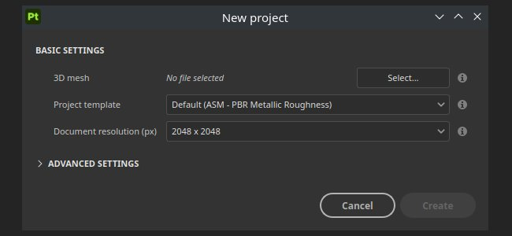

# 版本 12.0

<b>Substance 3D Painter 12.0</b> 提供直接在圖層堆疊中進行貼圖平面化、新的自動變速投影模式、重新設計的後製特效，以及改良的專案創建與設定工作流程。

上映日期： <b>2026年3月9日</b>

>[!NOTE]
>
> 此版本對整合 <b>GPU</b> 與統一/共享記憶體</b>的支援<b>有所提升。預期會有更好的視訊記憶體偵測，帶來更好的效能與較少的圖形問題。

## 主要特色

### 新的層數扁平化

現在在圖層堆疊的右鍵右鍵選單中，新增了一個 <b>Flatten</b> 動作。 多個圖層可以透過分<b>組（Ctrl/Cmd + G</b>）並建立扁平複製（<b>Ctrl/Cmd + M</b>）來快速合併。 來源群組會自動被停用，讓你可以選擇刪除它，或是儲存為 <b>智慧素材</b> 以便日後編輯。

圖層堆疊中扁平化的元素也可以直接匯出到磁碟，方便在其他應用程式中快速迭代。 群組、圖層或遮罩可以透過圖層堆疊的右鍵選單單獨或批次匯出。

* <b>直接在圖層堆疊中將貼圖壓平</b>\
  任何群組都可以透過按 <b>Ctrl/Cmd + M</b> 或在右鍵情境選單中選擇 <b>「扁平</b> 群組」來進行平面化。 此系統會產生合併後的選取內容副本，同時自動停用來源群組，保留原始圖層，直到決定移除或還原。

  
* <b>將貼圖扁平化並匯出到磁碟</b>\
  在右鍵選單中有一個專用的匯出動作，會烘焙圖層、遮罩或群組的扁平結果，並直接儲存到磁碟中。 這對於將烘焙內容轉移到其他應用程式很有用，而不必經過完整的材質匯出流程。
* <b>批次操作</b>\
  多個圖層、群組或遮罩可同時選擇，並在單一操作中逐一扁平化或匯出，使得一次處理圖層堆疊的大部分變得高效。

  

>[!NOTE]
>
> 關於層面扁平化的更多資訊，請參閱 [專門的文件頁面](../interface/layer-stack/flatten-layers.md)。

### 投影的全新變形至幾何模式

貼紙現在能自動適應複雜表面，減少手動調整的需求。 <b>當曲速投影啟動時，曲速轉幾何</b>的切換功能可在情境工具列中使用。

* <b>情境工具列中的新參數</b>\
  當Warp投影模式啟用時，情境工具列中會新增 <b>一個從Warp轉幾何</b> 的切換功能。 它可以隨時關閉，無需重置目前的投影設定。

  
* <b>自動包裹到網格表面</b>\
  啟用後，曲速投影會自動遵循底層網格的曲率與拓撲。 將投影拖曳過表面，能使其平滑地符合幾何形狀，大幅減少在複雜或曲線形狀上貼貼貼紙時所需的手動微調。

  
* <b>局部變形的保存</b>\
  在編輯扭曲投影網格頂點時，扭曲至幾何模式會嘗試保留預先定義的變形，以確保投影的形狀始終相同。

  

>[!NOTE]
>
> 想了解更多關於曲速投影的資訊，請參考 [專門的文件頁面](../painting/fill-projections/warp-projection.md)。

### 新 Post 效果

Painter 內部的渲染現在可以透過顯示設定</b>視窗中全新的後製效果<b>來強化。<b>新增功能如鏡頭光暈</b>與<b>底片顆粒</b>，並有更多改良<b>的景</b>深與<b>眩光</b>效果。

以下是新效果的範例：

* <b>新的後製效果</b>\
  所有後製效果皆可從 <b>顯示設定</b> 視窗中單獨啟用與設定。 效果依堆疊順序套用，且每個效果可獨立開關，方便組合與嘗試不同效果。

  
* <b>新增效果列表：</b>

  * <b>景深</b>：模糊焦距外的物體，以模擬鏡頭對焦。
  * <b>暈染</b>：從影像明亮區域散發出柔和的光暈。
  * <b>眩光</b>：在光源周圍產生光線條紋。
  * <b>鏡頭光暈</b>：模擬當強光照射相機時鏡頭的光學反射。
  * <b>側向像差</b>：模擬鏡頭瑕疵導致影像邊緣的色差現象。
  * <b>小景：</b>將畫面的角落和邊緣變暗，吸引焦點朝向中心。
  * <b>銳化</b>：增加邊緣對比度，使渲染出來的影像看起來更清晰。
  * <b>膠片顆粒</b>：疊加細微雜訊以模擬類比膠片的質感。
  * <b>色調映射</b>：將 HDR 亮度值重新映射到可顯示範圍，營造更具電影感的視覺效果。
  * <b>色彩校正</b>：調整對比度、飽和度、亮度與溫度，以微調整體色彩平衡。

>[!NOTE]
>
> 想了解更多關於新效果的資訊，請參考 [專門的文件](../features/post-processing/post-processing.md)。

### 改進的新專案與設定視窗

新的專案視窗和專案設定對話框已重新設計，讓導航更方便。 參數已重新排序與分組以提升可讀性，網格重新匯入工作流程也改進，減少專案迭代時重複步驟。

* <b>改良的新專案視窗</b>\
  新專案視窗中的參數已重新組織與排序，使最常用的設定更顯眼地呈現。 整體版面現在更容易掃描，減少設定新專案所需的時間。
* <b>在專案設定中重新匯入網格的新工作流程</b>\
  專案設定中新增的「 <b>重新匯入網格</b> 」勾選框，讓專案網格能更輕鬆地重新匯入，因為先前載入的檔案路徑會自動儲存並預先填充。

  

## 發行說明

## 版本 12

### 12.0.0

上映日期： <b>2026/03/09</b>\
摘要： <b>這是一個重大發行。 此版本包含圖層扁平化、幾何變形、新後製效果、新專案視窗改進及其他改進功能。</b>

<b>補充</b>：

* [壓平圖層]壓平圖層堆疊內的圖層
* [壓平圖層]將壓平圖層匯出到磁碟
* [曲速至幾何體]為曲速投影新增自動曲速功能
* [後期效果]用新增後期效果取代
* [後期效果]更新音調映射器
* [後期效果]新增後期特效資產的使用方式
* [內容][後期效果]將預設後效資產整合到函式庫中
* [新專案]改進專案創建的使用者介面
* [新專案]重新匯入網格功能的變更
* [新專案]允許開啟 \*.geo.usd 檔案
* [專案設定]改善專案設定介面
* 將 USD 函式庫更新至 25.05 版本
* 更新 Substance Engine 至 9.3.4 版本
* AMD GPU 的最低驅動程式提升到 25.3.1/25.Q2
* 更新Qt至6.8.6
* [腳本操作]將 JavaScript API 更新至 1.1.20 版本
* 將 Python 更新至 3.13

<b>修正：</b>

* [撞擊聲]在遮罩中改變材料通道輸出可能會當機
* [匯入]匯入 USD 檔案時，EXR 材質會強制轉成 sRGB 而非線性
* [UV 圖塊]包含單一影像的影像序列也會填充其他 UV 圖塊
* [烘焙中]AO 在 CPU 和 GPU 烘焙中是不同的
* [色彩管理][MacOS]視窗基底色與色彩選擇器不匹配
* [美元]有些情況下，統一價值並未進口
