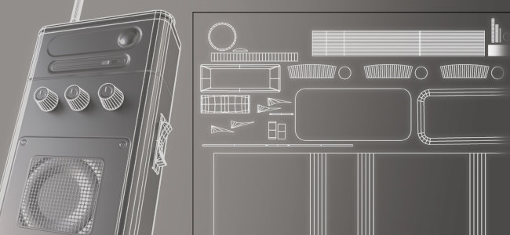

# 版本 12.1

<b>Substance 3D Painter 12.1</b> 帶來改良的烘焙工作流程，具備自動重新烘焙與斜面修正繪製，支援 OpenPBR 材質定義，並新增了自動 UV 展開的硬表面模式。

上映日期： <b>2026年6月22日</b>

>[!NOTE]
>
> 此版本將 macOS 支援的最低版本提升至 13.0（Ventura）。 欲了解更多資訊，請參閱我們的 [系統需求頁面](../getting-started/system-requirements.md)。

## 主要特色

### 斜切繪製改善烘焙工作流程

烘焙工作流程已重新設計，支援持續重新烘焙、網格上偏斜修正繪製、邊緣保護，以及重新設計的網格地圖清單。

* <b>自動再烘烤</b>

  網格貼圖可以隨著調整烘焙參數而持續重新烘焙，省去每次變更後手動觸發烘焙的需求。 自動重新烘焙是每張地圖都切換的，且一次只套用到一張地圖。 這對斜繪工作流程特別方便，也適合調整一般烘焙設定。

  

* <b>斜角修正繪畫</b>

  當籠子設定為 <b>基於</b> 距離模式時，可以直接在低多邊形網格上繪製偏斜修正，以控制烘焙時使用的投影方向。 有筆刷、橡皮擦和多邊形填充工具，並配有精簡的灰階值選擇器、對稱性，以及常見的筆刷控制（<b>Ctrl + 右鍵調整</b>畫筆大小， <b></b> X 鍵反轉繪製值）。斜繪動作可以被撤銷。

  

* <b>邊緣保護</b>

  在校正斜角時，新增了邊緣保護選項，保留投射在硬邊的高多邊形柔和感。 其結果由 <b>邊緣距離</b> 與 <b>邊緣對比</b> 度參數控制。

  

* <b>重新設計的網格地圖列表</b>

  網格貼圖清單提供每張貼圖的控制：切換地圖作為視口預覽、快速烘焙</b>單一貼圖、切換<b>自動重新烘焙</b>，以及<b>在多個貼圖集間同步</b>設定（當專案有多個貼圖集時可用）。 <b></b><b>每個控制點在懸停時都有提示。

  

* <b>簡化烘焙按鈕</b>

  視窗烘焙按鈕被一個烘焙按鈕取代<b></b>，顯示需要烘焙的貼圖數量（材質集 x UV 磚塊 x 選取的網格貼圖）。

  

>[!NOTE]
>
> 想了解更多烘焙相關資訊，請參閱 [專門的文件頁面](../baking/baking.md)。

### OpenPBR 支援

OpenPBR 著色模型現已在 Painter 中支援，並作為預設工作流程，提供可跨應用程式攜帶的標準化材質定義。

* <b>新的 OpenPBR 著色器與預設工作流程</b>

  預設使用並使用實作 OpenPBR 1.1 規範的著色器。 若新建專案未使用範本，則使用 OpenPBR 著色器，且新專案視窗的第一個項目現在標示為 <b>OpenPBR</b> ，而非 <b>ASM</b>。 新增了 OpenPBR 的專案範本，且範例專案也已更新以使用該範本。

  

* <b>從專案範本匯入時選取的著色器</b>

  匯入 USD 或 GLTF 檔案時，著色器是從專案範本設定，而非從檔案內容猜測。 當材料與範本使用不匹配工作流程時，日誌中會回報訊息。

  

* <b>OpenPBR 匯出時的命名規則</b>

  <b>匯出材質</b>視窗新增了一個下拉選單，可以選擇命名規則。當專案中至少有一個著色器使用 OpenPBR 時，預設會採用 OpenPBR，且所選方案會反映在每個貼圖集的貼圖清單中。

  

* <b>USD 與 MDL 支援</b>

  OpenPBR 教材透過 USD 格式支援。 新增 MDL 可於 Iray 中渲染 OpenPBR 材質，提供更精確的材質表示。

>[!NOTE]
>
> 自訂著色器可能需要更新。 著色器 API 已更改以支援 OpenPBR，詳情請參閱應用程式說明選單中的變更日誌。

### 新的硬質表面自動展開

新增了專為硬表面資產設計的自動展開模式。

* <b>硬表面展開模式</b>

  在自動展開設定中，有 <b>硬表面</b> 選項。 它能減少紫外線變形，並產生正交對齊的 UV 佈局，使其更適合機械網格與硬表面網格。

  

>[!NOTE]
>
> 欲了解更多自動展開的資訊，請參閱 [專門的文件頁面](../features/automatic-uv-unwrapping.md)。

### 其他

此版本新增了更多功能與改進：

* <b>一次新增或移除多個頻道</b>

  在 OpenPBR 推出後，從紋理集設定</b>中新增<b>一個視窗，允許同時選擇多個通道，這在設定 OpenPBR 工作流程中龐大的通道列表時非常方便。

  * 新視窗可在貼圖集設定中透過 <b>新增或移除通道</b> 按鈕進入。

    

  * 視窗會概述 Painter 中所有可用的通道。

    

  * <b>「套用至所有材質集</b>」按鈕可用來一次編輯所有材質集的通道設定。

    

* <b>在材質集間將所有實例平整化</b>

  實例圖層與群組新增了 <b>「所有實例</b> 扁平化」選項。 它會在每個實例出現的貼圖集上產生扁平化的結果，沿著整個實例樹向下，並記錄為單一的復原步驟。

  

* <b>統一的撤銷歷史</b>

  烘焙和上色模式現在共用相同的復原歷史。 在烘焙模式與繪畫模式間切換會被記錄為無法執行的步驟，因此動作只能在發生的模式中被撤銷。

## 教學課程

請觀看我們最新的 Youtube 教學影片：

## 發行說明

### 12.1.2

上映日期： **2026/08/03**

摘要： **小規模發行**

**修正：**

* \[撞擊聲\] 有些物質在渲染時會導致崩潰
* \[撞擊聲\] 烘焙模式下重新匯入網格
* \[當機\] 未初始化圖形顯示可能導致當機
* \[當機\] 匯出材質有時會在更新日誌時當機
* \[當機\] 在烘焙模式下，載入或更新環境貼圖時會當機
* \[烘焙中\] 修改高多邊形檔案後重新啟動烘焙可能會導致當機
* \[傳送到 Photoshop\] 無法匯出圖層遮罩
* \[引擎\] 錨點結果不會在遮罩和色彩通道之間渲染

### 12.1.1

發行日期： <b>2026/07/09</b>

摘要：小規模發行

補充：

* [斜向烘焙] 暴露斜度基礎 標準模式：網格或每個三角形
* [屬性：] 讓統一的顏色總是重置回通道的預設值
* [OpenPBR] 在輸出模板建立時，依分類重新群組頻道
* 更新 Substance 引擎至 9.4.5 版本

修正：

* []專案開啟和儲存某些專案可能會比平常花更長時間
* [當機] 重載多個網格可能導致當機
* [當機] 在遮罩檢視模式下刪除頻道會導致當機
* [撞車] 有些物質在呈現時可能導致撞車
* [繪圖傾斜] 在塗料斜向中選取的工具切換到繪圖模式後仍保持選取
* [烘焙 常見設定] 籠子距離設定不會更新籠子線框和著色器視覺化
* [引擎] 的 UV 填充「3D 空間鄰居」模式在細三角形上效果不佳
* [引擎] 錨點的結果不會在遮罩和色彩通道之間渲染

### 12.1.0

上映日期： <b>2026/06/23</b>

摘要： <b>這次更新是重大更新，包含 Baker 的改進，包括新的烘焙預設 UI 狀態、繪製斜面貼圖、自動重新烘焙、硬表面網格自動 UV 展開選項，以及 OpenPBR。 更多細節請參閱完整的發行說明。</b>

<b>補充</b>：

* [斜切烘焙聲]斜斜繪畫工具
* [斜向烘焙中]在繪製斜面貼圖時，新增斜預覽著色器和斜向量視覺效果
* [斜切烘焙聲]新增邊緣保護選項
* [斜烤聲]自動重新烘焙
* [斜向烘焙]重新設計網格地圖列表介面
* [傾斜烘焙]分割網格貼圖/常見烘焙設定 + 將共用設定從網格貼圖列表的基色或遮罩中移除
* [斜向烘焙]更改視窗工具列按鈕
* [斜向烘焙]在頂部工具列顯示對稱切換筆刷
* [斜向烘焙]網格地圖中的重命名選項列表同步選單
* [斜向烘焙]更新同步與已檢查狀態對話框
* [斜向烘焙]建立灰階選色器變體
* [斜向烘焙]更新烘焙模式圖示
* [自動展開]整合硬表面選項
* [OpenPBR]新增對 OpenPBR 1.1 的支援
* [OpenPBR]讓 OpenPBR 成為預設工作流程與著色器
* [OpenPBR]透過 USD 匯入 OpenPBR 材質與材質
* [OpenPBR]透過美元匯出 OpenPBR 材質與材質
* [OpenPBR]更新匯出貼圖視窗以顯示 OpenPBR 命名規則
* [OpenPBR]新增有關支援 OpenPBR 變更的文件
* [OpenPBR]&#x200B;[Iray]新增 MDL 以支援 Iray 中的 OpenPBR 1.1
* 美元出口的多項小幅改善
* [使用者介面]嘗試在另一個材質集上繪製時，在視窗中新增警告
* [扁平化]允許在貼圖集上將所有實例化圖層壓平
* [材質集設定]允許透過新視窗同時選擇多個頻道
* [歷史]更新「value」 還原條目措辭以反映參數名稱
* [圖層堆疊]將遮罩中的填充效果預設為白色（1.0）
* [物質]新增「mesh_hard_edges_triangle」引擎地圖輸入
* [物質]新增「mesh_hard_edges」引擎地圖輸入
* [著色器]防止著色器實例共用相同名稱
* [著色器]匯入 USD 或 GLTF 檔案時，請使用專案範本中的著色器
* 將 Adobe Color Engine 更新至 7.0 版本
* 將 MacOSX 最低版本升級到 13.0（Ventura）
* [內容]OpenPBR 新專案範本
* [內容]更新範例專案以使用新的 OpenPBR 著色器
* [Python]展開幾何遮罩 API，允許像 UI 一樣的包含與排除模式

<b>修正</b>：

* [崩潰聲]&#x200B;[網格映射設定]套用設定到其他材質集
* [撞擊聲]當從沒有世界空間法線的地圖烘焙曲率時
* [撞擊]&#x200B;[烘焙中]啟用自訂籠子但未選擇檔案時烘焙當機
* [撞擊聲]取消AO烘焙
* [自動籠]當高多邊形檔案路徑無效時，負載無限
* [Linux]&#x200B;[Windows]顏色選擇器有時會完全全黑或不出現
* [多邊形填充工具]此工具無法支援非 PBR
* &lbrack;[油漆] 刪除底色通道不會刪除之前塗過的顏色
* [美元]著色器實例並非全部正確偵測
* [內容]僅考慮輸入/輸出節點的首次使用情況
* [著色器]環境遮蔽會用不同的材質集混合方式套用兩次
* [引擎]法線貼圖中藍色通道為空（黑色）可能導致錯誤的混合結果
* [GLTF 匯入]所有材質集都啟用了 Alpha 混合
* [GLTF 匯出]匯出時 Alpha 混合總是啟用
* [匯出]匯入 GLTF 檔案時，雙面幾何總是被禁用
* [JavaScript]修改著色器設定不會影響還原歷史紀錄
* [取樣]Meet Mat 的顯示設定中未啟用次表面散射
