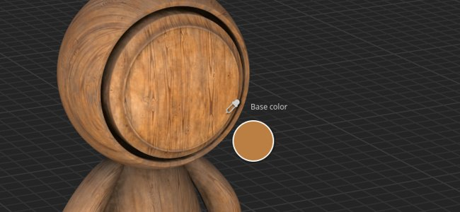
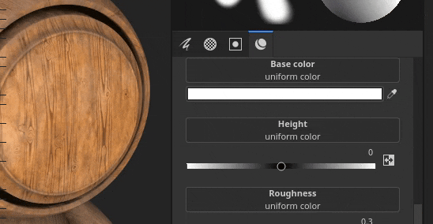

# 版本 8.1

**Substance 3D Painter 8.1** 整合了 Adobe Color Engine（ACE），支援 ICC 設定檔、新烘焙器、新 3D 音效、20 張 grunge 地圖及改良的吸管。

上映日期： *2022年6月7日*

## 主要特色

### Adobe 色彩引擎的新色彩管理（支援 ICC）

在這個新版本中，色彩管理系統擴充了 Adobe Color Engine（ACE），解鎖了 ICC 設定檔的使用 這套新系統允許在包括 Photoshop 在內的多種應用程式中匹配顏色。

* **新專案設定**\
  在建立新專案時，現在可以指定使用新加入 **的 Adobe 色彩引擎** （ACE）來指定色彩管理引擎。

  {width="400px"}

  ACE 附帶以下工作色彩空間：

  * **線性 sRGB**
  * **ACEScg**
  * **線性 Adobe RGB**
* **監控 ICC 設定檔支援**\
  你可以用 ICC 設定檔調整視窗外觀，讓顏色和螢幕相符。

  {width="400px"}

* **匯入與匯出嵌入 ICC 設定檔的影像**\
  匯入點陣圖時，可以自動擷取 ICC 設定檔。 也可以在圖層屬性中覆寫該設定檔。\
  匯出時可以指定將嵌入材質檔的 ICC 設定檔。

  {width="400px"}

* **新的 json 範本設定** 若要在專案間共享及重複使用設定，可以指定預設檔案。 想了解更多預設規格，請參閱 [專門的文件](../features/color-management/color-management-with-adobe-ace-icc.md)。

>[!NOTE]
>
> 欲了解更多資訊，請參閱 [色彩管理](../features/color-management/color-management.md) 文件。

### 物質材料的新物理尺寸支援

Substance 材質內部的尺寸現在可以用來驅動填充層投影中的比例和鋪磚。 這是一個實用的工具，可以根據實際尺寸正確匹配表面材料，無需自行猜測。

* **新的填充層參數**\
  填充層（或效果）有新的參數來控制材質的鋪磚/重複，前提是它已經定義了實體尺寸。 這些新參數僅在 3D 投影中提供。

  {width="400px"}

* **新的觀景窗網格**\
  為了讓實體尺寸更容易理解與視覺化，現在可以透過顯示設定[&#128279;](../interface/display-settings/display-settings.md)視窗在 3D 視口中啟用格子。\
  啟用後，網格會根據縮放程度自動細分。 格線單元標示於視窗左下角。

  {width="400px"}

  {width="400px"}

>[!NOTE]
>
> 欲了解更多資訊，請參閱 [專門的文件](../features/physical-size.md)。

### 新烘焙師

這三項新增功能縮短了 Designer 與 Painter 之間的差距，擴展了貼圖與渲染的可能性。

它們已被加入烘焙清單，但預設是被停用的：

新來的烘焙師有：

* **彎曲法線烘焙器**&#x200B;彎曲法線烘焙器允許烘焙一個遮擋方向（以向量形式，類似法線貼圖）。 這個材質可以用來改善視窗的著色效果，方法是在著色器設定[&#128279;](../interface/shader-settings/shader-settings.md)視窗中啟用&#x200B;**彎曲法線**&#x200B;設定。彎曲法線大幅提升了即時視窗著色的準確度。\
  對於 **漫反射陰影**，它能提供更精確的遮蔽效果，甚至看起來像是近似的全域光照（下面第一個例子）。\
  對於 **鏡面反射**，它能模擬自我陰影並減少漏光量，讓物體感覺更貼地，尤其是金屬表面（下面第二個例子）。

  {width="350px"}

  {width="400px"}

* **身高貝克**\
  Height baker 允許將低多邊形網格間的差異烘焙成灰階材質，進而在拼貼網格上產生位移。 例如在烘焙掃描資訊時。

  {width="400px"}

* **不透明度烘焙機**\
  不透明度烘焙器會產生一張黑白貼圖，顯示高多邊形網格的洞穴。 例如，它可以用來烤製圍欄，甚至是在布料表面內打洞。

### 新內容

本次發行新增了多種內容，包括：

* **全新且改良的 3D 音效，擁有超過 100 種預設**\
  現有的3D音效經過重新設計，並新增了三個音效。 現在每個音色都包含預設設定，總共 7 種音色中有 105 種預設。 這些預設可以作為起點，調整參數並取得特定的外觀。 像 3D 噪音一樣，它們無縫且能輕易重複且不會有明顯的模式。

  要找到 3D 音效，只需前往資產面板的程序化單元：

  {width="400px"}

  這些噪音提供了非常廣泛的可能性，以下是 3D Voronoi 分形&#x200B;**所提供的**&#x200B;預設：

  {width="300px"}

* **20 張新的 grunge 點陣圖和 2 種布料圖案**\
  新增一套以預設內容為基礎的 grunge 風格，以擴展現有的圖案範圍。 它們可以在程序劇>Grunges 點陣&#x200B;**圖中找到**。\
  在《程序劇>布料&#x200B;**》中也有兩種布料圖樣。**

  {width="400px"}

>[!NOTE]
>
> 有些 3D 雜訊在首次使用時可能需要幾秒鐘才能計算出來。

### 改良型吸管與物料選擇器

滴管已進行多項改良，使提取與管理顏色更為簡便。

* **新的撥弦模式**\
  選擇顏色時，不再需要同時按下並維持滑鼠點擊並移動滑鼠。 現在可以單點吸管，將滑鼠移到指定位置，再點擊一次捕捉顏色。

* **新的吸管按鈕**\
  在顏色按鈕旁邊新增了一個吸管圖示，可以直接捕捉顏色，而不必先打開色彩選擇器。

  {width="400px"}

* **新的吸管鍵盤快捷鍵**\
  當色彩選擇視窗開啟時，你也可以按 **I** 鍵進入吸管模式，無需點擊專用圖示，這讓你更容易快速切換選擇與上色。

* **眼球檢查時的新預覽**\
  使用吸管選擇顏色時，滑鼠旁邊不會顯示新的預覽。 此預覽同樣採用色彩管理。

  

* **新撥弦直接進入通道**\
  有了新的吸管行為，現在可以直接在網格上的某個通道中選取。 只要按並按住 SHIFT 鍵，直接從通道中選取顏色即可。 通道由滴管起始位置決定。 此方法繞過色彩轉換，而色彩轉換對色彩管理至關重要，以取得準確的色彩。 會出現提示，顯示該顏色是從哪個頻道擷取的。

  

* **捕捉顏色時的新色彩空間設定**\
  啟用色彩管理後，色彩選擇器中會新增設定，指定捕捉顏色時使用的色彩空間。 這個設定是全域適用於 Painter 的會話，也會套用到屬性視窗中顏色按鈕旁的吸管按鈕。

  

* **改良的材料拾取器行為**\
  工具列（鍵盤快捷鍵 P）中的材質選擇器現在會尊重屬性視窗中的通道選擇。 它將不再自動啟用 By Channels。

  {width="400px"}

### 改良的自動展開

自動 UV 展開過程現在提供了更自然的分割。

現在網格被切割成獨立的 UV 島，這種方法更接近手工完成，尤其是在有機網格上。

## 發行說明

### 8.1.0

*（2022年6月7日發行）*

**補充：**

* [色彩管理]新增 Adobe 色彩引擎（ACE）對 ICC 設定檔的支援
* [色彩管理]新增對「Adobe 98 RGB」作為 ICC 工作色彩空間的支援
* [色彩管理]允許透過設定檔設定 ACE/ICC 設定
* [色彩管理]允許在舊有模式的色彩選擇器中輸入線性色彩值
* [色彩管理]允許在介面外指定用於選取顏色的色彩設定檔
* [色彩管理]記得最後在視窗中選擇的顯示值
* [色彩管理][物質]讓產生器/濾鏡在色彩管理下正常運作
* [色彩管理][內容]新增色彩空間覆蓋關鍵字 $working 和 $standardsrgb
* [實體尺寸][引擎]從網格中提取實體尺寸資訊
* [物理尺寸][引擎]物理尺寸計算
* [實體尺寸]在使用者介面中揭露使用實體尺寸的選項
* [實體尺寸]在視窗中新增視覺輔助
* [烘焙中]增加高度烘焙師
* [烘焙中]加入彎曲法線的烘焙師
* [烘焙中]加入不透明度烘焙師
* [滴眼器]新色彩選擇器預覽
* [滴管]重新打開時，色彩選擇面板會回到最後的位置
* [滴眼器]物料拾取器的新圖示
* [滴管]色彩管理頻道預覽，選色器
* [滴管]為吸管加入點擊選擇功能
* [滴眼器]物料選擇器不再啟動非活躍通道
* [滴管]允許用捷徑使用滴管
* [滴管]吸管會偵測到相關頻道（如適用）
* [滴管]進入色彩選擇模式會關閉所有捷徑
* [滴管]移除六角形場的自動選擇功能
* [滴管]使用物料選擇器時不要關閉面板
* [滴管]當頻道無法選取時，新禁用狀態
* [匯出]將切線屬性加入 glTF 匯出
* 更新 Substance Engine 至 v8.4
* 自動展開更新至 0.9.0
* 更新至Qt 5.15.8
* 更新至 Python 3.9
* [著色器]新增對彎曲法線陰影的支援
* [MacOS]支援 3DConnexion SpaceMouse
* [Python]請記錄API中使用的Python版本
* [內容]新增 6 種 3D 音效，包含 105 種預設
* [內容] 20張新的垃圾搖滾地圖和2種布料摺疊圖案
* [內容]更新「網格貼圖」匯出預設以使用新的烘焙工具
* [內容]模糊斜率與變形濾鏡取決於材質集的解析度
* [內容]更新範例專案以使用三位新烘焙師

**修正：**

* [glTF]無法用特殊字元開啟 glTF
* [引擎]各向異性與SVT失效的遺跡
* [MacOS][M1]智慧材質未正確顯示
* [網格處理]無法從 Modeler 匯入網格
* [使用者介面]啟用色彩管理的新專案視窗中水平捲動條
* [色彩管理]部分 OCIO 設定中缺少工作空間值
* [色彩管理]視窗中的畫筆預覽並非色彩管理
* [太空鼠]Pivot 不會隨著焦點變更而立即更新，有時甚至會從模型中移除
* [匯出][美元]匯出的美元檔案結構錯誤
* [美元]出口時的環境遮蔽問題
* [內容]更新縮圖網格以符合預覽球體範例專案

**已知問題：**

* 使用擴散填充匯出材質會渲染黑色貼圖
* 正常/環境遮蔽混合壞掉了
* [MacOS]在某些罕見情況下啟動 Iray 時會當機
* [預覽縮圖]使用錨點時，簡化縮圖不會更新
* [色彩管理]在 Linux 上使用 ACE 進行 HDR 色彩空間轉換會產生壓縮色彩
