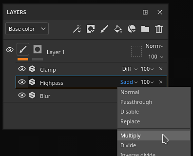
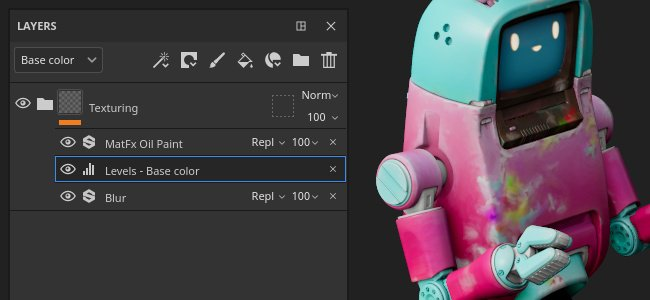
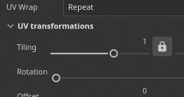

# 版本 8.2

**Substance 3D Painter 8.2** 專注於多項生活品質提升，並在應用的多個領域提供專屬功能。

上映日期： *2022年10月6日*

## 主要特色

### 新增混合模式與不透明度選項

新增了多個捷徑與動作，方便複製並套用混合模式及不透明度，跨多通道在圖層堆疊中。

* **右鍵點擊混合模式或不透明度控制**\
  當右鍵點擊混合模式或不透明度時，選擇 **「套用至所有通道** 」動作，才能在圖層的其他通道上使用此混合模式。 此動作也適用於具備混合模式與不透明度控制的效果器。

  

* **右鍵點擊圖層並選擇混合選項**\
  也可以右鍵點擊圖層（或效果）並選擇以下動作之一：

  * **對所有聲道套用混合：將**&#x200B;目前的聲道混合模式套用到當前圖層/效果的所有其他聲道。
  * **對所有通道套用不透明度：將**&#x200B;當前通道不透明度套用到當前層/效果中所有其他通道。
  * **同時套用在所有**&#x200B;通道：將當前通道混合模式和不透明度套用到當前圖層/效果的其他通道。
  * **複製通道混合設定**：將目前圖層/效果的所有混合模式和不透明度值複製到剪貼簿。
  * **貼上通道混合設定**：將剪貼簿中目前的混合模式和不透明度值套用到目標圖層/效果上。

  

### 新的混合模式與濾鏡及色彩選擇效果的不透明度

濾鏡和色彩選擇效果現在可以使用混合模式和不透明度控制。

* **濾鏡上的混合模式與不透明度**\
  濾鏡現在可以使用混合模式和不透明度值。 它們預設為 **替換** ，以保留相同的行為並避免重複 alpha 元件資訊。 濾鏡上的混合模式允許計算效果並直接在圖層上組合結果，避免使用錨點與填充效果來達成相同效果。 這也避免了在濾鏡本身手動實作混合模式的需求。

  

* **色彩選擇時的混合模式與不透明度**\
  色彩選擇效果已修改以支援混合模式與不透明度控制。 過去這個效果是輸出 alpha 結果，為了讓混合模式如預期運作，新增了一個設定來指定輸出的背景色。 它被設定成黑色，而不是透明（這是舊有的行為）。

  

  

* **簡化效果堆疊**\
  過去當需要以特定方式結合效果（例如透過混合模式）時，使用錨點和填充效果是必需的。 現在直接在濾波器上混合模式，這已經不一定能大幅降低效果堆疊的複雜度。

  {width="400px"}

### 資料夾的新效果

資料夾內容（圖層的顏色部分）現在可以接收任何類型的效果。 過去必須建立複雜的圖層配置（如直通圖層或錨點）才能達成相同結果。

### 新物質檔案（SBSAR）匯出

現在在匯出貼圖時可以使用 Substance archive（SBSAR）檔案格式。 SBSAR 是一個容器，可在許多應用程式中透過 Substance 整合開啟，讓自訂貼圖的「即插即用」變得更快且簡單。

* **匯出物質檔案（SBSAR）**\
  現在可以在匯出材質&#x200B;**視窗的檔案格式**&#x200B;列表中指定 SBSAR 檔案格式。這會匯出一個包含所有指定材質的 SBSAR 檔案。 輸出節點的命名及其使用方式由所選的匯出預設及其通道類型定義。

  

* **混合匯出預設與 PSD 與 SBSAR 檔案格式**\
  匯出預設現在除了所有其他影像格式外，也能指定輸出映射為 PSD 或 SBSAR。 PSD 與 SBSAR 格式被視為「容器」，意即可儲存多個材質。 當匯出預設同時指定容器格式與獨立影像格式時，模板中針對 SBSAR 檔案的輸出會被分組，其他輸出則匯出為獨立檔案。

  

### 新增 3D 模型下方點亮環境選項

顯示設定[&#128279;](../interface/display-settings/environment-settings.md)中的新設定允許將環境貼圖與相機對齊，從而調整光線角度並照亮 3D 模型下方的部分。

要使用此新設定，請到 [顯示設定](../interface/display-settings/environment-settings.md) 並更改 **環境對齊** 設定：

* **世界**：環境貼圖與場景對齊。
* **本地**：環境貼圖與攝影機對齊。

陰影會根據設定自動調整。

### 在資產視窗中新增收藏與刪除/重新載入

資產視窗新增[&#128279;](../interface/assets/assets.md)了動作，使資源管理更為便利。

* **快速找到它們的熱門資源**\
  在資產視窗中右鍵點擊任何資源，將它收藏（或取消收藏）。 最愛的資源總是在搜尋查詢中排在第一位，角落會有一個小星星標籤，讓它們更突出且易於取得。 還新增了專門的搜尋查詢，讓你輕鬆瀏覽所有喜愛的資源。

  {width="350px"}

* **刪除並重新載入磁碟上的資源**\
  位於使用者函式庫中的資源現在可以被刪除、重新載入或重新命名（除了套件中的資源，如 Substance 圖或 ABR 筆刷）。

### 其他特色與改進

這個新版本加入了許多小的額外改進與功能：

* **全新歡迎與最新資訊視窗**\
  為了隨時掌握應用程式新增的功能，我們現在在啟動應用程式時新增了「歡迎」與「新增內容」視窗。 這些視窗很容易關閉，下次發射時不會再出現。 你總是可以透過說明&#x200B;**選單重新開啟它們**。

  {width="400px"}

  {width="400px"}

* **快速重新匯入 3D 模型的新動作**\
  新增了鍵盤快捷鍵（**預設為 CTRL+SHIFT+R** ），可快速重新匯入目前專案的 3D 模型。 這讓資產的迭代變得更簡單、更快速。 若找不到原始檔案，日誌中會顯示錯誤訊息。 編輯選單也新增&#x200B;**&#x200B;**&#x200B;了一個動作。

  

* **提升 HDPI 支援**\
  關於 HDPI 螢幕和系統縮放，已有多項修正。 我們現在支援中間的縮放值（例如 125%），這樣可以避免某些螢幕的介面太大或太小。 在不同縮放值的 HDPI 螢幕間移動視窗也應該會正常運作。

* **將Substance Graph參數重置為預設值**\
  在所有使用物質圖（作為 alpha、材料、濾波器等）的地方， 現在可以將參數重設為預設值。

  * **重置所有參數**：使用參數列表下方的還原預設值按鈕，重置整個物質資源。
  * **右鍵點擊**：右鍵點擊特定參數，即可開啟與該參數相關的重置動作選單。

   

* **在視窗中查看個別 RGBA 元件**\
  在視窗中查看通道時，在顯示設定>通道顯示&#x200B;**下**&#x200B;有一個名為&#x200B;**「色彩通道」**&#x200B;的新設定，可以單獨查看 RGBA 組合。這對於分析貼圖或在使用者通道中隔離特定元件非常有用。

  

  {width="450px"}

* **填充圖層與效果超過 128**\
  填充層與效果的平鋪參數已修改為軟範圍。 這讓現在可以輸入任何想要的平鋪值。 滑桿的預設範圍也從 [-128,128] 縮小到 [-32,32]，以便拖曳。

  

* **新的 16f 和 32f EXR 材質匯出設定**\
  過去，EXR 貼圖匯出在介面中強制為 32f 位元，但在實際檔案中則會產生 16f 位元資料（半浮點）。 現在已經修正，並且明確可以選擇 16f 或 32f 位元。 舊專案和匯出預設使用 EXR 格式的預設會是 16f 位元，以尊重舊有的行為（主要是為了避免產生比以前更重的檔案）。

  

* **匯出並重新載入 UI 佈局**\
  儲存與重新載入 UI 佈局的新操作可在 Windows **選單中找到**。這讓切換不同版面更方便，或是在不同電腦間儲存並重複使用使用者介面。 目前的兩種畫家模式——渲染和繪畫——都有各自的版面配置。 Python 也提供一些功能，允許儲存並重新匯入 UI 佈局（見下文）。

  

* **重新整理的檔案選單**\
  我們透過將多個進階存檔功能組合起來，整理了檔案選單。 這些行動中有些也被重新命名，以釐清其行為。

  

* **開啟過於近期的專案時，錯誤訊息會改善。**\
  現在，當用新版應用程式開啟專案時，會顯示更實用的訊息。 訊息現在同時包含專案與應用程式版本，方便更了解所需版本。

  {width="400px"}

### 改良版 Python 腳本

Python API 新增了多項功能。 欲了解更多詳情，請參閱應用程式說明選單中的相關文件。

* **substance\_painter.resource**\
  **substance\_painter.resource.Type** 現在能辨識更多類型的資源，特別是 Substance 和 Photoshop 筆刷套件。\
  資源物件現在可以列出其父與子物件，例如，允許在 Substance 套件與 Substance 圖之間切換。

* **Substance\_painter.textureset**\
  新增了兩個功能（以及一個列舉）用於在材質集設定中取得和設定網格貼圖： **get\_mesh\_map\_resource（）** 和 **set\_mesh\_map\_resource（）**。

* **內容\_painter.ui**\
  新增了多項功能以儲存及重新載入 UI 版面。 請注意，版面配置也會依目前的應用程式模式（繪畫或渲染）而有所不同。

* **內容\_painter.事件**\
  新增了一個 **TextureStateEvent** ，以協助追蹤材質集圖層堆疊的修改及其他參數變更。 此事件會在塗裝筆觸或通道的新增/移除時觸發。

## 發行說明

### 8.2.0

*（發行日期：2022年10月6日）*\
摘要： **重大版本，新增了新入門面板（新的歡迎面板和新功能面板），匯出成 SBSAR，資料夾的效果，多項生活品質改進及錯誤修正。**

**補充：**

* [新手入職]新用戶入職小組歡迎

  新增一個歡迎畫面，當新自訂用戶第一次打開 Painter 時。
* [入職過程]新增面板將提升新功能的可發現性

  新增了一個「新增內容」畫面，顯示主要新功能。 在重大更新後首次開啟 Painter 時會自動顯示，並可透過「說明>新內容」再次存取。
* [入門中]重新命名舊版歡迎進入「主畫面」

  舊的歡迎畫面改名為主畫面，以避免與新的歡迎畫面混淆。
* [使用者介面]解決高 DPI 螢幕的縮放問題

  提升 Painter 介面在高畫質螢幕上的適應性，並可自訂顯示縮放。
* [使用者介面]避免使用者介面中持續出現錯誤訊息

  過去專案的錯誤訊息現在已從底部狀態列移除。
* [使用者介面]重新設計儲存選單

  額外的存檔選項現在會集中在子選單中，有些則為了保持一致性而重新命名。
* [使用者介面]儲存與匯出/分享 UI 佈局

  在視窗選單中新增了將 UI 佈局儲存成檔案並重新載入的新動作。 繪畫和渲染版面會分別儲存。\
  「substance\_painter.ui」新增了多種功能，可用於儲存、重置及載入 UI 版面。
* 新增複製貼上動作來混合模式或圖層的透明度

  在圖層右鍵選單新增了「混合選項」。 它允許將所有通道的混合模式和不透明度從一個圖層複製貼到另一個圖層。
* 對圖層的所有通道套用混合模式/不透明度

  新增了右鍵功能，讓圖層的混合模式和透明度能把目前點擊的設定套用到所有通道。
* 用鍵盤快捷鍵重新載入網格（CTRL+SHIFT+R）

  新增了一個可編輯的捷徑，可以重新載入網格檔案，並保留最後可用的設定。 也可以透過編輯>重新匯入網格來存取。
* 將物質參數重置為預設

  在 .sbsar 資源的屬性底部新增了一個按鈕，可以將資源重置為 defaut。
* 將畫筆重置為預設

  在屬性的筆刷區塊新增了一個選單，可以重置成預設的基本筆刷。
* 右鍵點擊可將個別物質參數重置為預設值

  新增了透過右鍵點擊重置 .sbsar 資源中個別參數的功能。
* [資產面板]「釘選」最喜歡的資產，顯示在資產面板頂端

  新增了一個右鍵功能，可以將素材置選為收藏，置於面板頂端。 你也可以透過「已儲存搜尋」查看所有喜愛的素材。
* [資產面板]刪除、重新載入並重新命名資產

  新增了右鍵選單選項，可以刪除、重新載入及重新命名使用者資料庫中的資產。 它們會直接從磁碟上的資料庫位置刪除，並從原始位置重新載入。 像 .abr 或 .sbsar 這類套件中的資產無法單獨編輯。
* [色彩選擇]將混合模式加入色彩選擇效果
* [圖層堆疊]在濾鏡上加入混合模式和不透明度
* [圖層堆疊]允許填充層/效果的平鋪值大於 128
* [層堆疊]填充層/效果中圓柱形投影的圓柱蓋

  填充層屬性中的圓柱投影現在可以移除圓柱蓋。
* [日誌]如果網格部分在負空間中，嘗試建立 UV Tile 專案時會顯示錯誤訊息

  新增了更清楚的錯誤訊息，因為 UV 部分位於負空間，導致無法建立 UV Tile 專案。
* [專案]開啟專案時，請在錯誤訊息中標示版本「資料過於近期」

  當開啟一個對該應用程式來說太新的專案時，錯誤訊息會顯示專案版本，方便辨識正確的應用程式版本。
* [視窗]允許從下方照亮網格

  在顯示設定>相機>環境設定中新增了一個環境對齊參數，讓環境貼圖的光照在設定為「本地」時與相機對齊。
* [視窗]在視窗中查看 R、G、B 和 Alpha（單人顯示模式）

  在「顯示設定」>「視窗設定」>「通道顯示」中，有一個新的色彩通道設定，允許在單一顯示模式下只顯示通道的 R、G、B 或 Alpha 成分。
* [著色器]允許在材質分層著色器中將使用者通道設定為 RGBA

  當在著色器中設定材質分層的 Texture Set 通道設定時，現在可以指定通道格式，使其偏離預設值。 這讓它能特別地請求彩色使用者通道，而非僅僅灰階。
* [匯出]允許將貼圖匯出為 SBSAR

  當透過檔案>匯出貼圖視窗匯出貼圖時，可以選擇 SBSAR（Substance Archive）檔案格式來重新組合這些貼圖。 SBSAR 的內容由所使用的輸出範本驅動。\
  SBSAR 檔案格式也可以在匯出預設中設定。 使用混合配置（SBSAR + 其他格式）時，針對 SBSAR 的貼圖會被分組，其餘則與之一併匯出。
* [匯出]EXR 檔案格式的 16 位元外露選項

  匯出 EXR 材質檔時，現在可以在匯出材質視窗中選擇 16f 位元（半浮點）或 32 位元（浮點）（匯出設定和匯出預設皆可）。 舊專案和舊匯出預設會預設為 16f 位元，以反映舊有的行為。
* [Python]新增事件以知道材質集何時被修改

  新的「substance\_painter.event.TextureStateEvent」可以讓你知道材質集是否因繪圖筆觸、新增通道或移除通道而被修改。
* [Python]允許在材質集設定中取得並設定網格貼圖資源

  新增了「substance\_painter.project」模組，用來取得和設定網格貼圖資源。 這些函式可以用來更新貼圖集設定所參考的網格貼圖。
* [插件]移除取得其他 JS 插件的選項

  移除了取得 Javascript 外掛的選項，因為它們被架設在已失控的 Share 網站上。
* [內容]新增 Roblox 範本並匯出預設

  新增了 Roblox 的「材質變體」和「表面外觀」專案範本與匯出預設，讓 PBR 材質匯出到 Roblox 變得更方便。 範本可透過檔案>新專案視窗存取。
* 更新 Substance Engine 至最新版本（8.6.3）
* [Steam]為 Apple Silicon 晶片組（Apple M1 / M2）優化組裝

**修正：**

* 使用 16k EXR 時會當機
* [撞擊聲]Ctrl Z 刪除著色器實例後
* [Iray]IoR 對某些著色器被封鎖在 1
* [Win]&#x200B;[烘焙聲]有些高多邊形無法載入
* [色彩管理]在 UI 中出現錯誤的色彩空間名稱，並搭配濾鏡
* [Python]由匯入函式回傳的資源物件沒有型別

  在 Python 匯入 Substance 套件時，函式回傳的是套件本身，而非其圖形。 資源模組現在提供函式與參數，以檢索 Substance 套件的圖。

**已知問題：**

* [色彩管理]在 Linux 上使用 ACE 進行 HDR 色彩空間轉換會產生壓縮色彩
* [層堆疊]輸入來源未儲存在每層
* [繪畫]時間抗鋸齒在某些情況下會在繪畫時產生偽影
* [匯出] 2DView 會隨機匯出均勻的貼圖
