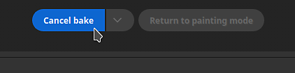
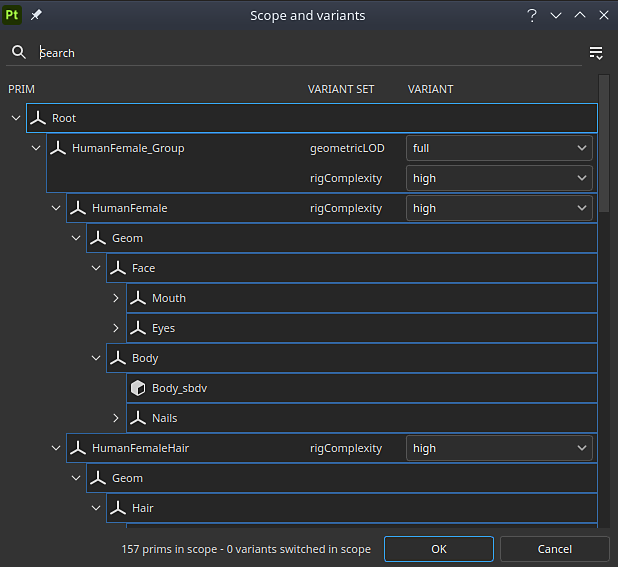

# 版本 8.3

**Substance 3D Painter 8.3** 新增了烘焙模式、USD 檔案匯入，以及在 UV 投影模式下支援實體尺寸。

上映日期： *2023年1月10日*

## 主要特色

### 全新烘焙模式

舊的烘焙視窗已被專用模式取代，並新增多項功能，特別是像是籠子顯示和錯誤匹配等視窗視覺化功能。

* **存取與切換模式**\
  烘焙現在成為一個全新的獨立模式，除了應用程式既有的繪畫和渲染模式之外。 要進入烘焙模式，只要使用情境工具列中的小可頌圖示即可。 切換模式也可透過模式選單或鍵盤快捷鍵切換。 要回到另一個模式，只要使用該模式的專用圖示（另外，**貼圖集設定](../interface/texture-set/texture-set-settings.md)中的[烘焙網格地圖**&#x200B;按鈕仍可進入新模式）。

  

  

* **新模式介面**\
  傳統的烘焙窗口已被改造成專用碼頭模式，特別是：

  * **貼圖集清單** 可以用來定義專案中哪些部分會被烘焙。
  * **Mesh Map Bakers** 允許在常見烘焙設定和烘焙設定之間選擇。 同時，這裡也能指定將啟動哪個烘焙流程。
  * **網格地圖設定** 是所有烘焙器和常用設定的所在，並可根據前兩個視窗的選擇進行修改。
  * **烘焙日誌** 會整合烘焙過程中的不同資訊，特別是錯誤訊息。
  * **烘焙視覺化**：這個面板位於視窗中，控制與低多邊形和高多邊形網格顯示相關的多個選項。

  {width="500px"}

* **直接從視窗開始並取消烘焙過程**\
  啟動或取消烘焙過程的按鈕現在位於視窗底部。 也可以用小箭頭來指定烘焙模式：根據材質集清單的選擇，或是使用目前啟用的材質集來指定。

  

  

* **在視窗中顯示高多邊形網格**\
  在烘焙設定中指定高多邊形網格時，現在也會載入在視窗中（除非禁用專用的視覺化設定）。 這可以檢查低多邊形和高多邊形的網格幾何是否匹配。

  {width="400px"}

* **在視窗中顯示籠狀網格，但缺少區域為錯誤**\
  籠狀網格也可以顯示在視窗中。 當不使用專用網格檔案時，會顯示一個隱含的籠子，並會根據最大正面距離參數做出反應。 調整籠子大小時，高多邊形網格中位於籠子外的任何部分預設會顯示為紅色，方便你輕鬆找到烘焙過程中會漏掉的網格部分。

  

* **載入和烘焙時可以看看網格**\
  載入網格和烘焙不會凍結應用程式，這表示在這些操作中仍能與視窗互動。 這有助於調查烘焙進度、及早發現問題並取消烘焙，最終節省時間。 同樣地，視窗中最明顯的材質集現在會先烘焙，有助於提前查看特定區域的結果。

  

* **中性材質與視窗設定**\
  為了幫助你專注於烘焙結果並找出問題，烘焙模式不會顯示已繪製的材質，而是使用中性材質。 這些中性材質的設定可以在視窗內的烘焙視覺化面板中調整。

  

* **顯示缺少 UV 接縫的硬邊**\
  烘焙時出現的瑕疵之一是硬邊沒有紫外線接縫。 這會導致明顯的線條，破壞陰影的平滑感。 為此，新增了視覺化設定，能在 3D 和 2D 視圖中突出這些標示，否則很容易被忽略。

  {width="450px"}

  {width="300px"}

* **參數同步與取消同步**\
  新的同步動作允許指定烘焙設定中哪部分在材質集間同步。 否則要用完全相同的方式多次設定會很麻煩。 有時候，擁有帶有專用設定的貼圖集，並且保持不同步會比較好。 例如，現在將 Common 設定分開，可以使用最大正面距離、解析度和/或高多邊形網格清單，這些都會因材質集而異。

  {width="400px"}

  {width="400px"}

* **以姓名檢查器配對**\
  **烘焙日誌**&#x200B;中的&#x200B;**「依名稱**&#x200B;配對」標籤可以幫助你在烘焙前發現配對過程中的錯誤，讓你更容易發現不匹配的網格。匹配的網格會被分組，其他則會被隔離並以紅色顯示。

  {width="450px"}

>[!NOTE]
>
> 這個新模式中還有更多新設定。 想了解更多，請參閱 [專門的文件頁面](../baking/baking.md)。

### 新的 USD 檔案匯入與匯出

此新版本新增了通用場景描述（USD）](https://graphics.pixar.com/usd/release/intro.html)檔案格式的支援[。現在可以啟動 Painter 專案，使用 USD 格式匯出網格和材質，讓跨應用程式的工作流程更一致。

* **匯入帶有變體、蒙皮和特定幀數的 USD 檔案**\
  在建立專案或重新匯入網格時，可以使用 USD 檔案格式。 USD 檔案常為複雜的場景，因此也提供示波器與變體選擇器，僅匯入檔案的子集。

  {width="400px"}

  {width="400px"}

* **匯出 USD 作為新檔案或連結到專案中使用的原始美元**\
  當你的貼圖準備好後，你可以用 **檔案>匯出貼圖** 視窗，將你的 USD 檔案和貼圖檔一起匯出。 只要啟用「匯出美元資產&#x200B;**」這個設定**&#x200B;就能完成。這會產生多個 USD 檔案，之後可以輕鬆整合進管線中。 如果你用的是非 USD 檔或沒有 UV 的 USD 檔，這會匯出一個新的 USD 幾何檔，除了材質貼圖和 USD 材質檔外。\
  此外，也可以使用 **檔案>匯出網格** ，將專案幾何匯出為 USD 檔案。

  

  {width="400px"}

### UV 模式下對實體尺寸的支援提升

對於嵌入物理尺寸的物質材料支援，已擴展至基於紫外線的投影。

* **UV 模式下的物理尺寸**\
  現在可以在填充層和 UV 投影模式下將縮放模式設定為實體大小，取代平鋪效果。 UV 的大小是根據 UV 展開後三角形的平均大小自動計算出來的。

  {width="400px"}

* **自動切換為實體尺寸**&#x200B;新增了一個專案設定，可以在建立材質時自動將縮放設定設為實體大小（例如拖放資源視窗時）。 這讓整個專案能使用一致的尺寸，而不必每次建立新填充圖層時手動切換設定。 若要在現有專案中啟用此功能，請到&#x200B;**「編輯專案設定**」>並在指派材料&#x200B;**時啟用**&#x200B;切換填充層縮放至實體尺寸。此設定在建立新專案時亦可啟用。

  

## 平台支援資訊

這次版本將 Steam 上 Painter 的最低支援版本提升至 Ubuntu 20.04。

## 教學課程

想了解並了解全新的烘焙模式，請參考我們最新的教學影片：

## 發行說明

*（發行日期：2023年1月10日）*\
摘要： **重大版本，新增烘焙模式、新的 USD 檔案匯入與匯出功能，以及 UV 投影的實體尺寸支援**

**補充：**

* 【烘焙模式】全新烘焙模式專注於烘焙過程
* [烘焙模式]將切換到烘焙模式的快捷鍵設為 F8
* [烘焙模式]在視窗中新增開始與取消烘焙按鈕
* [烘焙模式]在材質組合列表中新增烘焙選擇
* [烘焙模式]新增網格地圖烘焙視窗以選取烘焙者
* [烘焙模式]新增網格映射設定視窗以編輯烘焙設定
* [烘焙模式]新增烘焙日誌視窗以追蹤烘焙過程
* [烘焙模式]新增烘焙參數並還原至歷史視窗
* [烘焙模式]在網格地圖設定中加入麵包屑
* [烘焙模式]在 Mesh Map Bakers 視窗中新增網格貼圖縮圖
* [烘焙模式]在 3D 視口中新增可摺疊選單的視覺化設定
* [烘焙模式]新增視覺化設定以顯示或隱藏高多邊形網格
* [烘焙模式]新增視覺化設定以顯示/隱藏籠子網格與線框
* [烘焙模式]新增可視化設定以顯示或隱藏低多邊形網格
* [烘焙模式]新增視覺化設定，顯示沒有 UV 接縫的硬邊為錯誤
* [烘焙模式]如果烘焙日誌未顯示，請在視窗中告知網格與烘焙錯誤
* [烘焙模式]新增動作以同步所有材質集的烘焙設定

  在 Mesh Map Bakers 視窗中，每個烘焙者（以及共用設定）都可以點擊其名稱旁的連結圖示來同步。 這個動作會開啟一個視窗，讓你選擇哪些材質集會共享相同參數。
* [烘焙模式]新增複製貼上烘焙設定的動作

  在網格貼圖 Bakers 視窗中，可以透過視窗頂端的專用選單或右鍵上下文選單，將每個烘焙者設定複製並貼上到貼圖集各處。
* [烘焙模式]在烘焙日誌中新增按鈕，從錯誤跳到正確設定

  當烘焙機失敗或網格無法正常載入時，烘焙日誌會出現錯誤訊息。 訊息旁邊的按鈕可以切換網格地圖烘焙器和網格地圖設定視窗，顯示相關設定。 這有助於更容易找出問題根源，進而修復。
* [烘焙模式]新增選單來管理材質集和烘焙者選擇

  在「材質集合清單」和「網格貼圖烘焙器」視窗中，新增了一個小動作選單，幫助複製和反轉選取。
* [烘焙模式]依材質集分割烘焙選擇列表
* [烘焙模式]依材質集分割共用設定
* [烘焙模式]載入高多邊形和籠狀網格時，介面不會凍結
* [烘焙模式]使用視窗進度條顯示網格載入
* [烘焙模式]在烘焙日誌中新增網格載入狀態
* [烘焙模式]允許在烘焙時在視窗中轉動網格
* [烘焙模式]根據目前網格視窗可見度設定烘焙順序
* [烘焙模式]在視窗中顯示隱含烘焙籠

  當不使用自訂籠狀網格檔案時，會自動產生籠狀網格並在視窗中顯示。 它的大小會根據烘焙共用設定的最大正面距離參數來決定。 籠狀網格用來表示低多邊形與高多邊形匹配的距離。
* [烘焙模式]在烘焙日誌中顯示匹配網格名稱列表
* [烘焙模式]使用中性材質在視窗中顯示 3D 模型
* [烘焙模式]烘焙模式時關閉引擎計算
* [烘焙模式]烘焙過程中退出應用程式時會顯示警告
* [烘焙師]更新抗鋸齒設定標籤

  抗鋸齒設定值已改名為「超取樣」，並明確標示乘數以說明其行為。
* [烘焙師]將烘焙師更新至版本 2.5.7。
* [美元]匯入與匯出通用場景描述（USD）檔案
* [USD]在選擇 USD 檔案時，將 USD 選項加入新專案視窗
* [美元]新增範圍與變體選擇視窗

  匯入 USD 檔案時，點擊新專案或專案設定視窗中的變更按鈕，可以選擇要匯入 USD 檔案的哪部分及變體。
* [美元]新增細分層級選項

  當你建立包含細分的 USD 網格檔案的新專案時，可以用滑桿選擇細分的層級。 專案將使用細分網格來建立。 關卡可以透過專案設定來修改。
* [美元]匯入特定幀的美元蒙皮網格

  在建立包含動畫的 USD 網格檔案的新專案時，可以使用反映嵌入時間軸序列的滑桿選擇影格。 框架可以透過專案設定（Project Configuration）來修改。
* [美元][匯出]新增匯出美元檔案的選項

  在「匯出材質」視窗新增「匯出美元」勾選框。 勾選後，允許匯出 USD 檔案以及使用任何範本的貼圖。
* [美元][匯出]將美元檔案格式加入網格匯出
* [美元]將現有的「USD PBR Metal Roughness」出口預設更明確地命名為

  先前稱為「USD PBR Metal Roughness」的美元匯出範本，仍可透過 Export textures > Output 模板> USDz（Apple AR）存取。
* [自動展開]加裝鎖定方向以便打包

  新增自動展開設定選項，允許在使用包裝功能時保留現有 UV 島的方向。 可透過新專案>自動展開選項>UV島嶼方向存取。
* [實體尺寸]新增設定，自動在填充效果/圖層中使用實體尺寸

  新增了在使用具有嵌入物理尺寸的材料時自動切換到物理尺寸尺度的選項。 可透過新專案或透過編輯專案設定>>物理尺寸>切換填充層縮放至實體尺寸來啟用。
* [物理尺寸]曝光物理尺寸以進行紫外線投影

  現在 UV 投影支援實體尺寸縮放功能——它能根據網格的物理尺寸自動調整材質大小。 可透過填充圖層的縮放>物理尺寸或效果屬性視窗中選擇。
* [腳本][Python]允許查詢應用程式版本
* [腳本][JavaScript]更新 API 以匹配新的烘焙參數
* [腳本][Python]烘焙模組：編輯烘焙參數
* [腳本][Python]烘焙模組：啟動/取消烘焙
* [腳本][Python]烘焙模組：選擇曲率方法
* [腳本][Python]烘焙模組：烘焙師/UV 圖塊選擇
* [腳本][Python]烘焙模組：同步所有材質集的烘焙設定
* [SVT]啟用 AMD GPU 的稀疏硬體支援

  現在 AMD GPU 可以啟用稀疏虛擬材質系統的硬體加速。 此設定會在一般偏好設定中自動啟用。
* [投影]重新命名圓柱投影參數

  參數「圓柱蓋剔除」已改名為「背面剔除」，以更好地表示其動作。 相關的提示也已相應調整。
* [專案]將應用程式版本存於專案中，並透過腳本擷取

  自 8.2 版本起，應用程式的版本現在儲存在 spp 檔案中。\
  此版本號可透過 Python API 專案模組中的 last\_saved\_substance\_painter\_version（） 函式取得。\
  對於 8.2 之前製作的專案，回傳的值將為空值。
* [匯入]改善 3D 模型的一般匯入時間

  我們改善了網格的一般匯入時間。 例如，在烘焙時，能縮短載入高多邊形網格時的等待時間。 此優化特別適用於 OBJ 檔案的載入。

**修正：**

* [撞擊聲]在特定堆疊中切換濾波器頻道
* [Mac][M1]建立填充層並離開圖層堆疊時會崩潰

  這個問題可以透過更新到 Mac OS 13（Ventura）來解決。
* [腳本寫作][Python]使用 ui.add\_dock\_widget（） 錯誤型別時會當機
* [烘焙中]烘焙失敗時，日誌中出現不完整的錯誤訊息
* [烘焙聲]烘焙完成後，記憶不會被釋放
* [引擎]當改變效果可見性時，貼圖快取不會更新
* [匯出] 2DView 會隨機匯出均勻的貼圖
* [專案]儲存大型網格專案時的記憶體配置錯誤
* [視窗]TAA 在某些情況下會在繪畫時產生雜訊

**已知問題：**

* [色彩管理]在 Linux 上使用 ACE 進行 HDR 色彩空間轉換會產生壓縮色彩
* [層堆疊]輸入來源未儲存在每層
* [匯出] 2D 檢視會隨機匯出均勻的地圖
