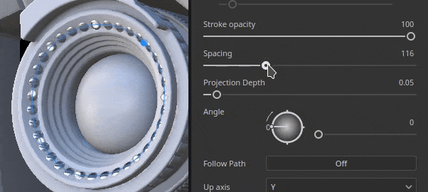
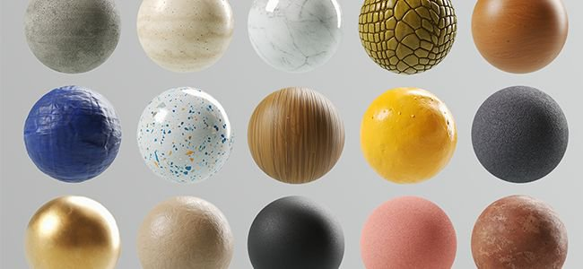

# 版本 9.0

<b>Substance 3D Painter 9.0</b> 引入了一種新的筆觸繪製方式，可在 3D 視口中以可重新編輯路徑繪製，並刷新預設內容。

上映日期： *2023年6月20日*

## 主要特色

### 在3D視窗中沿路徑重新塗裝

<b>「沿路徑</b>繪圖」工具是一種在 3D 視窗中繪製筆觸的新方法。和其他應用程式類似，你可以根據 3D 物件表面的點來建立基於貝茲曲線的曲線來繪製圖案。 結合物質材料，這個新工具能開啟許多新的可能性。

* <b>新增工具，用來建立由帶有點的路徑驅動的繪畫筆觸</b>\
  工具列內有一個專門用於路徑工具的新圖示。 這個新工具允許在 3D 模型表面繪製曲線，創造繪畫筆觸。 這些筆劃總是可以重新編輯。 當工具啟動時，只要點擊網格表面即可新增一個點。 點擊現有點並按刪除鍵將其移除。

  

  
* <b>在網格表面拖曳並移動點</b>\
  要編輯路徑形狀，只需點擊並拖曳一個點，沿著 3D 模組曲面移動即可。

  
* <b>關閉路徑以創造無縫圖案</b>\
  路徑也可以封閉以形成環狀，這對於在特定區域周圍創造重複圖案都很有用。

  

  
* <b>用路徑面板重新編輯路徑（及其屬性）</b>\
  當選擇 Paht 工具時，當前繪圖層內所繪製的路徑會顯示在 3D 視窗頂端的專用 Paht 面板中。 此面板允許選擇、刪除或重新命名路徑為

  

  
* <b>相容於其他繪畫功能，如對稱、幾何遮罩、動態筆觸等。</b>\
  許多來自一般繪畫筆觸的設定都可以用路徑工具使用：

  * 啟用對稱性後，可以同時繪製一條路徑多次，同時只管理一條路徑。
  * 在啟用幾何遮罩的圖層上的路徑可以在隱藏幾何下繪製

  
* <b>用橡皮擦或污漬等工具上色</b>\
  路徑工具也相容於橡皮擦和污漬工具，解鎖更進階的繪畫方式，並將筆觸與可重複編輯的路徑點操作方式結合。

  

* <b>儲存並重用帶有預設的路徑屬性</b>\
  使用路徑工具時，你也可以將筆刷屬性存為預設。 這允許儲存工具預設，當從資產視窗選擇時，預設會自動切換到路徑工具。

>[!NOTE]
>
> 欲了解更多資訊，請參閱 [專門的文件](../painting/tool-list/path.md)。

### 可搭配「沿路徑繪製」功能使用的新內容

本版本新增了幾個工具預設，以利用沿路徑繪圖功能：

* 管架科幻
* 皺縮
* 煤層
* 頂縫
* 焊接金屬
* 拉鍊膠帶

### 沿路徑繪圖功能改進的動態筆觸

我們利用新路徑工具為動態筆劃系統新增屬性。 這些新特性解鎖了以前無法使用的筆觸，例如上方圖片中的箭頭，呈現不同的開始與結束視覺效果。

* <b>新起點/中段/終點屬性</b>\
  可以定義一個新的性質，用來在 Substance 圖中指定一個筆劃內的印章是第一個、最後一個，或中間的任意一個。 這可以建立起點和終點，例如製作拉鍊時非常有用。 （<b>註：</b>終點狀態僅能透過路徑工具取得。）
* <b>新的尺寸與間距特性</b>\
  大小與間距特性允許根據當前印章狀態調整 Substance 圖的輸出。
* <b>新的行程長度特性</b>\
  擁有路徑上的距離與路徑的最大距離，能更好地控制某些效應何時重複，而非直接提供正規化值。\
  它使得可以同時製作一個成長筆劃（例如），同時也能根據畫出的距離（而非總郵票數量）來建立具有重複圖案的筆劃。

>[!NOTE]
>
> 欲了解更多資訊，請參閱 [專門的文件](../painting/dynamic-strokes/creating-custom-dynamic-strokes.md)。

### 更新的預設材料

這次發行我們決定對圖書館做些清理，因此調整了預設的基礎素材，讓它們對所有人都更有用。 這些素材由同一團隊製作，負責在 Substance 3D Assets[&#128279;](https://substance3d.adobe.com/assets) 上提供內容。

>[!NOTE]
>
> 被移除的內容可在 Substance 3D 社群資產[&#128279;](https://substance3d.adobe.com/community-assets?q=painter23update&u=painter23update)中取得。

## 教學課程

想了解並了解這個新的路徑工具，請參考我們最新的教學影片：

## 發行說明

### 9.0.0

上映日期：<b>2023/06/20</b>\
摘要：<b>重大版本，Paint Along Path 支援 3D 曲線、新的基礎材質、舊材質清理，以及 3D 曲線的新預設</b>

<b>補充：</b>

* [路徑]新增沿路徑繪圖工具
* [路徑]為路徑工具新增一個空的捷徑
* [路徑]允許在現有路徑上新增點
* [路徑]新增捷徑以退出目前路徑建立
* [路徑]允許編輯路徑的刷子屬性
* [路徑]放置點時自動調整切線
* [路徑]當點移動時重新計算切線
* [路徑]新建立的吸附點指向網格表面
* [路徑]允許編輯每個頂點的壓力
* [路徑]從鄰近點調整新建立點的壓力
* [路徑]允許將點轉換為平滑/角角（切斷）
* [路徑]允許立即移動新加入的點
* [路徑]允許從現有路徑中移除點
* [路徑]允許將路徑的方向反轉
* [路徑]允許在視窗中選擇路徑
* [路徑]允許透過標記選取路徑點
* [路徑]引入 CTRL-A 捷徑以選取路徑上的所有點
* [路徑]允許關閉路徑
* [路徑]允許在屬性中指定路徑上方軸
* [路徑]在上下文工具列新增頂點控制選單
* [路徑]在路徑工具中引入繪畫/擦除/暈染模式
* [路徑]為視窗中的路徑建立視覺回饋
* [路徑]新增路徑方向的視覺指示器
* [路徑]在路徑顯示設定中加入線條粗細
* [路徑]允許隱藏路徑介面
* [路徑]新增路徑面板以列出目前選取圖層的路徑
* [路徑]在路徑面板中滑鼠移至路徑上時，會新增視覺回饋
* [路徑]每當選擇路徑工具時，都會顯示路徑面板
* [路徑]允許在路徑面板中重新命名、刪除、複製、剪切及複製路徑
* [路徑]嘗試在二維視窗中使用路徑工具互動時顯示訊息
* [圖書館]整合新內容（路徑工具與基礎素材）
* [動態筆劃]新增動態筆劃的距離屬性
* [動態筆劃]為動態筆劃加入大小與間距特性
* [動態筆劃]新增動態筆劃的起始/中間/結尾屬性
* [Python]&#x200B;[美元]揭露 USD 格式的專案設定參數
* [Python]&#x200B;[USD]為 USD 格式揭露專案建立參數
* [匯出]&#x200B;[美元]在匯出的 USD 檔案中新增專案路徑資訊
* [GLTF]在重新載入 GLTF 檔案時，更新函式庫中的貼圖
* [著色器]減少不同方向的 UV 島的接縫偽影
* [引擎]Substance 引擎版本 9.0 更新

<b>修正：</b>

* [匯入]有些帶有貼圖的 GLB 在 Painter 中無法取得貼圖
* [AMD]所有3D投影填充的邊框瑕疵
* [引擎]切換圖層可見性時貼圖會斷裂
* [引擎]切換混合模式時，有些地方貼圖是空白的
* [引擎]有些情況下，貼圖/投影是空的曲速模式
* [Iray]儲存渲染時，迭代重置為 0
* [日誌]執行新檔案時的美元錯誤訊息>

<b>已知問題：</b>

* [色彩管理]在 Linux 上使用 ACE 進行 HDR 色彩空間轉換會產生壓縮色彩
* [層堆疊]輸入來源未儲存在每層
