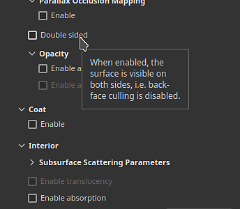
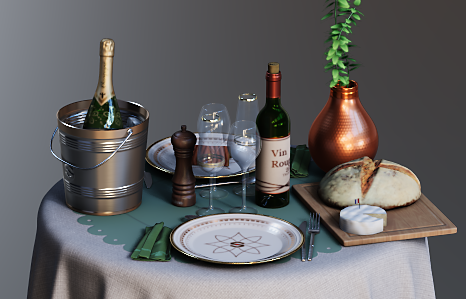
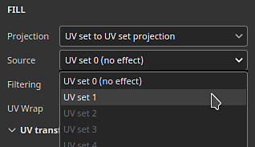

# 版本 9.1

<b>Substance 3D Painter 9.1</b> 新增了路徑工具的切線控制、支援 SVG 檔案格式、可拖放匯入與套用資源，以及支援視窗的半透明功能。

上映日期： *2023年11月7日*

## 主要特色

### 路徑工具的新切線控制與改進

在這個新版本中，我們持續開發 Path 工具（在 9.0 版本引入），以補充社群所缺失的部分與功能。

* <b>手動控制路徑點切線</b>

  現在可以手動設定路徑上特定點的切線。 這允許自動覆蓋行為以建立新的形狀。

  
* <b>透過操作手編輯路徑點</b>

  有時候，僅僅在物體表面滑動點數是不夠的。 操作手允許將點移動到表面之外。 這對於同時移動多個點非常有幫助，例如在網格重新匯入後，它們離表面太遠。

  
* <b>路徑可單獨切換可見性</b>

  現在可以透過專用的視埠面板，在每條路徑上調整路徑的可見性。 停用路徑會移除其在最終材質中的貢獻，無需刪除。

  
* <b>複製並貼上路徑位置與屬性</b>

  複製貼上路徑已被擴展，只能複製路徑點的位置或其屬性。 現在可以以不同方式同步路徑，讓創造複雜效果（透過位置）或跨不同地點共享特定視覺效果（透過屬性）變得更容易。

  

  

>[!NOTE]
>
> 欲了解更多關於路徑工具的資訊，請參閱 [專門的文件](../painting/tool-list/path.md)。

### 視窗中對半透明、透明度與吸收的新支援

<b>Adobe 標準材質</b>（ASM）著色器是建立新專案時的預設，已更新以支援<b>半透明</b>、<b>透明度</b>與<b>吸收</b>屬性。這表示現在可以在即時視窗（以及 Iray 渲染器內部）中看到這些渲染行為的結果。

因此，像玻璃、植被</b><b>或塑膠</b>等吸收光線薄的材料<b>現在成為可能，且能直接在視窗中觀看。 <b></b>匯出到其他 Substance 3D 應用程式時，ASM 定義也會讓外觀相符。

* <b>新的 ASM 著色器設定</b>

  ASM 著色器已更新以支援新功能，這些功能可透過 [著色器設定](../interface/shader-settings/shader-settings.md) 視窗進行修改：

  * <b>透明度</b> （不透明度）：現在是否不需要切換到其他著色器才能獲得透明表面，比如植被？ 相反地，請在幾何>不透明度</b>群組下<b>啟用 <b>alpha 測試</b>或 <b>alpha 混合</b>參數。常見的設定，例如抖動，也有可用。
  * <b>半透明</b>性：這項新特性允許創造類似玻璃的表面，使形狀透明，同時保留鏡面反射。 使用方法是在專案中新增一個半透明通道，並在 Interior</b> 群組下<b>啟用 <b>Translucency</b> 參數。
  * <b>吸收：</b>這項新特性能模擬光線穿過物體並被剝離，這比起使用次表面散射，更有助於模擬塑膠或液體。 要使用它，請在 Interior</b> 群組下<b>啟用<b>吸收</b>設定。
* <b>改進的著色器設定介面與提示</b>

  在著色器重製時，我們利用機會改善參數的介面，並新增許多提示，方便使用者辨識如何啟用它們。

  參數的順序也應該更符合其他 Substance 3D 軟體，讓來回調整設定變得更容易。

  
* <b>全新示範專案，展示 Adobe 標準教材</b>

  一開始操作新的 ASM 屬性可能會很困難，因此新增了一個示範著色器多項功能的範例專案，讓學習變得更容易。

  這個專案名為 <b>French Restaurant Table</b> ，可透過 <b>檔案>開啟範例</b> 選單找到。 它也用了很多小技巧，是發掘新貼圖方法的絕佳學習資源。

  
* <b>半透明通道現在預設為黑色</b>

  為了讓新的著色器屬性更易使用並避免視窗出現意外結果，通道的半透明（Translucency）預設顏色由白色改為黑色。

  如果這個通道已經在你的專案中使用，你可以透過在圖層堆疊底部加一個填充圖層，並將通道值設為白色來達到之前的做法。 你可能想啟用 <b>設定：在著色器參數中使用半透明作為散射遮罩</b> ，重新套用通道對次表面散射結果的貢獻。

### 新增向量圖形檔案（SVG）支援

此版本新增了 SVG 檔案作為資源的支援，可用於圖層、繪製工具等。

SVG 檔案非常方便，能精確表示標誌或形狀，且非常輕巧。 在 Painter 中，它們可以以所需解析度渲染且易於更新，非常適合非破壞性工作流程。

* <b>匯入 SVG 檔案</b>\
  SVG 檔案可以像匯入其他資源一樣，在專案、函式庫中，etc. SVG <b>最高可匯入版本 1.1</b> ，但不支援新版本的功能。

  這個版本的匯入也變得更簡單（見下文），因此使用 SVG 檔案只需將外部 Painter 的資源直接拖放到網格或圖層堆疊上即可。
* <b>專用 SVG 設定</b>\
  使用 SVG 資源時，有幾個設定可用來控制其外觀：

  * <b>解決方法</b>：要麼使用自動的 1、檔案中定義的，或是自訂的 1。
  * <b>裁切區域</b>：定義 SVG 畫布的特定區域。
  * <b>範圍</b>：選取 SVG 的全部內容或僅部分元素。

  
* <b>全新SVG量身訂製材料</b>

  新增了 3 項資源，以協助在貼圖時使用 SVG 檔案：

  * <b>自訂噴漆</b>：允許從單一輸入影像模擬牆上繪製的貼紙。
  * <b>自訂貼紙</b>：在表面製作塑膠貼紙。 它包含多種設定來模擬損壞和摺疊。
  * <b>圖形轉材質</b>：允許從單一影像輸入建立多種材質屬性。 當將 SVG 檔案拖放到視窗時，這個資源會自動插入。 這個資源提供了一個簡單的方式，讓大家能在多個管道中分享其輸入的透明度，非常適合簡單貼花。

  

  

>[!NOTE]
>
> 欲了解更多關於 SVG 格式與設定的資訊，請參閱 [專門的文件](../painting/vector-graphic-svg.md)。

### 新的資源拖放匯入方式

此版本允許將外部檔案拖放到應用程式的不同情境中，自動匯入資源並使用。 這個新流程可以跳過與匯入檔案相關的繁瑣步驟。

* <b>透過拖放方式匯入視窗</b>

  把一個外部檔案拖到視窗裡，這樣就能直接放在網格上。 這個動作會自動建立一個新的圖層。 根據資源的性質（影像、物質材質、物質過濾器等） 結果會相應調整。
* <b>透過拖放方式匯入圖層堆疊</b>\
  就像可以將外部資源檔案丟進視埠一樣，將檔案放入圖層堆疊也能直接建立包含該資源的圖層或效果。
* <b>透過拖放方式匯入資源欄位</b>

  也可以直接將資源匯入圖層或工具。 如果已經有合適的填充層或效果，只要在屬性視窗的通道槽中放入一個外部檔案，就能匯入並套用。

>[!NOTE]
>
> 欲了解更多關於資源匯入的資訊，請參閱 [專門的文件](../content/importing-assets/import-drag-and-drop.md)。

### 新增資源拖放行為

拖放改進不僅限於資源匯入。 現在可以從資產視窗拖放資源，隨時建立新的圖層、效果甚至遮罩。

* <b>拖放多種資源</b>

  現在可以直接拖放資源類型到視窗或圖層堆疊中。 以下類型的資源現在幾乎可以拖放到任何地方：

  * 阿爾法
  * 材質
  * 程序劇
  * 材質
  * 智慧材料
  * 智慧口罩
  * 發電機
  * 濾鏡
  * 環境地圖
* <b>將資源作為新圖層或效果</b>

  透過選擇資源掉落位置，Painter 會自動建立新的圖層或新效果：

  
* <b>拖曳時可選擇內容效果堆疊或遮罩效果堆疊\
  </b>

  當將資源拖曳到縮圖上時，Painter 會自動切換到相關的效果堆疊。 之後，只要把資源放在堆疊裡的精確位置就變得非常簡單了。 這樣可以避免事先切換到正確的組合。

  
* <b>即時建立新的黑色遮罩</b>

  拖曳資源時，任何沒有遮罩的圖層上會出現新的圖示。 當資源被丟到這個幽靈遮罩上時，它會自動建立新的遮罩並新增該資源。 這是快速設定新遮罩的方法，避免取消拖放手動新增。

  
* <b>直接放入視窗來建立新圖層</b>

  也可以在視埠中拖放資源來建立新的圖層。 根據資源的類型，結果可能會有所不同。 濾鏡會在通透模式下建立一個塗裝圖層，而智慧遮罩則會用新的遮罩建立一個填充圖層。

  

  
* <b>進階行為使用鍵盤修飾鍵</b>

  在丟棄資源時，維持鍵盤修飾鍵 CTRL 或 ALT 可以啟用其他行為：

  * <b>在放入<b>圖層堆疊</b>時按 CTRL</b>：用黑色遮罩建立一個新圖層，資源會被遮罩。例如，強制將材料放入遮罩中非常有用。 或者跳過下拉選單，裡面有 alpha 版本。
  * <b>在圖層堆疊</b>中放置<b>時的 ALT</b>：只適用於在圖層縮圖上放置時。ALT 會移除所有之前的效果。 這可以作為快速嘗試不同資源的方法，尤其是智慧口罩，而無需先手動移除。
  * <b>在視窗<b></b>中按下 CTRL</b>：建立一個新圖層，資源用黑色遮罩。資源會被置於 <b>一個色彩識別</b> 選擇效果下，該效果會根據視窗中的選取結果來設定。
  * <b>在視窗</b>中下<b>放時的 ALT</b>：和之前一樣，會強制資源進入貼花投影模式。

### 其他改進

本版本也加入了多項小功能與改進。

* <b>16位元影像的無損壓縮</b>

  從現在起，任何位元深度為 16 的專案中包含的影像都會以無損演算法壓縮，允許縮小影像大小而不損失品質。 這是專案檔案本身已經在壓縮資料的基礎上。

  這個改動主要針對 <b>烘焙貼圖</b> ，這通常是專案檔案在磁碟上會非常繁重的原因。 平均而言，我們看到磁碟</b>上的專案規模縮<b>減了30%到50%。

  當儲存任何專案（舊專案或新專案）到尚未壓縮的資源時，會自動套用此壓縮。 這表示對於舊專案來說，首次在這個新版本中儲存可能會比平常花更多時間。 完成後節省時間應該會恢復正常。
* <b>新 UV 設定為 UV 設定為填充投影模式</b>

  新增了一個填充圖層/效果投影模式，名為 <b>UV Set to UV Set</b> 投影。 它可以用來根據專案內網格上可用的不同 UV 投影貼圖。 它可用於執行更進階的貼圖轉移，無需依賴外部工具。

  <b>UV set 0</b> 是 Painter 用於繪畫的預設 UV。 如果有額外的 UV 集合可用，它們會在設定 <b>的下拉選單中找到。來源</b>：

  
* <b>任何新專案預設啟用時間抗鋸齒</b>

  建立新專案時， <b>顯示設定視窗中的時間抗鋸齒</b> 設定預設為啟用，以提升視窗渲染品質。
* <b>新的 Python API 改進</b>

  Python API 在此版本中新增了一些內容：

  * Painter 可以透過 Python <b>新增的 substance\_painter.application.close（） </b>函式關閉或關閉。
  * 主視窗攝影機現在可以透過 API 進行修改。 這包括它的位置、旋轉，還有其他屬性，例如視野、光圈等。為了讓相機更容易地與網格定位，API 現在也會公開場景邊界框。
  * 現在可以透過匯出模組，不論有沒有三角剖分、有沒有位移，都能匯出專案網格。
  * 專案的匯出貼圖路徑現在也能從 API 中取得。
* <b>新發送至 After Effects（測試版）</b>

  新增了送入動作功能，可以將網格及其貼圖匯出到 After Effects，方便在視覺特效上反覆修改。 此功能至少需取得 After Effects 24.1 beta 版本的存取權限。

## 教學課程

## 發行說明

### 9.1.0

（發行日期：2023年11月7日）\
摘要： <b>重大版本引入 SVG 與透明度支援，以及拖放與路徑工具的改進</b>

<b>補充：</b>

* [SVG]允許匯入向量檔案（SVG）
* [SVG]&#x200B;[使用者介面]新增對 SVG 專屬屬性的支援
* [SVG]新增選項以輕鬆保留原始影像比例
* [SVG]允許自動使用 SVG 的透明度 alpha
* [互通性]允許將貼圖網格傳送至 After Effects（Ae 24.1 beta）
* [互通性]新增傳送至 After Effects 的設定
* [生活品質]&#x200B;[資產]&#x200B;[使用者介面]拖放資產到 UI 欄位時自動匯入
* [生活品質]允許將外部資產拖放到圖層堆疊中
* [生活品質]&#x200B;[圖層堆疊]將材質從資產面板拖放到圖層堆疊中
* [生活品質]&#x200B;[視窗]允許拖放生成器，並在網格上設置過濾器
* [生活品質]&#x200B;[視窗]允許將外部資產投放到網格上
* [生活品質]&#x200B;[投影]新增 UV 設定為 UV 設定投影模式
* [生活品質]將智慧口罩拖放為視口與圖層堆疊中的新圖層
* [生活品質]在遮罩中使用時，為多輸出產生器新增選擇器
* [生活品質]允許將單一通道影像拖放到補色效果上
* [生活品質]&#x200B;[圖層堆疊]使用 CTRL/ALT 修飾鍵搭配拖放，指定在哪裡/如何建立效果/圖層
* [路徑]在路徑面板中分別切換路徑可見性
* [路徑]允許使用轉換操作器來控制路徑點
* [路徑]允許手動控制每個頂點的切線
* [路徑]複製/貼上路徑屬性
* [路徑]引入一個空的快捷鍵給斷線切線按鈕
* [著色器]在 ASM 著色器中新增不透明度與半透明性支援
* [著色器]加入 ASM 著色器對吸收色彩通道的支援
* [著色器]改進 ASM 著色器參數工具提示
* [著色器]將半透明通道預設顏色改為黑色
* [顯示設定]預設啟用時間抗鋸齒
* [顯示設定]預設啟用次表面散射設定
* [實質]新增對圖形輸入/輸出色彩空間屬性的支援
* [Substance]將Substance引擎更新至版本9.0.3
* [使用者介面]即使應用程式視窗很小，也讓情境工具列按鈕變得可存取
* [自動展開]用 Texel 密度控制 UV 圖塊數
* [烘焙中]預設會關閉 AMD GPU 的光線追蹤
* [效能]對 16 位元影像套用無損壓縮以減少專案佔用空間
* [Python]允許在 3D 視圖中操作預設攝影機
* [Python]公開透過腳本匯出網格的能力
* [內容]&#x200B;[樣本]新增範例專案「法國餐廳桌」
* [內容]更新Substance標誌alpha至新版本
* [內容]新增三個以 SVG 為核心的材質過濾器（自訂貼紙、自訂噴塗與圖像於材質）

<b>修正：</b>

* [撞擊聲]在不使用對稱工具時改變操作手尺寸
* [崩潰聲]&#x200B;[圖層堆疊]當沒有選擇任何東西時，正在建立圖層
* [專案]移除未使用的資源後，網格貼圖可能會損壞
* [專案]重新匯入或重新烘焙映像檔後的資源損毀
* [資產]重新載入資產會將其從收藏中移除
* [匯入]當資產面板顯示「未找到結果」時，無法匯入資源
* [使用者介面]情境工具列箭頭在某些情況下不會出現
* [實質]不支援布林值的並排按鈕
* [關卡]在掩蔽中使用時，頻道標籤錯誤
* [匯出]&#x200B;[glTF] 從 Painter 匯出的 glTF/GLB 檔案沒有實體大小單位
* [內容]模糊濾波器的強度被壓縮到16
* [內容]色彩匹配過濾器「目標顏色」影像輸入不可見

<b>已知問題：</b>

* [色彩管理]在 Linux 上使用 ACE 進行 HDR 色彩空間轉換會產生壓縮色彩
* [當機聲]&#x200B;[Linux] 在 AMD 上拖放資源時，使用 Linux Wayland 在 Layer Stack 中
* [撞擊聲]&#x200B;[Mac]更改 Monterey OS 上的各向異性過濾值
* [撞擊聲]Exr 用作影像輸入
* [撞擊聲]使用 16K 環境地圖
* [自動展開]像素密度控制的使用者介面問題
* [回歸]&#x200B;[使用者介面]右鍵選單在高清螢幕上太小了
* [Python]由 TextureStateEvent 觸發的匯出 USD 崩潰
* [生活品質]在貼花模式下拖放 Alpha 資源會產生遮罩中的 UV 投影
