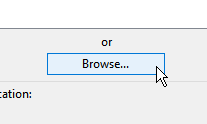
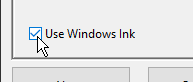

# 筆與平板配置

本頁列出多項建議，用於在 Windows 上設定繪圖板筆，以提升其與應用程式的相容性。

## 什麼是 Windows Ink？

Windows Ink 是一款軟體/服務，可處理觸控筆或繪圖板上的筆。 它提供多種應用程式，如便利貼和素描本，方便在電腦上與筆互動。

自 2019.3 版本起，應用程式依賴它來處理繪圖板。 在此版本之前，使用的是 Wintab（較舊的服務，並非所有繪圖板型號都支援）。

## 在平板驅動程式設定中啟用 Windows Ink

為了確保筆壓被正確辨識，必須在繪圖板的驅動程式設定中啟用 Windows Ink。

>[!NOTE]
>
> Windows Ink 不支援虛擬機，因此圖形繪圖板事件不會轉發給應用程式。 因此此配置不支援筆壓。

### 啟用 Windows Ink 適用於 Wacom 平板

1. 打開  **開始**  選單。
1. 輸入  **Wacom Tablet Properties**  ，然後點選第一個搜尋結果。
1. 在 **Wacom 繪圖板屬性**&#x200B;視窗中，點選工具清單中的筆&#x200B;**。**\
   
1. 點擊加號  **「+」**  按鈕可新增申請資料。\
   
1. 點擊  **新視窗中的瀏覽**  按鈕，找到 Substance 3D Painter 執行檔。\
   
1. 點擊  **確定**  以驗證並建立個人檔案。\
   
1. 點選「  **地圖」**  標籤。\
   
1. 在視窗左下角，確保  **啟用了 Windows Ink**  。\
   

>[!NOTE]
>
> 啟用 Windows Ink 後，重新啟動應用程式以確保變更被妥善考慮。

### 啟用 Huion 平板的 Windows Ink

1. 打開  **開始**  選單。
1. 輸入  **Huion平板**  ，點選第一個搜尋結果
1. 在Huion平板&#x200B;**視窗中**&#x200B;點選數位&#x200B;**筆**。\
   
1. 在視窗左下角，確保  **啟用 Windows 墨水**  。\
   

## 如何存取 Windows Ink 設定

Windows Ink 設定可在一般 Windows 設定中取得：

1. 打開  **開始**  選單。
1. 點擊  **設定**  圖示。\
   
1. 在設定視窗中，點選  **裝置**  。\
   
1. 在裝置視窗中&#x200B;**，點選**&#x200B;筆與 Windows 墨水&#x200B;**（只有連接繪圖板時才**&#x200B;可用）。\
   

## 推薦的 Windows Ink 設定

以下是 Windows Ink 的設定以及每個設定的推薦設定。

>[!NOTE]
>
> 即使遵循本指南，仍有一些與 Windows Ink 相關的視覺效果可見。 可惜 Microsoft 在 Windows 裡沒有提供關閉這些設定。
> 
> 其餘視覺效果如下：
> 
> * **右鍵點擊時圈出**  。
> * **按下快捷鍵修改鍵（Ctrl、Alt 或 Shift）時，滑鼠下方的工具提示**  。

### 筆式設定

| ***背景設定*** | ***描述*** |
| --- | --- |
| **選擇用哪隻手書寫** | 建議：  **右手持** 此設定控制筆的方向辨識。 將此設定設為左手時，調整參數時可能會出現介面凍結。 |
| **視覺特效秀** | 建議：  **關閉** 此設定控制在各種筆互動中顯示的視覺效果。 關閉它後，點擊時可以隱藏漣漪圓圈效果： 

 |
| **顯示游標** | 建議：  **已停用** |
| **讓我在一些桌面應用程式裡用我的筆當滑鼠** | 建議：  **啟用** 此設定允許繪圖板筆發送一般滑鼠輸入。 如果關閉此設定，可能會導致與使用者介面參數的互動問題。 |

### 手寫設定

| ***背景設定*** | ***描述*** |
| --- | --- |
| **直接寫入文字欄位時的字型大小** | 推薦：  **中等難度（預設）** |
| **使用手寫字體時的字體** | 推薦：  **Segoe 介面（預設）** |
| **當我用筆點擊文字欄位時，請用手寫文字輸入文字** | 建議：  **僅限平板模式** 此設定控制手寫文字輸入視窗的出現時間與方式。 若未設定為「僅在平板模式下」，每當使用者介面中選取文字欄位時，視窗就會出現。 例如在滑桿中輸入特定值時。 |
| **讓我在一些桌面應用程式裡用我的筆當滑鼠** | 建議：  **啟用** 此設定允許繪圖板筆發送一般滑鼠輸入。 如果關閉此設定，可能會導致與使用者介面參數的互動問題。 |
| **用指尖在字寫欄上寫字** | 建議：  **已停用** |

### 筆速鍵設定

| ***背景設定*** | ***描述*** |
| --- | --- |
| **點擊一次** | 推薦：  **什麼都不做** |
| **雙擊** | 推薦：  **什麼都不做** |
| **長按（僅部分筆支援）** | 推薦：  **什麼都不做** |
| **允許應用程式覆蓋捷徑按鈕的行為** | 建議：  **已啟用** |
| **如果有，請在我從儲存空間取出筆後顯示 Ink Workspace** | 建議：  **已停用** |

## 如何存取筆與觸控設定

觸控筆與觸控設定可在控制面板中存取：

1. 打開  **開始**  選單。
1. 輸入  **控制面板**  ，點選第一個搜尋結果。
1. 將控制面板  **顯示模式**  切換為  **小圖示**  。\
   
1. 點選  **筆觸設定**  。\
   

## 推薦的筆與觸控設定

建議採用以下設定來改善繪畫行為與鏡頭操作。

要進入設定，請在視窗中點擊其中一個  **筆操作**  ，然後點擊  **設定**  按鈕。

| ***背景設定*** | ***描述*** |
| --- | --- |
| **單點抽頭** | 沒有參數。 |
| **雙重點擊** | 建議：  **預設值。** |
| **按住** | 建議：  **停用「啟用長按右鍵**  點擊」設定 關閉此設定後，可以正常拖曳任何元素，而不會啟動 Windows 拖曳圈： 

 |
| **用筆按鈕當作右鍵的對應** | 建議：  **已啟用** |
| **用筆頂擦掉墨水（如果有的話）** | 建議：  **已啟用** |
