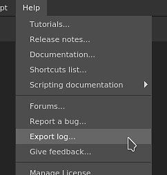

# 匯出日誌檔案

本頁說明如何找到申請日誌檔案，以及如何分享以請求支援。

## 取回日誌檔案

取得日誌檔有兩種方式：

### 從應用程式匯出日誌檔案

登入日誌檔案可直接從應用程式匯出，方法是進入 **說明** 選單並選擇 **匯出日誌** 操作。

### 手動在磁碟上取得日誌檔

如果應用程式無法啟動，就無法匯出日誌檔。 幸運的是，日誌檔案可以在磁碟上手動找到。 請前往下方與你作業系統相符的資料夾，手動取得 **log.txt** 檔案。

<table data-preserve-html="true"><colgroup> <col/> <col/> <col/> <col/> </colgroup><tbody><tr><th>平台</th><th>版本</th><th colspan="2">路徑</th></tr><tr><td rowspan="4"><strong>窗戶</strong></td><td rowspan="2"><strong>7.2</strong> 或更新版本</td><td colspan="1">App Data（本地）</td><td colspan="1">C：\Users\[username]\AppData\Local\Adobe\Adobe Substance 3D Painter</td></tr><tr><td colspan="1">App Data（漫遊）</td><td colspan="1">C：\Users\[username]\AppData\Roaming\Adobe\Adobe Substance 3D Painter</td></tr><tr><td rowspan="2">遺產</td><td colspan="1">App Data（本地）</td><td colspan="1">C：\Users\[用戶名]\AppData\Local\Allegorithmic\Substance Painter</td></tr><tr><td colspan="1">App Data（漫遊）</td><td colspan="1">C：\Users\[用戶名]\AppData\Roaming\Allegorithmic\Substance Painter</td></tr><tr><td rowspan="2"><strong>麥克</strong></td><td colspan="1"><strong>7.2</strong> 或更新版本</td><td colspan="2">/使用者/[使用者名稱]/函式庫/應用程式支援/Adobe/Adobe Substance 3D 畫家</td></tr><tr><td colspan="1">遺產</td><td colspan="2">/使用者/[使用者名稱]/函式庫/應用程式支援/寓言/內容畫家</td></tr><tr><td rowspan="2"><strong>Linux</strong></td><td colspan="1"><strong>7.2</strong> 或更新版本</td><td colspan="2">/home/[username]/.local/share/Adobe/Adobe Substance 3D 畫家</td></tr><tr><td>遺產</td><td colspan="2">/home/[username]/.local/share/寓意/Substance Painter</td></tr></tbody></table>

>[!NOTE]
>
> 上述路徑中的部分目錄可能預設是隱藏的。 在檔案總管手動輸入路徑，或顯示隱藏檔案以查看。

## 將日誌檔案附加到社群訊息以求支持。

撰寫訊息時，請使用附件區插入您的日誌檔案：

