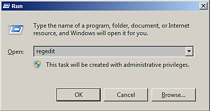
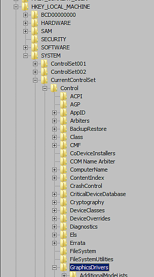

# GPU 驅動程式在長時間計算時會當機（TDR 當機）

{zoomable="yes"}

在 Windows 上，當 Substance 3D Painter 偵測到目前 TDR 值低於特定限制（10 秒）時，此視窗才會出現。

<table>
<tr style="border: 0;">
<td style="border: 0;" valign="top">

## 為什麼 GPU 驅動程式會當機？

</td>
<td style="border: 0;" valign="top">

### 如何編輯TDR值

</td>
<td style="border: 0;" valign="top">

### 將TDR值還原為預設值

</td>
</tr>
</table>

## 為什麼 GPU 驅動程式會當機？

為了防止任何渲染或 GPU 運算 **導致系統**&#x200B;當機，Windows 作業系統 **會在渲染超過幾秒時終止 GPU 驅動** 程式。 當驅動程式死亡時，使用該驅動程式的應用程式會自動當機。 無法知道渲染任務或計算所需時間（視 GPU、驅動程式、作業系統、網格大小、貼圖大小等而定），因此無法限制電腦處理量，避免應用程式層級的當機。

在 Windows 上，有一個&#x200B;**登錄**&#x200B;**檔金鑰**&#x200B;會指定作業系統應該等待多久才會終止 GPU 驅動程式。應用程式無權直接修改此設定，此程序必須手動完成（見下文）。

欲了解更多資訊，請參閱官方文件： <https://docs.microsoft.com/en-us/windows-hardware/drivers/display/tdr-registry-keys>。

### 需要更改的金鑰列表

調整TDR只需增加TDR延遲：將TdrDelay **和** TdrDdiDelay **都**&#x200B;調整到更高的數值（例如60秒）。

{zoomable="yes"}

>[!NOTE]
>
> 請注意，這些鍵可透過 Windows 更新或 GPU 驅動程式更新重置為預設值。

## 如何編輯TDR值

請依此程序更改TDR值。

***請注意，必須建立或編輯兩個不同的鍵。***

>[!WARNING]
>
> 請注意，編輯登錄檔可能會帶來嚴重且意想不到的後果，可能導致系統無法啟動，若不確定如何修改，可能需要重新安裝整個作業系統。 不過，本頁提到的登錄檔金鑰不應該會造成這類問題。
> 
> Adobe 對於修改系統登錄檔所造成的系統損害不負責。

### 1 - 開啟跑步視窗

點選 **開始** ，然後 **執行** （或按 **Windows** 和 **R** 鍵）。 它會打開 **「跑步」** 視窗。

{zoomable="yes"}

### 2 - 啟動登錄檔編輯器

在文字欄位輸入 **regedit** ，然後按 **確定**。

{zoomable="yes"}

### 3 - 導航到 GraphicsDrivers 登錄檔金鑰

登記冊視窗會開啟。\
在左側窗格，透過以下操作進入樹狀結構，找到 **GraphicsDrivers** 鍵：

```
Computer\HKEY_LOCAL_MACHINE\SYSTEM\CurrentControlSet\Control\GraphicsDrivers
```


請務必&#x200B;**保持在**「GraphicsDrivers」頁面，並且&#x200B;**在進行下一步前不要點擊**&#x200B;下方&#x200B;**的登錄檔**&#x200B;鍵。

+++Windows 登錄檔樹中的「GraphicsDrivers」
{zoomable="yes"}


+++

### 4 - 新增或編輯 TdrDelay 值

>[!NOTE]
>
> 如果 TdrDelay 值還不存在，請在右側窗格右鍵點擊，選擇<b>新 > DWORD （32 位元） 值</b>。</b><b></b> <b>命名為「<b>TdrDelay</b>」。 這個格很重要，務必遵循它（並確認沒有其他字元，例如後方空格）。
> 
> 

在&#x200B;**右側窗格**，雙擊 TdrDelay **值**。把基本&#x200B;**設定改**&#x200B;成&#x200B;**十進位。**&#x200B;將數值設為非預設 **2** （我們建議 **60**）。

此數值以秒計表示作業系統會在計算過程中認為 GPU 無反應前會等待多久。

{zoomable="yes"}

### 5 - 新增或編輯 TdrDdiDelay 值

>[!NOTE]
>
> 如果 TdrDdiDelay</b> 值<b>不存在</b>，請在右側窗格右鍵點擊並選擇<b>新 > DWORD （32 位元） 值</b>。<b>命名為「 <b>TdrDdiDelay</b> 」。 如果重要，請務必遵守（並確認沒有其他字元如空格）。
> 
> 

在&#x200B;**右側窗格，雙**&#x200B;擊 TdrDdiDelay **的值**。把基本&#x200B;**設定改**&#x200B;成&#x200B;**十進位。**&#x200B;將數值設為預設 **5** 以外的數值（我們建議 **60** ）。

這個數值以秒計表示作業系統會等待多久，才會認為軟體花了太多時間才離開 GPU 驅動程式。

**十六進位** 是預設值，只要切換到 **十進位** 即可顯示正確值。 請注意， **3C** （十六進位）等 **於60** （十進位）。

### 6 - 完成並重新開始

右側的窗格現在應該是這樣：

{zoomable="yes"}

**關閉** 登錄編輯器。 **&#x200B;**&#x200B;重新啟動電腦時，請先選擇「開始&#x200B;**」再**「**重新啟動**」。

TdrValue 只會在電腦啟動時查看，因此強制刷新需要重新啟動。

如果應用程式在長時間計算時仍然當機，可以試著將延遲（以秒計）從 60 增加到 120 秒。

## 將TDR值還原為預設值

有兩種方法可以將TDR回復預設值：

* 按照上述步驟，將 TdrDelay 設為 2 秒&#x200B;**，TdrDdiDelay**&#x200B;**設為** 5 秒&#x200B;**。**&#x200B;**&#x200B;**
* 或者 **從登錄檔條目中移除** **TdrDelay** 和 **TdrDdiDelay** 金鑰。
