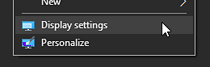
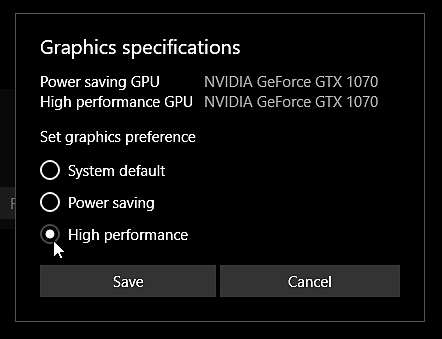

# Painter 不會在正確的 GPU 上啟動

在 Windows 上，應用程式開機時可能沒有使用正確的 GPU，這可能導致效能和穩定性的問題。 以下是常見問題及其解決方案清單，確保軟體能在合適的 GPU 上正常運作。

想知道是哪張顯示卡，可以查看 [日誌檔](../../exporting-the-log-file.md)。

## 窗戶

### 監控線材配置

在 Windows 上，分配給應用程式的 GPU 取決於該應用程式所運行的螢幕。 這是因為螢幕線直接連接到 GPU 的輸出端。 因此，如果應用程式啟動的顯示器連結到主機板的顯示輸出，而非顯示卡本身的輸出，應用程式可能會從錯誤的 GPU 啟動。 在這種情況下，Windows 很可能會使用內建 GPU 而非獨立 GPU。

<b>要解決這個問題</b> ：只要把連接到主機板的螢幕拔掉，改用 GPU 輸出來修復線材配置。

### 錯誤安裝顯示卡驅動程式

如果 GPU 驅動程式沒有正確安裝，應用程式將無法連接到獨立的 GPU，只能用整合式 GPU 作為備援。

<b>解決這個問題</b> 的方法：先卸載目前的顯示卡驅動程式，進行清理，然後在電腦重開機後重新安裝顯示卡驅動程式。

### Nvidia GPU 驅動程式設定檔設定

在某些電腦上，例如筆記型電腦，該應用程式預設會運行在內建 GPU 上，而非獨立的 Nvidia GPU。 用 NVIDIA GPU 時，切換到合適的顯示卡取決於應用程式配置檔。 如果應用程式沒有這樣的設定檔，你可以手動指派一個。

<b>解決這個問題</b> ：

1. 右鍵點擊桌面，選擇 NVIDIA 控制面板， <b>或</b> 進入控制面板搜尋 NVIDIA 控制面板
1. 在 3D 設定</b>中<b>，請點選<b>「管理 3D 設定」</b>
1. 在程式設定</b>標籤<b>下新增 Substance 3D Painter 的設定檔<b></b>
1. 將首選顯示卡設定改為高效能 NVIDIA 處理器

### Windows 效能設定

Windows 可能因為預設效能和耗電設定，設定錯誤了 GPU 的應用程式。

<b>解決這個問題的方法： </b>請依照以下步驟覆蓋預設的 GPU 設定。

1. 請在桌面上右鍵點擊開啟顯示設定：

   
1. 請前往主頁視窗底部，點選「圖形設定」：

   
1. 點擊「瀏覽」按鈕，找到 Substance 3D Painter 執行檔：

   
1. 應用程式加入後，請點擊「選項」按鈕：

   
1. 選擇「高效能」設定，點選「儲存」按鈕

   

## Linux

### 關閉「偏好非預設顯示卡」

從桌面捷徑執行 Painter 或透過 Steam 執行時，請確保 <b>\*.desktop</b> 檔案中的 <b>PrefersNonDefaultGPU</b> 設定為 <b>false</b>。

這種設定可能會誤導，導致內建顯示卡被強制使用，而非更隱密且更強大的顯卡。 更多資訊 [請參見此討論](https://github.com/ValveSoftware/steam-for-linux/issues/9940)。

### 強制使用 DRI 或_PRIME環境變數的特定 GPU

Painter 預設會使用 Vulkan 圖形 API 中列出的第一張 GPU，但這張 GPU 可能是錯誤的（可能是前面列出的整合式 GPU），導致效能不佳。 可以使用 DRI/_PRIME 環境變數強制切換你選擇的 GPU。 更多資訊 [請參閱 Arch 維基](https://wiki.archlinux.org/title/PRIME#For_open_source_drivers%E2%80%94PRIME)的文件。 你也可以參考 [Mesa 的文件](https://docs.mesa3d.org/envvars.html#envvar-DRI_PRIME)。
