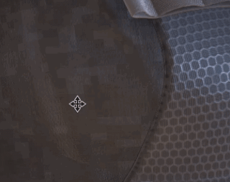

# 移動攝影機時網格閃光燈轉為白色

{width="300px"}

舊專案移動時，視窗中的相機可能會短暫出現由白色或空白材質產生的白色閃光。 這是因為  [稀疏虛擬貼圖](https://substance3d.adobe.com/display/DRAFTPAINTER/Sparse+Virtual+Textures)  （SVT）系統依賴特定的著色器配置，而舊著色器並不使用這些設定。

要消除白色閃爍，只需&#x200B;**更新**&#x200B;專案著色器&#x200B;**：**

* 對於&#x200B;**預設著色器**：請依照「更新著色器[&#128279;](../../../interface/shader-settings/updating-a-shader.md)」頁面的逐步步驟操作。
* 自訂 **著色器**&#x200B;方面：請查看日誌中的錯誤訊息以及 [著色器 API](https://helpx.adobe.com/tw/substance-3d/unlisted/documentation/spdoc/custom-shader-api-89686018.html) 頁面。
