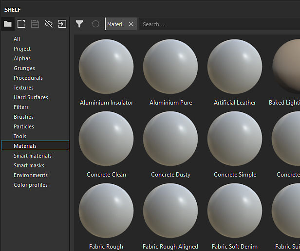

# 架子上的縮圖看起來不對

如果書架上的縮圖看起來和慣常不一樣，可能是因為用來渲染預覽的著色器不同。

| 壞掉的縮圖 | 一般縮圖 |
| --- | --- |
| 

 | 

 |

## 1 - 開啟主設定視窗

請點  **選「編輯**  」並點選  **設定**  ：

## 2 - 移除 Shelf 預覽著色器

在  **一般**  檢視中往下滑，直到「預覽選項」區塊可見。\
點擊&#x200B;**「**&#x200B;材質預覽著色器&#x200B;**」前方的十字**&#x200B;按鈕，即可移除目前指定的著色器。

{width="450px"}

## 3 - 重新啟動 Substance 3D Painter

為了重新生成縮圖使其看起來正確，Substance 3D Painter 需要重新啟動。
